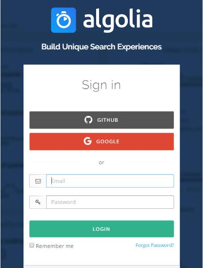
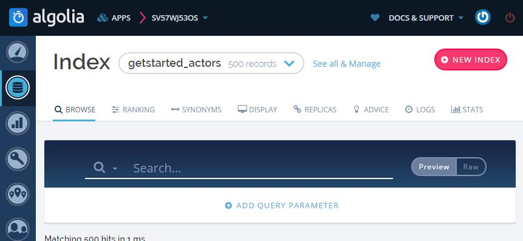
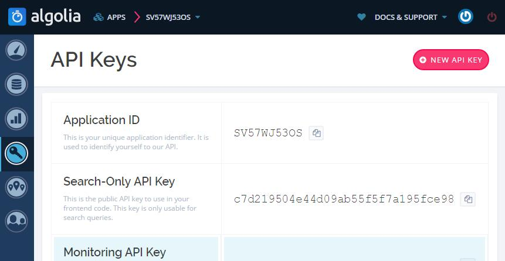

## 前言

个人博客自从2016年10月21日搭建以来，迄今为止已经有49 篇日志了。虽然不是很多篇文章，但是搜索站内的内容已经力不从心了。

搜索了网上很多关于“Hexo 站内搜索”的内容，发现大部分都是使用[Swiftype](https://swiftype.com/)，但是发现Swiftype 搜索只有15 天的免费，之后就需要开始收费了。

因为只是为自己的[个人博客 ](https://jobbym.github.io/)使用站内搜索，所以希望找一个类似与Swiftype 的，但是**免费的**站内搜索。最后找了Algolia 这个免费版本替代。

<!-- more -->

下面简单说下搭建过程：

## 搭建过程

### 前提条件

如果你的Next 版本为5.1.0 之后，可以使用Algolia。如果不是，请先升级到5.1.0 版本之后

### 一个Algolia 帐号

[官网地址](https://www.algolia.com/users/sign_in) 使用GitHub 或Google 帐号登录。
[](http://zouzeir.xyz/2017/01/16/Hexo%E9%9B%86%E6%88%90Algolia%E6%90%9C%E7%B4%A2%E6%8F%92%E4%BB%B6/algolia_login.jpg)

### 创建Index

进入[Dashboard](https://www.algolia.com/dashboard)，
选择[Indices](https://www.algolia.com/explorer#?index=getstarted_actors) 新建一个Index。
[](http://zouzeir.xyz/2017/01/16/Hexo%E9%9B%86%E6%88%90Algolia%E6%90%9C%E7%B4%A2%E6%8F%92%E4%BB%B6/algolia_explorer.jpg)
[](http://zouzeir.xyz/2017/01/16/Hexo%E9%9B%86%E6%88%90Algolia%E6%90%9C%E7%B4%A2%E6%8F%92%E4%BB%B6/algolia_newindex.jpg)

### 安装Hexo Algolia

Index 创建完成后，此时Index 为包含任何数据。需要安装Hexo Aloglia 扩展，这个扩展的功能是搜集站点的内容并通过API 发送给Aloglia。前往站点根目录，执行命令安装：

```
npm install --save hexo-algolia
```

### 获取Key，更新站点信配置

点击Dashborad 左侧的[API Keys](https://www.algolia.com/api-keys)，其中的信息接下来将会被用到。
[](http://zouzeir.xyz/2017/01/16/Hexo%E9%9B%86%E6%88%90Algolia%E6%90%9C%E7%B4%A2%E6%8F%92%E4%BB%B6/algolia_apikeys.jpg)
包括`Application ID` 、`Search-Only API Key` 和 `Admin API Key`，其中`Admin API Key`需要保密保存

编辑站点配置文件，新增以下配置：

```
algolia:
  applicationID: 'SV57WJ53OS'
  apiKey: 'c7d219504e44d09ab55f5f7a195fce98'
  adminApiKey: 'adminApiKey'
  indexName: 'dev_jobbymsblog'
  chunkSize: 5000
```

### 更新Index

当配置完成，在站点根目录下执行`hexo algolia` 来更新Index。请注意观察命令的输出。
[](http://zouzeir.xyz/2017/01/16/Hexo%E9%9B%86%E6%88%90Algolia%E6%90%9C%E7%B4%A2%E6%8F%92%E4%BB%B6/algolia_hexo_algolia.jpg)

### 主题集成

更改主题配置文件，找到Algolia Search 配置部分：

```
# Algolia Search
algolia_search:
  enable: false
  hits:
    per_page: 10
  labels:
    input_placeholder: Search for Posts
    hits_empty: "We didn't find any results for the search: ${query}"
    hits_stats: "${hits} results found in ${time} ms"
```

将`enable` 改为`true` 即可，根据需要你可以调整`labels` 中的文本。

## 问题

```
1. 点击搜索结果，结果跳转地址为：
```

```
Cannot GET /undefined/
```

按照[5.1.0使用algolia搜索问题](https://github.com/iissnan/hexo-theme-next/issues/1084)这里进行的处理，在这里总结一下：

- 因为hexo-aloglia 的作者没有把`post.path` 加入index，所以`data.path` 是`undefined`。
- 遇到这个问题，首先运行`npm uninstll hexo-algolia` 卸载之前的版本，再运行`npm install hexo-algolia@0.2.0 --save`,最后运行`hexo algolia` 命令重新index 就可以了。

## 参考文档

1. [Swiftype站内搜索](https://github.com/iissnan/hexo-theme-next/wiki/Swiftype%E7%AB%99%E5%86%85%E6%90%9C%E7%B4%A2)
2. [Next 第三方服务集成](http://theme-next.iissnan.com/third-party-services.html)

------

***本文转载自***[Hexo集成Algolia搜索插件](http://zouzeir.xyz/2017/01/16/Hexo%E9%9B%86%E6%88%90Algolia%E6%90%9C%E7%B4%A2%E6%8F%92%E4%BB%B6/)

