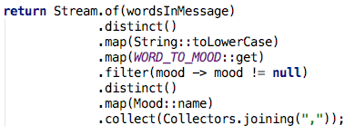

原文：https://dzone.com/articles/java-8-top-tips

# Optional

Optional是一个评价过低的特性，它可以显著的降低代码抛出NullPointerException的可能。它在边界代码(你正在使用的API或者你发布的API)中特别有用。

但是对于它的不适当的使用和设计很容易使一个小的变动影响到很多的类，或者降低代码的可阅读性。这里有一些如何更加高效使用Optional的建议。

### Optional应该仅仅用在返回类型中

不要用在参数或者域中。[阅读这篇博文](http://blog.joda.org/2015/08/java-se-8-optional-pragmatic-approach.html)可以看到如何正确使用Optional进行编码。幸运的是，IntelliJ IDEA可以打开inspections去检查你是否遵循了这些推荐规范。


要尽早在Optional出现的地方对它进行处理。IntelliJ IDEA会阻止Optional出现在你代码的各个地方，所以记住一定要在Optional出现的地方就对他进行处理。


### 不能简单地调用get()方法

Optional是用来表示这个值是有可能为空的，让你做好应对的准备。因此，很重要的一点就是在使用这个值之前务必要检查其是否存在。简单地调用get方法而不是先调用isPresent可能会导致产生空指针异常。幸运的是，IntelliJ IDEA再一次提供了对此种方案的检查。


### 更加优雅的方案

如下代码，isPresent和get当然能够解决这个问题。


但是这里有更加优雅的方式，你可以使用orElse来设置一个默认值。


或者你可以使用orElseGet来设置当值为null的时候去调用的方法。虽然看着和前面的方案没有什么大的不同。但是提供的方法应该仅仅在需要调用的时候才被调用。那么当这是个代价昂贵的方法时，那么使用lambda会带来更好的性能提升。


## 使用Lambda表达式

Lambda表达式是Java8最主要的卖点。即使你现在用不到Java8，你也应该对它有了一些基本的了解。下面讲述了一种新的方式使用Java编程，虽然这并不是一个“最佳实践”，仅仅是一个使用的指导。

### 保持简短

函数式编程对于长的lambda表达式是欢迎的，但是对于仅仅使用Java开发很多年的人发现编写短的lambda表达式会更容易一些。你甚至会想把表达式缩减到一行，也很容易把长的表达式重构成一个方法。


当然，这些甚至牵扯到了方法引用(Method References)。方法引用可能看着有点陌生，但是由于其能让代码达到更好的阅读性，还是有很大应用价值的。后面，我会讲到这个概念。


### 显式声明

在lambda表达式中是没有类型信息的，所以你会发现在参数中包含类型信息是非常有用的。


如你所见，这会变得很笨重。所以我更喜欢赋予参数有意义的名字。当然，无论你是否这么做，Intellij IDEA都会让你可以看到参数的类型信息。


甚至lambda表示的函数接口也能看到。


## 设计Lambda表达式

我认为lambda表达式有一点类似于泛型-我们会经常使用到泛型(例如，添加类型信息到List<>)，但是比较罕见的是我们去设计一个具有泛型的方法或者一个类(比如像Person<T>)。同样的，我们经常会在使用诸如Streams API的时候传递lambda，但是却很少会创建一个需要传递lambda参数的方法。

如果你发现自己处在这样一种境况，那么这里有一些提示。

### IntelliJ IDEA能够帮助你引入函数参数

能够让你创建一个参数，这个参数是一个lambda而不是一个Object。这个特性的最好的一点就是它会智能建议一个匹配规格的已存在的函数接口。


### 使用存在的函数接口

随着开发者变得对Java8越来越熟悉，当使用Supplier和Consumer这些接口时，我们将会知道什么是我们所期望的，比如创建一个ErrorMessageCreator(例子)会是令人迷惑和浪费的。可以看一下[函数包](https://docs.oracle.com/javase/8/docs/api/java/util/function/package-summary.html)获取已经存在的那些函数接口。

### 给你的函数接口添加@FunctionalInterface

如果你确实需要创建自己的函数接口，那么用这个注解去标记它。看起来不需要这么做，但是Intellij IDEA会在你的函数接口没有符合规范时提示你。当没有方法实现这个接口时，它会提示你。


当方法太多时，也会提示你。


当你把注解应用到一个类而不是接口时，也会发出提醒。


Lambda表达式可以被用在任何有一个Single Abstract Method的接口中，但是它不能够应用到一个抽象类中。看起来没有啥逻辑，但它就是这样的。

## Streams

[Stream API](https://docs.oracle.com/javase/8/docs/api/java/util/stream/Stream.html)是Java8另一个最大的卖点，我认为我们到现在还是没有真的搞清楚这会如何改变我们的代码。这里有一些我自己发现很有用的东西。

### 将点号对齐

我个人比较喜欢对齐Stream操作。当然，你不需要非得这么做，但是我发现这样还是有很大好处的。

- 一眼就看到所有的操作以及他们的顺序
- 更容易调试(虽然Intellij IDEA提供了在一行中的lambda表达式中任意地方打断点的功能，但是将他们分隔成单独的行会更简单)
- 可以很容易地注释掉一些操作以供测试
- 很容易地插入peek()供调试或者测试



这样做也会让代码看起来很舒服。当然，如果这么做，会增加代码的行数。

你可以修改一下格式化设置使点号对齐。


### 使用方法引用(Method References)

你可能需要一会儿才能习惯这个奇怪的语法。但是，当我们能够正确地使用，它确实能够提高程序的可阅读性。考虑下面的代码：


对比一下使用新引入的Objects类的辅助方法(helper methods)：


后面的代码能够更加明显地表明它想保存的值。IntelliJ IDEA会提示你何时一个lambda可以被替换成方法引用。

### 当迭代一个集合，尽可能地使用Streams API

使用新的集合方法：forEach。IDEA会提示你。


使用Streams API相比起使用循环和if语句更加清晰明了。例如：


IDEA会建议重构为：


我做的性能测试表示这个重构是令人惊奇的-无论性能是不变、提升还是变差，都是不能被预测的。因此，当你的应用对性能要求很苛刻的话，重构的时候务必做好测试。

### 当遍历数组时使用循环

使用Java8并不是意味着你必须到处都使用Stream和新的集合方法。IDEA会智能提示哪些地方可以转换为Stream操作，但是并不意味着你必须这么做。

特别是当遍历一个保存基本数据类型的小数组时，使用loop循环的性能是更加好的，而且更加可阅读(至少对哪些Stream的新手来说是这样的)。

以上的建议，并非是固定不变，也不是必须要遵守的。但是无论你倾向于继续使用loops做某些操作还是在能够使用的地方使用Stream API, 你都要做出你自己的决定。

# 附录

## Lambda表达式


### Lambda语法

一行执行语句的写法：

```java
(parameters) -> expression
```

如果有多行执行语句，可以加上 `{}`

```java
(parameters) -> { statements; }
```

如：

```java
public int add(int x, int y) {    return x + y;}
```

转换成Lambda表达式有以下几种写法：

```java
// 指定参数类型及
return(int x, int y) -> { return x + y; }
// 指定参数类型，不指定
return(int x, int y) -> x + y;
// 不指定参数类型和return，编译器会自动推断
(x, y) -> x + y; 
```

### Lambda用途

#### 1、只有一个抽象方法的函数式接口

Lambda表达式的目标类型是函数式接口，什么是函数式接口之后会讲。

下面拿创建线程来举例，用lambda表达式可以有以下几种写法。

```java
public static void main(String[] args) {    
	new Thread(new Runnable() {        
		@Override        
		public void run() {            
			System.out.println("t1");        
		}    
	}).start();    
	Runnable runnable = () -> System.out.println("t2");    
	new Thread(runnable).start();    
	new Thread(() -> System.out.println("t3")).start();    
	new Thread(() -> run("t4")).start();    
	new Thread(() -> {        
		String str = "t5";        
		System.out.println(str);    
	}).start();
}

private static void run(String str) {
	System.out.println(str);
}
```

最后输出：

```bash
t1t2t3t4t5
```

#### 2、集合批量操作

下面打印list集合的两种写法是等价的。

```java
List<String> list = Arrays.asList("a","b","c");
for(String str : list) {    
	System.out.println(str);
}
list.forEach((e) -> System.out.println(e));
```

#### 3、流操作

下面是流查询list集合中等于 `"a"`的数量。

```java
list.stream().filter((e) -> "a".equals(e)).count();
```