日常的操作中，增删改查都会使用什么类型的锁？其实这个问题，可以分为两个方面，一方面是读，一方面是写。

# 01 读（select）

  我们先来看读的部分。读的操作，其实分为两种，分别是**一致性读**和**锁定读**，

  这里我们温习一下，一致性读其实就是利用事务的MVCC机制，来读取一份数据的快照，所以有的书上也称之为快照读，一致性读是不加锁的，其他的事务是可以对表中的数据记录进行改动的。一般情况下，常见的读，例如：

select * from table；

select * from table left join table2;

  这种操作，在RU，RC，RR隔离级别下都是采用一直性读，不加锁的操作。这种情况下，**读的并发可以非常高。**

  再来看看锁定读，如果我们的表当中有索引，我们想在读取记录的时候，获取某一条记录的锁，禁止别的事务对这条记录进行修改，那么我们可以使用下面的语句来对读取的记录加锁：

**select ... lock in share mode;**加共享锁。(其他事务可读，不可写)

**select ... for update;**加排它锁。(其他事务不可读，不可写)，这样，其他事务就不能对这条记录进行读取和更改了。

关于读操作的是否加锁，还有以下几点需要注意： 

1、在Serializable这种事务的隔离级别下，普通的select操作会升级为select...in share mode；的模式。

2、在唯一索引上使用唯一的查询条件，会使用记录锁，而不会封锁记录之间的间隔，即不会使用间隙锁。

3、其他类型的索引使用范围的查询条件或者唯一的查询条件，innodb会自动锁定被扫描的范围，避免索引范围区间内插入新的记录。这块儿可能比较模糊，文章最后面给出各种类型下的加锁测试结果。


# 02 写（update、delete、insert）

## 关于delete

  对一条数据做delete的过程实际上是要先在索引的B+树上获取该记录的位置，然后再这个记录所在的位置加X锁，也就是排它锁。

  如果对某个范围内的数据做delete操作，则会在索引B+树上对范围内符合查询条件的记录以及记录之前的区间加next-key锁(本质是记录锁和间隙锁的组合，后面的文章会讲到)。  

   加完锁之后，再进行delete操作。这个delete操作的本质，其实是先将delete的标识为标识为1，而不是真正进行删除，如果下次这块空间可以复用，则innodb会直接进行复用。

   更多详情请见：Innodb数据页简介

## 关于update

  对一条记录做update的时候，我们知道，如果该要更新的列在更新前后的存储空间没有发生变化，则会直接在该记录上进行更新操作。而如果发生了存储空间的变化，则会现将这条记录彻底删除掉，然后再插入一条新的记录。

  基本上分为一下三种情况：

1、如果update操作没有更新索引键值并且没有导致存储空间变化，则会直接在索引B+树上使用X锁来锁定update的记录。

2、如果update操作没有更新索引键值但却导致了数据的存储空间发生变化，则会现将这表数据记录删除掉，然后再插入一条新的记录，在这个过程中，先会获取索引B+树的X锁，然后insert过程会使用隐式锁来进行保护。

3、如果update修改了某条记录的索引键值，则需要先进行delete，然后再进行一次insert，加锁的规则就和delete以及insert一样了。

  这里有几点需要注意：

1、如果在唯一索引上使用唯一的查询条件来进行update和delete操作，那么这个过程中只会对记录加锁。

2、除了第一种情况之外，都会加排他的next-key锁，来锁定记录和记录之前的范围。

3、如果update的是主键的记录，则对应的普通索引的记录也会被隐式加锁，这是因为innodb中的普通索引会存储主键的值，检索普通索引本质上要进行回表操作，二次扫描聚集索引。


## 关于insert

  insert操作会用排它锁封锁被插入的索引记录，而不会封锁记录之前的范围。除此之外，会在插入区间加入插入意向锁

  最后，今天我做了一点测试，测试的数据太多了，不方便整理，这里把测试结果放在这里，大家可以看看，和自己设想的情况一样不一样：

（注意：所有测试均在RR隔离级别下，RC隔离级别下只有记录锁，没有间隙锁，相对比较简单，大家可以自行研究）


**RR隔离级别下**，如果会话1锁定了一个空的记录，例如id=6的记录，表中只有id=5和id=9的值，那么会话2中**不能**插入id=6、7、8的值，因为这个间隙已经被锁定。其中，**id可以是主键或者唯一索引。**

**RR隔离级别下**，如果会话1锁定了一个存在记录，例如id=5的记录，表中有id=5的值，那么会话2中**可以**插入id=4、6、7、8的值，间隙没有锁定。其中，**id可以是主键或者唯一索引。**

**RR隔离级别下**，如果会话1锁定了一个范围记录，例如id<6的记录，表中有id=5的值和id=9的值，那么会话2中**不能**插入id=6、7、8的值，间隙被锁定。其中，**id可以是主键或者唯一索引。**

**RR隔离级别下**，如果会话1锁定了一个范围记录，例如id>6 and id <11的记录，表中有id=5的值和id=9的值，那么会话2中**不能**插入id=6、7、8的值以及id大于9的所有值，间隙被锁定。其中，**id可以是主键或者唯一索引**。

**RR隔离级别下**，如果会话1锁定了一个空的记录，例如id=6的记录，表中有id=5的值和id=9的值，那么会话2中**不能**插入id=5、6、7、8的值，间隙被锁定。但是可以插入9的值，其中，**id是普通索引。**

**RR隔离级别下**，如果会话1锁定了一个存在记录，例如id=5的记录，表中有id=5的值和id=9的值，那么会话2中**不能**插入id=4、6、7、8的值，但是可以插入9的值。间隙被锁定。其中，**id是普通索引。**

**RR隔离级别下**，如果会话1锁定了一个范围记录，例如id<6的记录，表中有id=5的值和id=9的值，那么会话2中**不能**插入id=4、6、7、8的值，但是可以插入9的值，间隙被锁定。其中，**id是普通索引****。**

**RR隔离级别下**，如果会话1锁定了一个范围记录，例如id>6 and id<11的记录，表中有id=5的值和id=9的值，那么会话2中**不能**插入**所有值的记录，所有****间隙被锁定，类似全表锁**。其中，**id是普通索引****。**

# 附录

## 关于MySQL锁的两个知识点

### MySQL快照读和当前读

  当我们对数据库中的表进行select、update、delete以及insert的时候，innodb存储引擎会根据操作类型的不同来给这些操作添加具体的锁。

  在MySQL中，读操作可以分成两类：**快照读** (snapshot read)与**当前读** (current read)。快照读，读取的是记录的可见版本 (有可能是历史版本)，不用加锁。当前读，读取的是记录的最新版本，并且，当前读返回的记录，都会加上锁，保证其他事务不会再并发修改这条记录。

这里我们首先给出快照读和当前读的例子：

快照读：简单的select操作，属于快照读，不加锁。(当然，也有例外，下面会分析)

```sql
select * from table where id>10;
```

当前读：特殊的读操作，插入/更新/删除操作，属于当前读，需要加锁。

```
select * from table where id>10 lock in share mode;
select * from table where id>10 for update;
insert into table values (…);
update table set id=11 where id=10;
delete from table where id>10;
```

读取之后，需要保证其他并发事务不能修改当前记录，对读取记录加锁。其中，除了第一条语句明确指出了lock in share mode之外，也就是对读取记录加S锁 (共享锁)外，其他的操作，都加的是X锁 (排它锁)。

这里我们给出一个update操作过程中，mysql server和innodb存储引擎进行交互的过程如下：

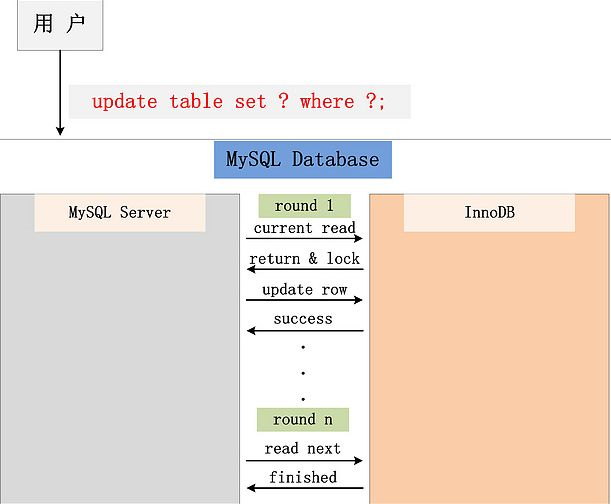

从上图中，我们可以看出一个update操作的具体流程。当update SQL被发给MySQL后，MySQL Server会根据where条件，读取第一条满足条件的记录，然后InnoDB引擎会将第一条记录返回，并加锁 (current read)。待MySQL Server收到这条加锁的记录之后，会再发起一个update请求，更新这条记录。一条记录操作完成，再读取下一条记录，直至没有满足条件的记录为止。因此，update操作内部，就包含了一个当前读。同理，delete操作也一样。insert操作会稍微有些不同，简单来说，就是insert操作可能会触发Unique Key的冲突检查，也会进行一个当前读。

### 关于死锁

>  死锁是指两个或者两个以上的事务在执行的过程中，因争夺资源而造成的一种互相等待的现象。若无外力作用，这两个事务将保持等待状态，无法推进下去。很明显，这是我们不想看到的。

  从上面的概念可以看出，死锁的关键点在于互相等待，如果我们要解决死锁的问题，就要从“等待”这个关键词上面入手，如果我们将等待都转化为回滚操作，并且事务都重新开始，这种方法无疑可以避免死锁问题的产生。但是会导致数据库并发性能的降低，这样的问题也是我们无法接受的。

  为了解决这一问题，我们采用一种超时的方法进行折中进行处理，超时是指当两个事务互相等待时，当某一方的等待时间超过一个阈值，我们将它进行回滚，这样，另一个事务就能够继续进行，在innodb存储引擎中，我们使用参数innodb_lock_wait_timeout来设置超时时间，这个参数如下：

```sql
mysql> show variables like "innodb_lock_wait_timeout";
+--------------------------+-------+
| Variable_name            | Value |
+--------------------------+-------+
| innodb_lock_wait_timeout | 50    |
+--------------------------+-------+
1 row in set, 1 warning (0.11 sec)
```

  为了加深印象，我们模拟一个死锁的现象，让大家感受一下。

  首先，要模拟死锁，程序必须并发运行，串行的方法是无法模拟死锁的，这里我们采用两个连接会话进行模拟：

**会话A**

**我们先开启事务，然后锁定id=3的行；**

```sql
mysql> select * from t;
+----+-----+
| id | age |
+----+-----+
|  1 |   5 |
|  2 |   4 |
|  3 |   3 |
|  4 |   2 |
|  5 |   1 |
+----+-----+
5 rows in set (0.00 sec)

mysql> begin;
Query OK, 0 rows affected (0.00 sec)

mysql> select * from t where id=3 for update;
+----+-----+
| id | age |
+----+-----+
|  3 |   3 |
+----+-----+
1 row in set (0.02 sec)
```

**会话B**

**在会话B上锁定id=2的行**

```sql
mysql> begin
    -> ;
Query OK, 0 rows affected (0.00 sec)
mysql> select * from t where id=2 for update;
+----+-----+
| id | age |
+----+-----+
|  2 |   4 |
+----+-----+
1 row in set (0.00 sec)
```

**会话A**

**我们在会话A上获取id=2的记录的锁，发现无法获取，产生了等待：**

```sql
mysql> select * from t where id=2 for update;
##产生等待

mysql>
```

**会话B**

在会话A进行等待的过程中，我们在会话B上面获取id=3的记录的锁，我们发现了两个变化：

第一、会话B上输出了死锁的提示信息，如下；

```sql
mysql> select * from t where id=3 for update;
ERROR 1213 (40001): Deadlock found when trying to get lock; try restarting traction

mysql>
```

第二、会话A上输出了id=2的记录，也就是A会话得到了特定的资源，但是产生了9s的延迟，如下；

**会话A**

```sql
mysql> select * from t where id=2 for update;
+----+-----+
| id | age |
+----+-----+
|  2 |   4 |
+----+-----+
1 row in set (9.04 sec)

mysql>
```

  在上述操作中，会话B抛出了1213这个错误状态码，它代表事务发生了死锁，死锁的原因是会话A和B的资源进行了相互等待，但是此时我们发现会话B中抛出死锁提示信息之后会话A中立即得到了记录为2的这个资源，这其实是因为会话B中的事务发生了回滚，否则的话，会话A中的事务是不可能得到相应的资源的。

  这里又不得不提innodb的一个特性，那就是它会回滚死锁情况下的一个事务，因此当我们在程序中捕获了一个1213的错误，其实不需要我们手动进行回滚。

## Innodb数据页简介

  页是内存和磁盘交互的基本单位，它的大小一般是16KB，可以被分为如下几个部分：

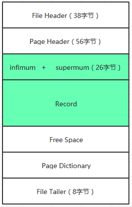

  上次的文章里面，我们对这几个部分大概做了介绍，今天我们说说上面数据页的蓝色部分。

  该部分保存的是数据页中真正的数据记录，也就是用户存储的记录。当我们一开始生成页的时候，其实并没有蓝色的Record部分，而是随着我们不断给数据库中插入记录，才逐渐从Free Space中划分出来的空间。用示意图来描述就是：


 如果Free Space中的数据页被分配完了，则去申请新的数据页。

为了方便理解，我们现在创建一个表进行演示：

```sql
CREATE TABLE test(
    ->     c1 INT,
    ->     c2 INT,
    ->     c3 VARCHAR(1000),
    ->     PRIMARY KEY (c1)
    -> ) engine=innodb charset=utf8;
Query OK, 0 rows affected (0.03 sec)
```

现在我们给这个表里面插入几条数据：

```sql
insert into test values
(1,2,'a'),
(2,3,'bb'),
(3,4,'ccc'),
(4,5,'dddd');
```

我们可以把上面的数据页结构简单表示如下：

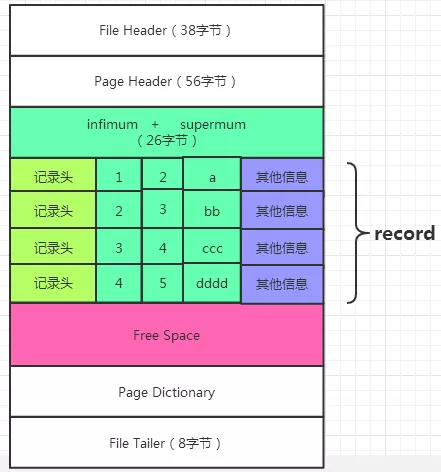

  我们可以看到，每条记录由三个部分构成，分别是记录头、记录数据以及其他信息，其中记录头里面包含很多字段来表示该条记录的信息，这些字段我们会逐渐进行讲解。目前4条记录都已经插入到record部分了，在实际过程中这四条记录是通过链表的方式进行连接的，如下：


  在第一张图的数据页中，蓝色部分还有一部分是infimum和supermun，它们是两条伪记录，它们分别是这个数据页中"指定的"最大的记录和最小的记录。它们的作用是作为当前数据页内数据链表的首末两端。这样，数据页中的数据就可以被我们排列成下面的样子：

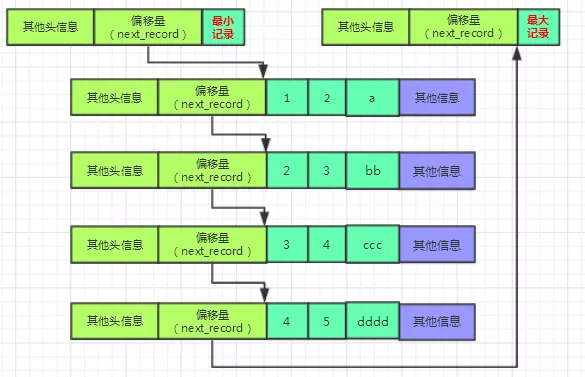

  我们已经可以看到，我们的主键按照从大到小的顺序形成了一个链表，链表的首末位置分别是两条伪记录。

  当我们对数据记录中id=2的一条记录进行删除时，实际上，在数据记录链表里面发生的变化如下：


  可以看出，实际上并没有删除那条记录，而是通过将头信息中的delete标识位改为1、偏移量改为0来实现的，也就是说，这条记录所占用的空间并没有还给Free Space，当下一次插入id=2的记录的时候，这块空间还可以接着使用。

  在这个过程中，我们加入了record_type字段，这两条伪记录和正常记录的区别之处在于数据记录的头信息里面的record_type字段，最小记录的record_type为2，最大记录的record为3，正常记录的record_type为0，record_type为1的记录，稍后我们会进行解释。

  到现在为止，我们已经知道了头信息中的3个字段，分别是next_record和record_type以及delete字段，next_record保存的是下一条数据记录的真是数据的偏移量，record_type代表的是数据记录的类型，delete标示的是该字段是否被删除。除此之外，我们还需要知道记录头信息里面的另外一个字段n_owned，这个字段保存的是改组内一共有多少个数据记录，在上述删除的操作中，最大记录中该字段的变化过程如下：


  关于这个初始值为何是5，后续的文章中我们会说明。至此，我们已经了解到，一个数据页，大概可以描述成如下形式：


## MySQL锁优化

### MySQL 锁分类

当多个事务或者进程访问同一个资源的时候，为了保证数据的一致性，就需要用到锁机制。

从锁定资源的角度来看，MySQL 中的锁分为：

- **表级锁**
- **行级锁**
- **页面锁**


**表级锁：**对整张表加锁。开销小，加锁快；不会出现死锁；锁定粒度大，发生锁冲突的概率最高，并发度最低。 

**行级锁：**对某行记录加锁。开销大，加锁慢；会出现死锁；锁定粒度最小，发生锁冲突的概率最低，并发度也最高。

**页面锁：**开销和加锁时间界于表锁和行锁之间；会出现死锁；锁定粒度界于表锁和行锁之间，并发度一般。


在实际开发过程中，主要会使用到表级锁和行级锁两种。既然锁是针对资源的，那么这些资源就是数据，在 MySQL 提供插件式存储引擎对数据进行存储。

插件式存储引擎的好处是，开发人员可以根据需要选择适合的存储引擎。

在众多的存储引擎中，有两种引擎被比较多的使用，他们分别是：

- **MyISAM 存储引擎，**它不支持事务、表锁设计，支持全文索引，主要面向一些在线分析处理（OLAP）数据库应用。说白了主要就是查询数据，对数据的插入，更新操作比较少。

- **InnoDB 存储引擎，**它支持事务，其设计目标主要面向在线事务处理（OLTP）的应用。

  其特点是行锁设计、支持外键，并支持类似于 Oracle 的非锁定读，即默认读取操作不会产生锁。

  简单来说，就是对数据的插入，更新操作比较多。从 MySQL 数据库 5.5.8 版本开始，InnoDB 存储引擎是默认的存储引擎。

上面两种存储引擎在处理多进程数据操作的时候是如何表现的，就是我们接下来要讨论的问题。

为了让整个描述更加清晰，我们将表级锁和行级锁以及 MyISAM，InnoDB 存储引擎，就形成了一个 2*2 的象限。

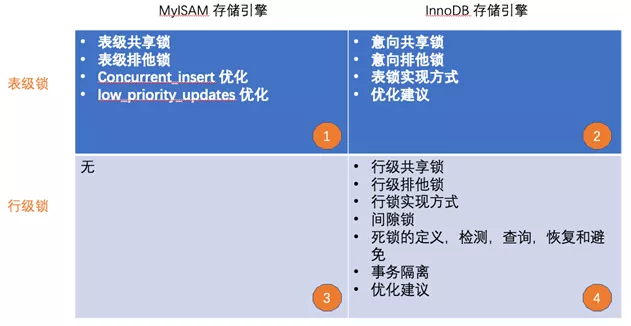

<center>*2\*2 表行锁，MyISAM，InnoDB 示意图*</center>

由于 MyISAM 存储引擎不支持行级锁，实际上后面讨论的问题会围绕三个象限的讨论展开。

从内容上来看，InnoDB 作为使用最多的存储引擎遇到的问题和值得注意的地方较多，也是本文的重点。

MyISAM 存储引擎和表级锁


首先，来看第一象限的内容：

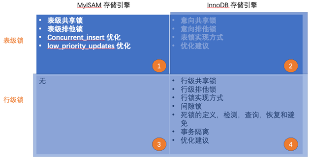

<center>*2\*2 表行锁，MyISAM，InnoDB 示意图-第一象限*</center>

MyISAM 存储引擎支持表级锁，并且支持两种锁模式：

- **对 MyISAM 表的读操作（共享锁），**不会阻塞其他进程对同一表的读请求，但会阻塞对其的写请求。当读锁释放后，才会执行其他进程的写操作。
- **对 MyISAM 表的写操作（排他锁），**会阻塞其他进程对同一表的读写操作，当该锁释放后，才会执行其他进程的读写操作。

### MyISAM 优化建议

在使用 MyISAM 存储引擎时。执行 SQL 语句，会自动为 SELECT 语句加上共享锁，为 UDI（更新，删除，插入）操作加上排他锁。

由于这个特性在多进程并发插入同一张表的时候，就会因为排他锁而进行等待。

因此可以通过配置 concurrent_insert 系统变量，来控制其并发的插入行为。

**①concurrent_insert=0 时，**不允许并发插入。

**②concurrent_insert=1 时，**如果 MyISAM 表中没有空洞（即表中没有被删除的行），允许一个进程读表时，另一个进程向表的尾部插入记录（MySQL 默认设置）。

> 注：空洞是行记录被删除以后，只是被标记为“已删除”其存储空间没有被回收，也就是说没有被物理删除。由另外一个进程，异步对这个数据进行删除。
>
> 因为空间长度问题，删除以后的物理空间不能被新的记录所使用，从而形成了空洞。


**③concurrent_insert=2 时，**无论 MyISAM 表中有没有空洞，都允许在表尾并发插入记录。


如果在数据插入的时候，没有并发删除操作的话，可以尝试把 concurrent_insert 设置为 1。

反之，在数据插入的时候有删除操作且量较大时，也就是会产生“空洞”的时候，就需要把 concurrent_insert 设置为 2。

另外，当一个进程请求某个 MyISAM 表的读锁，另一个进程也请求同一表的写锁。

即使读请求先到达，写请求后到达，写请求也会插到读请求之前。因为 MySQL 的默认设置认为，写请求比读请求重要。

我们可以通过 low_priority_updates 来调节读写行为的优先级：

- 数据库以读为主时，要优先保证查询性能时，可通过 low_priority_updates=1 设置读优先级高于写优先级。
- 数据库以写为主时，则不用设置 low_priority_updates 参数。

### InnoDB 存储引擎和表级锁

再来看看第二象限的内容：

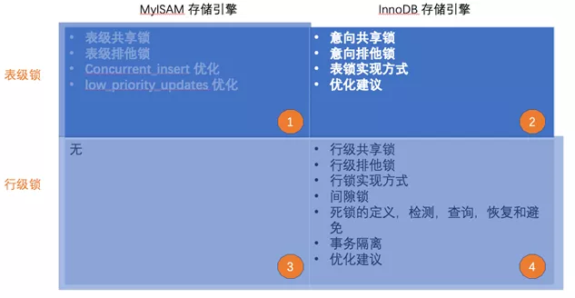

<center>*2\*2 表行锁，MyISAM，InnoDB 示意图-第二象限*</center>


InnoDB 存储引擎表锁。当没有对数据表中的索引数据进行查询时，会执行表锁操作。

上面是 InnoDB 实现行锁，同时它也可以实现表锁。其方式就是意向锁（Intention Locks）。

这里介绍两种意向锁：

- **意向共享锁（IS）：**事务打算给数据行加行共享锁，事务在给一个数据行加共享锁前，必须先取得该表的 IS 锁。
- **意向排他锁（IX）：**事务打算给数据行加行排他锁，事务在给一个数据行加排他锁前，必须先取得该表的 IX 锁。


> 注：意向共享锁和意向排他锁是数据库主动加的，不需要我们手动处理。对于 UPDATE、DELETE 和 INSERT 语句，InnoDB 会自动给数据集加排他锁。


**InnoDB表锁的实现方式：**假设有一个表 test2，有两个字段分别是 id 和 name。

没有设置主键同时也没有设置任何索引（index）如下：

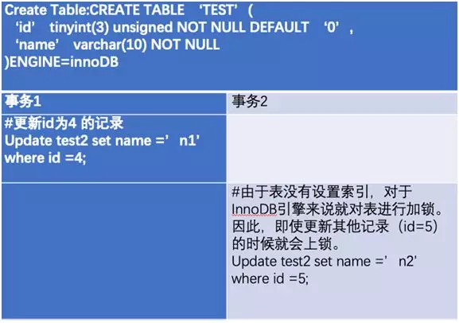

<center>*InnoDB 表锁实现方式图*</center>

### InnoDB 存储引擎和行级锁

第四象限我们使用的比较多，讨论的内容也相对多些：


<center>*2\*2 表行锁，MyISAM，InnoDB 示意图-第四象限*</center>


InnoDB 存储引擎行锁，当数据查询时针对索引数据进行时，会使用行级锁。

**共享锁（S）：**当一个事务读取一条记录的时候，不会阻塞其他事务对同一记录的读请求，但会阻塞对其的写请求。当读锁释放后，才会执行其他事务的写操作。

例如：select … lock in share mode


**排他锁（X）：**当一个事务对一条记录进行写操作时，会阻塞其他事务对同一表的读写操作，当该锁释放后，才会执行其他事务的读写操作。

例如：select … for update


**行锁的实现方式：**假设有一个表 test1，有两个字段分别是 id 和 name。

id 作为主键同时也是 table 的索引（index）如下：

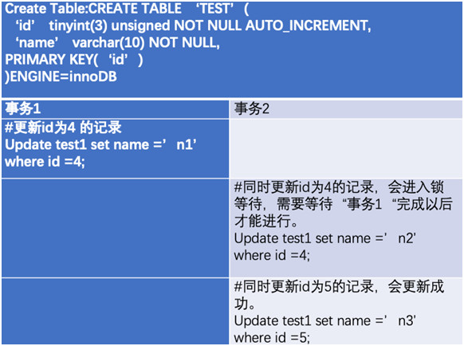

<center>*InnoDB 行锁实现方式图*</center>


在高并发的情况下，多个事务同时请求更新数据，由于资源被占用等待事务增多。

如此，会造成性能问题，可以通过 innodb_lock_wait_timeout 来解决。innodb_lock_wait_timeout 是事务等待获取资源的最长时间，单位为秒。如果超过时间还未分配到资源，则会返回应用失败。

### 四种锁的兼容情况


<center>*共享锁，排他锁，意向共享锁，意向排他锁兼容图例*</center>


如果一个事务请求的锁模式与当前的锁兼容， InnoDB 就将请求的锁授予该事务；反之， 如果两者不兼容，该事务就要等待锁释放。

#### **间隙锁**

前面谈到行锁是针对一条记录进行加锁。当对一个范围内的记录加锁的时候，我们称之为间隙锁。

当使用范围条件索引数据时，InnoDB 会对符合条件的数据索引项加锁。对于键值在条件范围内但并不存在的记录，叫做“间隙（GAP)”，InnoDB 也会对这个“间隙”加锁，这就是间隙锁。间隙锁和行锁合称（Next-Key锁）。

如果表中只有 11 条记录，其 id 的值分别是 1,2,...,10，11 下面的 SQL：

```sql
Select * from table_gapwhere id > 10 for update;
```

这是一个范围条件的检索，InnoDB 不仅会对符合条件的 id 值为 10 的记录加锁，会对 id 大于 10 的“间隙”加锁，即使大于 10 的记录不存在，例如 12，13。

**InnoDB 使用间隙锁的目的：**

- 一方面是为了防止幻读。对于上例，如果不使用间隙锁，其他事务插入了 id 大于 10 的任何记录，本事务再次执行 select 语句，就会发生幻读。
- 另一方面，也是为了满足恢复和复制的需要。


<center>*间隙锁图*</center>


#### **死锁**

两个事务都需要获得对方持有的排他锁才能继续完成任务，这种互相等待对方释放资源的情况就是死锁。

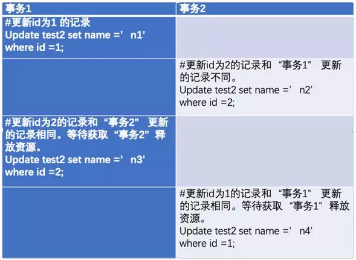

<center>*死锁图*</center>


**检测死锁：**InnoDB 存储引擎能检测到死锁的循环依赖并立即返回一个错误。

**死锁恢复：**死锁发生以后，只有部分或完全回滚其中一个事务，才能打破死锁。

InnoDB 方法是，将持有最少行级排他锁的事务回滚。在应用程序设计时必须考虑处理死锁，多数情况下重新执行因死锁回滚的事务即可。

**避免死锁：**

- 在事务开始时，如果有记录要修改，先使用 SELECT... FOR UPDATE 语句获取锁，即使这些修改语句是在后面执行。 

- 在事务中，如果要更新记录，直接申请排他锁。而不是查询时申请共享锁、更新时再申请排他锁。

  这样做会导致，当申请排他锁时，其他事务可能已经获得了相同记录的共享锁，从而造成锁冲突，甚至死锁。

  简单来说，如果你要更新记录要做两步操作，第一步查询，第二步更新。就不要第一步上共享锁，第二部上排他锁了，直接在第一步就上排他锁，抢占先机。

- 如果事务需要锁定多个表，那么尽量按照相同的顺序使用加锁语句，可以降低产生死锁的机会。

- 通过 SELECT ... LOCK INSHARE MODE（共享锁）获取行的读锁后，如果当前事务再需要对该记录进行更新操作，则很有可能造成死锁。所以，如果要对行记录进行修改，直接上排他锁。

- 改变事务隔离级别（事务隔离级别在后面详细说明）。

#### **MySQL 锁定情况的查询**

在实际开发中无法避免数据被锁的问题，那么我们可以通过哪些手段来查询锁呢？

表级锁可以通过两个变量的查询：

- Table_locks_immediate，产生表级锁的次数。
- Table_locks_waited，数显表级锁而等待的次数。

行级锁可以通过下面几个变量查询：

- Innodb_row_lock_current_waits，当前正在等待锁定的数量。
- Innodb_row_lock_time（重要），从系统启动到现在锁定总时长。
- Innodb_row_lock_time_avg（重要），每次等待所花平均时间。
- Innodb_row_lock_time_max，从系统启动到现在等待最长的一次花费时间。
- Innodb_row_lock_waits（重要），从系统启动到现在总共等待的次数。

**MySQL 事务隔离级别**

前面讲的死锁是因为并发访问数据库造成。当多个事务同时访问数据库，做并发操作的时候会发生以下问题。

**脏读（dirty read），**一个事务在处理过程中，读取了另外一个事务未提交的数据。未提交的数据称之为脏数据。

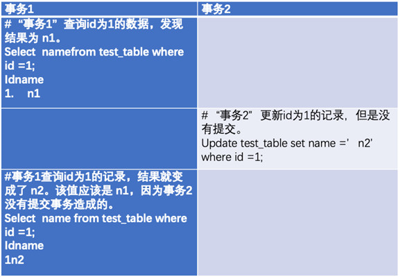

<center>*脏读例子*</center>


**不可重复读（non-repeatable read），**在事务范围内，多次查询某条记录，每次得到不同的结果。

第一个事务中的两次读取数据之间，由于第二个事务的修改，第一个事务两次读到的数据可能不一样。

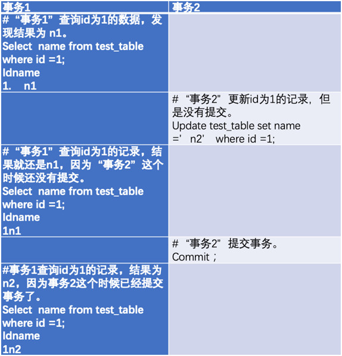

<center>*不可重复读例子*</center>

**幻读（phantom read），**是事务非独立执行时发生的一种现象。

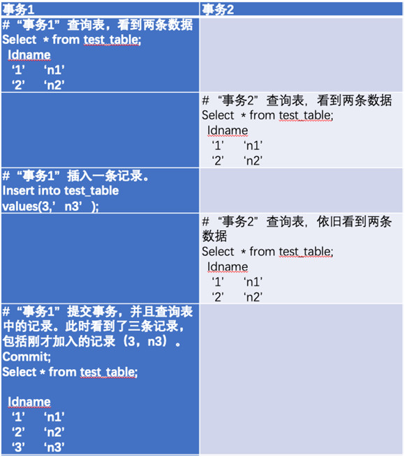

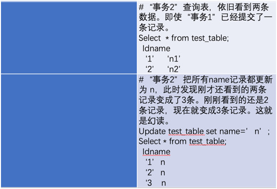

<center>*幻读的例子*</center>

在同一时间点，数据库允许多个并发事务，同时对数据进行读写操作，会造成数据不一致性。


<center>*四种隔离级别，解决事务并发问题对照图*</center>

隔离性就是用来防止这种数据不一致的。事务隔离根据级别不同，从低到高包括：

- **读未提交（read uncommitted）：**它是最低的事务隔离级别，一个事务还没提交时，它做的变更就能被别的事务看到。有脏读的可能性。

- **读提交（read committed）：**保证一个事物提交后才能被另外一个事务读取。另外一个事务不能读取该事物未提交的数据。可避免脏读的发生，但是可能会造成不可重复读。

- **可重复读（repeatable read MySQL 默认方式）：**多次读取同一范围的数据会返回第一次查询的快照，即使其他事务对该数据做了更新修改。事务在执行期间看到的数据前后必须是一致的。

- **串行化（serializable）：**是最可靠的事务隔离级别。“写”会加“排他锁”，“读”会加“共享锁”。

  当出现读写锁冲突的时候，后访问的事务必须等前一个事务执行完成，所以事务执行是串行的。可避免脏读、不可重复读、幻读。

### InnoDB 优化建议

从锁机制的实现方面来说，InnoDB 的行级锁带来的性能损耗可能比表级锁要高一点，但在并发方面的处理能力远远优于 MyISAM 的表级锁。这也是大多数公司的 MySQL 都是使用 InnoDB 模式的原因。

但是，InnoDB 也有脆弱的一面，下面提出几个优化建议供大家参考：

- 尽可能让数据检索通过索引完成，避免 InnoDB 因为无法通过索引加行锁，而导致升级为表锁的情况。换句话说就是，多用行锁，少用表锁。
- 加索引的时候尽量准确，避免造成不必要的锁定影响其他查询。
- 尽量减少给予范围的数据检索（间隙锁），避免因为间隙锁带来的影响，锁定了不该锁定的记录。
- 尽量控制事务的大小，减少锁定的资源量和锁定时间。
- 尽量使用较低级别的事务隔离，减少 MySQL 因为事务隔离带来的成本。

### 总结


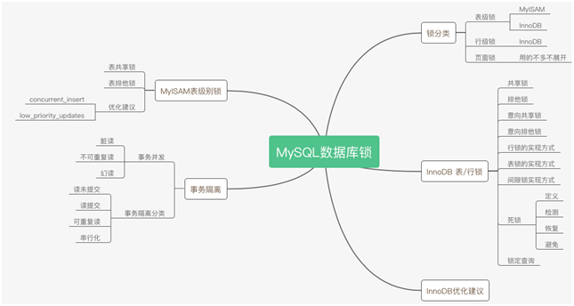

<center>*MySQL 数据库锁的思维导图*</center>


MySQL 的锁主要分为表级锁和行级锁。MyISAM 引擎使用的是表级锁，针对表级的共享锁和排他锁，可以通过 concurrent_insert 和 low_priority_updates 参数来优化。

InnoDB 支持表锁和行锁，根据索引来判断如何选择。行锁有，行共享锁和行排他锁；表锁有，意向共享锁，意向排他锁，表锁是系统自己加上的；锁范围的是间隙锁。遇到死锁，我们如何检测，恢复以及如何避免。

MySQL 有四个事务级别分别是，***读未提交，读提交，可重复读，串行化***。他们的隔离级别依次升高。

通过隔离级别的设置，可以避免，脏读，不可重复读和幻读的情况。最后，对于使用比较多的 InnoDB 引擎，提出了一些优化建议。