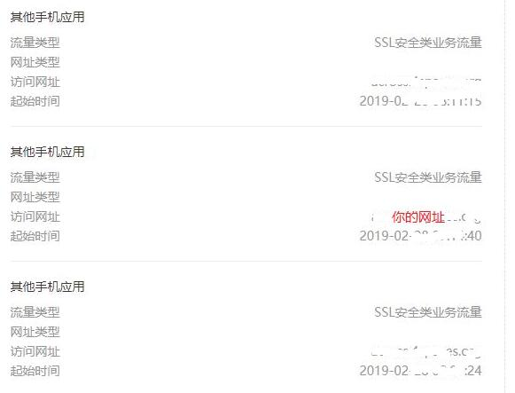

> 文章转载自[centos7基于nginx搭建v2ray服务端配置vmess+tls+websocket完全手册](https://www.4spaces.org/v2ray-nginx-tls-websocket/)，根据实际搭建情况，略有修改

一直都是使用[自建shadowsocks科学上网](https://www.4spaces.org/0-1-shadowsocks-start/)，服务很稳定，虽然v2ray出现了很久，但是没花心思研究两者之间有什么区别。后来无意间查询自己手机的上网记录，出现下图信息，我感觉还是让上网更隐蔽一点更好。

<!-- more -->


怎么让手机上网记录看起来更正常一点呢？v2ray服务端配置vmess+tls+websocket就是一种解决方式，下面是我使用这种方式之后手机上网记录信息：



接下来就是我实现上述情形的解决过程记录。

## 环境准备

- VPS : [推荐一下搬瓦工：史上最详细搬瓦工VPS注册/购买图文教程(内附优惠券)](https://www.4spaces.org/best-details-to-buy-banwagonhost/)；
- 一个域名，推荐去godaddy注册，注册之前最好找一下优惠券；
- vps部署Nginx并启用tls安装证书；

相关文章推荐：

- [如何在Digitalocean上构建一个服务器？](https://www.4spaces.org/create-a-dg-account-and-connect-droplets/)
- [CentOS 7通过yum安装Nginx](https://www.4spaces.org/centos-yum-install-nginx/)
- [Nginx启用Let’s Encrypt SSL证书。](https://www.4spaces.org/nginx-lets-encrypt-ssl/)

请继续下一步之前，先依次完成下列步骤：

- 注册一个自己的VPS服务器；
- 注册一个自己的域名并解析到自己的VPS；(可通过[noip](https://www.noip.com/)免费获取三个域名)
- 登录VPS并安装部署Nginx；
- 完成域名的https SSL安全证书启用；

只有完成上面的步骤在继续下面操作，才能实现v2ray服务端配置vmess+tls+websocket。

我的环境：

- 服务器系统：Digitalocean CentOS 7.5 x64 ；
- v2ray版本：v4.17.0；
- nginx版本：nginx/1.14.2 (CentOS)；
- 证书：Let’s Encrypt certbot-0.31.0；
- v2rayN：2.22

## 安装v2ray

安装过程很简单，只要能正常连接自己的VPS并进行登录，然后执行一下安装命令即可，安装过程参考：[2020年最新v2ray搭建详细图文教程(从小白到老炮)](https://www.4spaces.org/build-v2ray-from-0-to-1/)，重要的接下来的配置过程。

## 配置v2ray服务端

假设你的域名是v2ray.com，并将二级域名`hi.v2ray.com`解析到你的VPS。

执行下面的命令，开始配置v2ray:

```
[root@ss-us ~]# vi /etc/v2ray/config.json 
```

按`i`键编辑文件，把内容更改为下面的内容：

```
{
  "log": {
    "access": "/var/log/v2ray/access.log",
    "error": "/var/log/v2ray/error.log",
    "loglevel": "warning"
  },
  "inbounds": [
    {
      "port": 33684,
      "listen": "127.0.0.1",
      "protocol": "vmess",
      "settings": {
        "clients": [
          {
            "id": "0c67ca68-63ad-40c5-898e-9cf1925c8694",
            "level": 1,
            "alterId": 64
          }
        ]
      },
      "streamSettings": {
        "network": "ws",
        "wsSettings": {
          "path": "/v2ray"
        }
      }
    }
  ],
  "outbounds": [
    {
      "protocol": "freedom",
      "settings": {}
    },
  ]
}
```

## 配置Nginx

执行下面的命令，开始配置nginx:

```
[root@ss-us ~]# vi /etc/nginx/conf.d/v2ray.conf 
```

按`i`键编辑文件，把内容更改为下面的内容：

```
server{
    listen 80;
    server_name hi.v2ray.com;
    root /etc/nginx/html;
    index index.html;

}

server {
    listen 443 ssl http2 default_server;
    server_name hi.v2ray.com;

    ssl_certificate /etc/letsencrypt/live/hi.v2ray.com/fullchain.pem;
    ssl_certificate_key /etc/letsencrypt/live/hi.v2ray.com/privkey.pem;

    root /etc/nginx/html;
    index index.html;

    location /v2ray {
        proxy_redirect off;
        proxy_pass http://127.0.0.1:33684;
        proxy_http_version 1.1;
        proxy_set_header Upgrade $http_upgrade;
        proxy_set_header Connection "upgrade";
        proxy_set_header Host $http_host;
    }
}
```

**注意：**

- `proxy_pass http://127.0.0.1:33684;` 这里的`33684`需要跟v2ray配置文件`config.json`端口对应；
- `root /etc/nginx/html`及`location /etc/nginx/html`行，需要与nginx实际根目录对应；

## 重启v2ray、nginx服务

```
systemctl restart v2ray

systemctl restart nginx
```

## 客户端界面配置

这里我是用[v2rayN](https://github.com/2dust/v2rayN/releases)，配置如下：


## 常见问题

1）[使用v2ray访问谷歌提示异常流量](https://www.4spaces.org/v2ray-google-check/)；
2）[启用cloudflare cdn之后v2ray报403错误](https://www.4spaces.org/v2ray-cloudflare-cdn-403/)；

## 温馨提示

上述文章是`ws + tls`搭建v2ray的详细步骤，如果想快速、简洁、标准搭建，请参考：[在docker-compose环境下以ws+tls方式搭建v2ray(So easy)](https://www.4spaces.org/docker-compose-install-v2ray-ws-tls/) 。