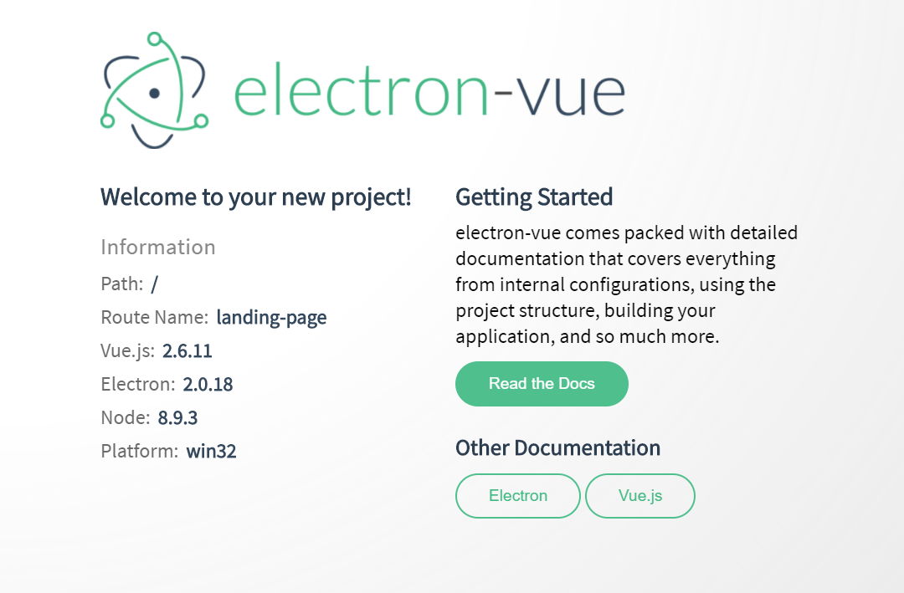
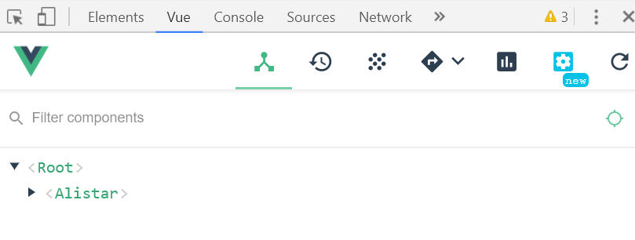

# Electron概述


1. [GitHub](https://github.com/electron/electron) 官网不翻墙太卡，本着能偷懒就偷懒，GayHub就够了，不用翻官网了
2. [中文文档](https://github.com/electron/i18n/tree/master/content/zh-CN)
3. [W3C教程](https://www.w3cschool.cn/electronmanual/wcx31ql6.html)

# VUE概述


1. [GitHub](https://github.com/vuejs/vue)
2. [VUE官网](https://cn.vuejs.org/) 官网资料齐全，中英文档都齐备，基本看完够搞个工程了

# Electron + Vue 联合使用

## 安装Nodejs

安装成功之后`node -v`，会显示版本，版本可以不用这么新，看心情安装。

```css
$ node -v
v12.14.0
```

## 搭建Vue开发环境

直接使用脚手架工具vue-cli，因为在国内的npm非常慢，所以需要重新设置npm镜像，设置为淘宝的镜像

```bash
npm config set registry https://registry.npm.taobao.org/
```

我们可以看一下镜像地址是：

```bash
vue npm config get registry  
https://registry.npm.taobao.org/
```

如果不想修改默认npm地址，也可以[设置cnpm](https://npm.taobao.org/)(因为自带翻墙光环，考虑到后面可能不方便翻墙，后面全程优先使用墙内网络操作。)

```bash
npm install -g cnpm --registry=https://registry.npm.taobao.org
//输入命令,查看是否安装成功
cnpm 
```

安装脚手架工具：

```bash
npm install --global vue-cli
```

安装web-pack：

```bash
npm install -g webpack
```

yarn 使用国内镜像

```bash
yarn config set registry https://registry.npm.taobao.org
yarn config list
```

### 什么是Yarn和NPM?

**Yarn:Yet Another Resource Negotiator，是一个快速、可靠、安全的依赖管理工具，一款新的JavaScript包管理工具。**

Yarn工作流：

 

Yarn使用方法：[https://yarn.bootcss.com/docs/usage](https://yarn.bootcss.com/docs/usage/)/

Yarn使用方法-如图：


 

Yarn是什么：https://yarn.bootcss.com

Npm是什么 :https://www.npmjs.cn/

### yarn和npm命令对比

#### 一、命令对比

|                yarn                 |                     npm                     | 命令功能                                |
| :---------------------------------: | :-----------------------------------------: | :-------------------------------------- |
|         **`yarn install`**          |              **`npm install`**              | **根据`pack.json`安装项目所需的依赖包** |
|      **`yarn install --flat`**      |                  **`--`**                   | **注释1**                               |
|  **`yarn install --no-lockfile`**   |     **`npm install --no-package-lock`**     | **不读取或生成`yarn.lock`锁文件**       |
| **`yarn install --pure-lockfile`**  |                  **`--`**                   | **不要生成`yarn.lock`锁文件**           |
|      **`yarn add [package]`**       |         **`npm install [package]`**         | **安装需要的依赖包**                    |
|   **`yarn add [package] --dev`**    |   **`npm install [package] --save-dev`**    | **注释2**                               |
|    **`yarn add [package] --D`**     |   **`npm install [package] --save-dev`**    | **同上**                                |
|   **`yarn add [package] --peer`**   |                  **`--`**                   | **注释3**                               |
|    **`yarn add [package] --P`**     |                  **`--`**                   | **同上**                                |
| **`yarn add [package] --optional`** | **`npm install [package] --save-optional`** | **注释4**                               |
|    **`yarn add [package] --O`**     | **`npm install [package] --save-optional`** | **同上**                                |
|  **`yarn add [package] --exact`**   |  **`npm install [package] --save-exact`**   | **注释5**                               |
|    **`yarn add [package] --E`**     |  **`npm install [package] --save-exact`**   | **同上**                                |
|   **`yarn global add [package]`**   |    **`npm install [package] --global`**     | **全局安装依赖包**                      |
|      **`yarn global upgrade`**      |          **`npm update --global`**          | **全局更新依赖包**                      |
|       **`yarn add --force`**        |              **`npm rebuild`**              | **更改包内容后进行重建**                |
|     **`yarn remove [package]`**     |        **`npm uninstall [package]`**        | **卸载已经安装的依赖包**                |
|  **`yarn cache clean [package]`**   |            **`npm cache clean`**            | **注释6**                               |
|         **`yarn upgrade`**          |  **`rm -rf node_modules && npm install`**   | **更新依赖包**                          |
|     **`yarn version --major`**      |           **`npm version major`**           | **更新依赖包的版本**                    |
|     **`yarn version --minor`**      |           **`npm version minor`**           | **更新依赖包的版本**                    |
|     **`yarn version --patch`**      |           **`npm version patch`**           | **更新依赖包的版本**                    |

#### 二、命令注释

- **注释1** ：安装所有依赖项，但每个依赖项只允许一个版本。在第一次运行时，这将提示你为多版本的依赖包选择一个版本，进行安装。这些将添加到您package.json的 resolutions字段下。


```json
"resolutions": {
  "package-a": "2.0.0",
  "package-b": "5.0.0",
  "package-c": "1.5.2"
}
```

- **注释2** ：安装所需的依赖包，并将该包的记录写到`package.json`文件的 **devDependencies** 选项中。


```json
"devDependencies": {
    "autoprefixer": "^7.1.2",
    "babel-core": "^6.22.1",
    "babel-helper-vue-jsx-merge-props": "^2.0.3",
    "babel-loader": "^7.1.1",
    "babel-plugin-syntax-jsx": "^6.18.0",
}
```

- **注释3** ：安装所需的依赖包，并将该包的记录写到`package.json`文件的 **peerDependencies** 选项中。
- **注释4** ：安装所需的依赖包，并将该包的记录写到`package.json`文件的 **optionalDependencies** 选项中。
- **注释5** ：安装依赖包的确切版本，默认设置是使用依赖包的最新版本。例如， `yarn add foo@1.2.3`将接受版本1.9.1，但 `yarn add foo@1.2.3 --exact` 只接受版本1.2.3。
- **注释6** ：运行此命令将清除全局缓存依赖包。当再次yarn或yarn install运行，进行下载依赖包

## 安装Electron

```bash
 cnpm install -g electron
```

验证

```bash
>electron -v

 v7.1.10
```

## 搭建electron-vue项目

### 相关文档

- [electron-vue](https://simulatedgreg.gitbooks.io/electron-vue/content/cn/)文档

### 使用electron-vue脚手架工具初始化项目

可能会比较慢，可以通过webpack方式初始化vue项目，然后在引入electron方式，这个会快很多

```bash
$ vue init simulatedgreg/electron-vue alistar

? Application Name alistar
? Application Id org.evue.alistar
? Application Version 0.0.1
? Project description 哞利斯塔, 快乐辅助
? Use Sass / Scss? Yes
? Select which Vue plugins to install axios, vue-electron, vue-router, vuex, vuex-electron
? Use linting with ESLint? Yes
? Which ESLint config would you like to use? Standard
? Set up unit testing with Karma + Mocha? Yes
? Set up end-to-end testing with Spectron + Mocha? Yes
? What build tool would you like to use? builder
? author vincentruan <rzw0813@gmail.com>

   vue-cli · Generated "alistar".

---

All set. Welcome to your new electron-vue project!

Make sure to check out the documentation for this boilerplate at
https://simulatedgreg.gitbooks.io/electron-vue/content/.

Next Steps:

  $ cd alistar
  $ yarn (or `npm install`)
  $ yarn run dev (or `npm run dev`)

```

上面已经有提示下一步做什么了，`cd alistar`目录下，之后对照执行，如果用yarn记得设置代理或者用国内镜像。

```bash
$ cnpm install
| [22/67] Installing get-stdin@^4.0.1platform unsupported babel-loader@7.1.5 › webpack@4.41.5 › watchpack@1.6.0 › chokidar@2.1.8 › fsevents@^1.2.7 Package require os(darwin) not compatible with your platform(win32)
[fsevents@^1.2.7] optional install error: Package require os(darwin) not compatible with your platform(win32)
√ Installed 67 packages
√ Linked 1218 latest versions
[1/7] scripts.postinstall babel-core@6.26.3 › babel-register@6.26.0 › core-js@^2.5.0 run "node -e \"try{require('./postinstall')}catch(e){}\"", root: "D:\\gitspace\\alistar\\node_modules\\_core-js@2.6.11@core-js"
Thank you for using core-js ( https://github.com/zloirock/core-js ) for polyfilling JavaScript standard library!

The project needs your help! Please consider supporting of core-js on Open Collective or Patreon:
> https://opencollective.com/core-js
> https://www.patreon.com/zloirock

Also, the author of core-js ( https://github.com/zloirock ) is looking for a good job -)

[1/7] scripts.postinstall babel-core@6.26.3 › babel-register@6.26.0 › core-js@^2.5.0 finished in 2s
[2/7] scripts.postinstall electron-builder@20.44.4 › app-builder-lib@20.44.4 › ejs@^2.6.2 run "node ./postinstall.js", root: "D:\\gitspace\\alistar\\node_modules\\_ejs@2.7.4@ejs"
Thank you for installing EJS: built with the Jake JavaScript build tool (https://jakejs.com/)

[2/7] scripts.postinstall electron-builder@20.44.4 › app-builder-lib@20.44.4 › ejs@^2.6.2 finished in 2s
[3/7] scripts.postinstall electron@^2.0.4 run "node install.js", root: "D:\\gitspace\\alistar\\node_modules\\_electron@2.0.18@electron"
Downloading SHASUMS256.txt
[============================================>] 100.0% of 5.39 kB (5.39 kB/s)
[3/7] scripts.postinstall electron@^2.0.4 finished in 17s
[4/7] scripts.install spectron@3.8.0 › electron-chromedriver@~1.8.0 run "node ./download-chromedriver.js", root: "D:\\gitspace\\alistar\\node_modules\\_electron-chromedriver@1.8.0@electron-chromedriver"
Downloading tmp-2644-1-SHASUMS256.txt-1.8.0
[============================================>] 100.0% of 8.02 kB (8.02 kB/s)
successfully dowloaded and extracted!
[4/7] scripts.install spectron@3.8.0 › electron-chromedriver@~1.8.0 finished in 5s
[5/7] scripts.install karma@2.0.5 › socket.io@2.0.4 › engine.io@3.1.5 › uws@~9.14.0 run "node-gyp rebuild > build_log.txt 2>&1 || exit 0", root: "D:\\gitspace\\alistar\\node_modules\\_uws@9.14.0@uws"
[5/7] scripts.install karma@2.0.5 › socket.io@2.0.4 › engine.io@3.1.5 › uws@~9.14.0 finished in 3s
[6/7] scripts.install node-sass@^4.9.2 run "node scripts/install.js", root: "D:\\gitspace\\alistar\\node_modules\\_node-sass@4.13.1@node-sass"
Downloading binary from https://cdn.npm.taobao.org/dist/node-sass/v4.13.1/win32-x64-72_binding.node
Download complete
Binary saved to D:\gitspace\alistar\node_modules\_node-sass@4.13.1@node-sass\vendor\win32-x64-72\binding.node
Caching binary to C:\Users\vincentruan\.npminstall_tarball\node-sass\4.13.1\win32-x64-72_binding.node
[6/7] scripts.install node-sass@^4.9.2 finished in 4s
[6/7] scripts.postinstall node-sass@^4.9.2 run "node scripts/build.js", root: "D:\\gitspace\\alistar\\node_modules\\_node-sass@4.13.1@node-sass"
Binary found at D:\gitspace\alistar\node_modules\_node-sass@4.13.1@node-sass\vendor\win32-x64-72\binding.node
Testing binary
Binary is fine
[6/7] scripts.postinstall node-sass@^4.9.2 finished in 2s
[7/7] scripts.postinstall alistar@0.0.1 run "npm run lint:fix", root: "D:\\gitspace\\alistar"

> alistar@0.0.1 lint:fix D:\gitspace\alistar
> eslint --ext .js,.vue -f ./node_modules/eslint-friendly-formatter --fix src test

[7/7] scripts.postinstall alistar@0.0.1 finished in 11s
√ Run 7 scripts
peerDependencies link ajv@5.5.2 in D:\gitspace\alistar\node_modules\_ajv-keywords@2.1.1@ajv-keywords unmet with D:\gitspace\alistar\node_modules\ajv(6.11.0)
peerDependencies WARNING karma-webpack@^3.0.0 requires a peer of webpack@^2.0.0 || ^3.0.0 but webpack@4.41.5 was installed
deprecate css-loader@0.28.11 › cssnano@3.10.0 › autoprefixer@6.7.7 › browserslist@^1.7.6 Browserslist 2 could fail on reading Browserslist >3.0 config used in other tools.
deprecate babel-core@6.26.3 › babel-register@6.26.0 › core-js@^2.5.0 core-js@<3 is no longer maintained and not recommended for usage due to the number of issues. Please, upgrade your dependencies to the actual version of core-js@3.
deprecate eslint@4.19.1 › file-entry-cache@2.0.0 › flat-cache@1.3.4 › circular-json@^0.3.1 CircularJSON is in maintenance only, flatted is its successor.
deprecate karma-coverage@1.1.2 › istanbul@^0.4.0 This module is no longer maintained, try this instead:
  npm i nyc
Visit https://istanbul.js.org/integrations for other alternatives.
deprecate karma@2.0.5 › log4js@2.11.0 › circular-json@^0.5.4 CircularJSON is in maintenance only, flatted is its successor.
deprecate karma@2.0.5 › log4js@2.11.0 › nodemailer@^2.5.0 All versions below 4.0.1 of Nodemailer are deprecated. See https://nodemailer.com/status/
deprecate karma@2.0.5 › log4js@2.11.0 › nodemailer@2.7.2 › socks@1.1.9 If using 2.x branch, please upgrade to at least 2.1.6 to avoid a serious bug with socket data flow and an import issue introduced in 2.1.0
deprecate karma@2.0.5 › log4js@2.11.0 › nodemailer@2.7.2 › mailcomposer@4.0.1 This project is unmaintained
deprecate karma@2.0.5 › log4js@2.11.0 › loggly@1.1.1 › request@2.75.0 › node-uuid@~1.4.7 Use uuid module instead
deprecate karma@2.0.5 › log4js@2.11.0 › loggly@1.1.1 › request@2.75.0 › hawk@~3.1.3 This module moved to @hapi/hawk. Please make sure to switch over as this distribution is no longer supported and may contain bugs and critical security issues.
deprecate karma@2.0.5 › log4js@2.11.0 › nodemailer@2.7.2 › mailcomposer@4.0.1 › buildmail@4.0.1 This project is unmaintained
deprecate karma@2.0.5 › log4js@2.11.0 › loggly@1.1.1 › request@2.75.0 › hawk@3.1.3 › cryptiles@2.x.x This version has been deprecated in accordance with the hapi support policy (hapi.im/support). Please upgrade to the latest version to get the best features, bug fixes, and security patches. If you are unable to upgrade at this time, paid support is available for older versions (hapi.im/commercial).
deprecate karma@2.0.5 › log4js@2.11.0 › loggly@1.1.1 › request@2.75.0 › hawk@3.1.3 › sntp@1.x.x This module moved to @hapi/sntp. Please make sure to switch over as this distribution is no longer supported and may contain bugs and critical security issues.
deprecate karma@2.0.5 › log4js@2.11.0 › loggly@1.1.1 › request@2.75.0 › hawk@3.1.3 › hoek@2.x.x This version has been deprecated in accordance with the hapi support policy (hapi.im/support). Please upgrade to the latest version to get the best features, bug fixes, and security patches. If you are unable to upgrade at this time, paid support is available for older versions (hapi.im/commercial).
deprecate karma@2.0.5 › log4js@2.11.0 › loggly@1.1.1 › request@2.75.0 › hawk@3.1.3 › boom@2.x.x This version has been deprecated in accordance with the hapi support policy (hapi.im/support). Please upgrade to the latest version to get the best features, bug fixes, and security patches. If you are unable to upgrade at this time, paid support is available for older versions (hapi.im/commercial).
deprecate spectron@3.8.0 › webdriverio@^4.8.0 outdated version, please use @next
deprecate karma@2.0.5 › socket.io@2.0.4 › engine.io@3.1.5 › uws@~9.14.0 New code is available at github.com/uNetworking/uWebSockets.js
Recently updated (since 2020-01-23): 10 packages (detail see file D:\gitspace\alistar\node_modules\.recently_updates.txt)
  Today:
    → babel-preset-env@1.7.0 › browserslist@3.2.8 › electron-to-chromium@^1.3.47(1.3.342) (09:02:31)
    → webpack-dev-server@3.10.1 › del@4.1.1 › @types/glob@7.1.1 › @types/node@*(13.5.2) (05:51:42)
√ All packages installed (1560 packages installed from npm registry, used 1m(network 27s), speed 2.23MB/s, json 1285(3.12MB), tarball 58.05MB)
```

编译完成后`run dev`，

```bash
$ cnpm run dev
```



### 问题收集与处理

**修复问题前先将项目初始化提交github**

#### 问题一：ERROR in Template execution failed: ReferenceError: process is not defined

高版本的node，大于12的版本时候。使用electron-vue项目时候会报错！Webpack ReferenceError: process is not defined!

```bash
ReferenceError: process is not defined
  
  - index.ejs:11 eval
    [.]/[_html-webpack-plugin@3.2.0@html-webpack-plugin]/lib/loader.js!./src/index.ejs:11:2
  
  - index.ejs:16 module.exports
    [.]/[_html-webpack-plugin@3.2.0@html-webpack-plugin]/lib/loader.js!./src/index.ejs:16:3
  
  - index.js:284 
    [alistar]/[_html-webpack-plugin@3.2.0@html-webpack-plugin]/index.js:284:18
  
  - runMicrotasks
  
  - task_queues.js:93 processTicksAndRejections
    internal/process/task_queues.js:93:5
```

修改 .electron-vue/webpack.renderer.config.js 和  .electron-vue/webpack.web.config.js如下

webpack.renderer.config.js：L125

```js
new HtmlWebpackPlugin({
  filename: 'index.html',
  template: path.resolve(__dirname, '../src/index.ejs'),
  minify: {
    collapseWhitespace: true,
    removeAttributeQuotes: true,
    removeComments: true
  },
  templateParameters(compilation, assets, options) {
    return {
      compilation: compilation,
      webpack: compilation.getStats().toJson(),
      webpackConfig: compilation.options,
      htmlWebpackPlugin: {
        files: assets,
        options: options
      },
      process,
    };
  },
  nodeModules: process.env.NODE_ENV !== 'production'
    ? path.resolve(__dirname, '../node_modules')
    : false
}),
```
webpack.web.config.js: L97

```js
new HtmlWebpackPlugin({
  filename: 'index.html',
  template: path.resolve(__dirname, '../src/index.ejs'),
  templateParameters(compilation, assets, options) {
    return {
      compilation: compilation,
      webpack: compilation.getStats().toJson(),
      webpackConfig: compilation.options,
      htmlWebpackPlugin: {
        files: assets,
        options: options
      },
      process,
    };
  },
  minify: {
    collapseWhitespace: true,
    removeAttributeQuotes: true,
    removeComments: true
  },
  nodeModules: false
}),
```
重新执行`run dev`

#### 问题二： Unable to install `vue-devtools`

electron-devtools-installer无法安装远程的vue-devtool，采用手动安装方式。

从本地浏览器已安装的插件中拷贝到项目路径，在项目目录下创建文件夹`devTools\vue-devtools`，拷贝

C:\Users\${userName}\AppData\Local\Google\Chrome\User Data\Default\Extensions\nhdogjmejiglipccpnnnanhbledajbpd\5.1.1_0文件夹内容`devTools\vue-devtools`下，

修改src/main/index.dev.js

```js
/**
 * This file is used specifically and only for development. It installs
 * `electron-debug` & `vue-devtools`. There shouldn't be any need to
 *  modify this file, but it can be used to extend your development
 *  environment.
 */

/* eslint-disable */

// Install `electron-debug` with `devtron`
require('electron-debug')({ showDevTools: true })

// 新增变量定义
import { BrowserWindow } from 'electron';
import path from 'path';

// Install `vue-devtools`
require('electron').app.on('ready', () => {
  // 注释掉的这部分是 Electron-Vue 中预装devtool的代码，没有用
  // let installExtension = require('electron-devtools-installer')
  // installExtension.default(installExtension.VUEJS_DEVTOOLS)
  //   .then(() => {})
  //   .catch(err => {
  //     console.log('Unable to install `vue-devtools`: \n', err)
  //   })
  
  // 安装vue-devtools
  BrowserWindow.addDevToolsExtension(path.resolve(__dirname, '../../devTools/vue-devtools'));
})

// Require `main` process to boot app
require('./index')
```

应用自动重启，注意首次启动vue插件被>>这个隐藏了，需要手动拖动一下



#### 问题三：ERROR in  Error: .\node_modules\html-webpack-plugin\node_modules\clean-css\index.js:1 SyntaxError: Invalid or unexpected token

找到这个文件发现下载的是一串ASII乱码，尝试删除重新安装，发现用yarn install下载的这个文件总有问题，改为cnpm下载就行了

#### 问题四： ERROR in   TypeError: compilation.templatesPlugin is not a function

webpack不是最新版

解决方法：

1.删除node_modules，重新安装

```bash
npm install
```

2.安装最新webpack

```bash
 npm add webpack@latest
```

# 知识库

## vue项目转换为electron-vue

1. 把原有项目package.json的dependencies，devDependencies中不同的配置项，添加到 my-project 的package.json中
2. 把vue项目src的内容全部拷贝到 my-project/src/renderer 中
3. 安装依赖 npm install
4. 运行 npm run dev 就可以看到跑起来的客户端
5. 打包 npm run build 项目的安装文件放进build里面，执行.exe文件就可以安装了（build文件有点大）

## electron-vue使用electron-builder指定打包32位

//package.json

```js
    "win": {
      "icon": "build/icons/icon.ico",
      "target": [
        {
          "target": "nsis",
          "arch": [
            "ia32"
          ]
        }
      ]
    },
```

## electron-vue开发环境跨域代理设置

//.electron-vue/dev-runner.js

```js
function startRenderer(){
...
        proxy: {
          '/api': {
            target: 'http://192.168.74.222:6019',
            // secure: false,  // 如果是https接口，需要配置这个参数
            changeOrigin: true, // 如果接口跨域，需要进行这个参数配置
            pathRewrite: {
              '^/api': ''
            }
          }
        }
        ...
}
```

## 通过[BrowserWindow](https://electronjs.org/docs/api/browser-window#browserwindow)新窗口打开项目内页面

```js
      const BrowserWindow = require('electron').remote.BrowserWindow
      const winURL = process.env.NODE_ENV === 'development'
        ? `http://localhost:9080/#/new`
        : `file://${__dirname}/index.html#new`
      let newWindow = new BrowserWindow({
        height: 600,
        width: 800
      })
      newWindow.loadURL(winURL)
      newWindow.on('closed', () => {
        newWindow = null
      })
```