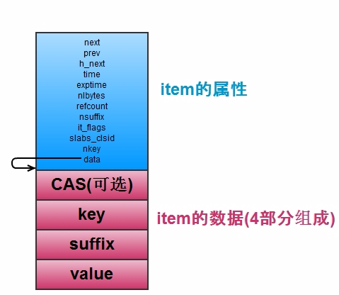
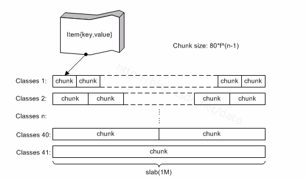
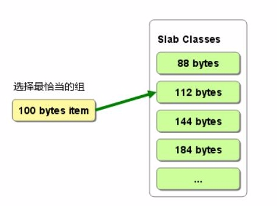
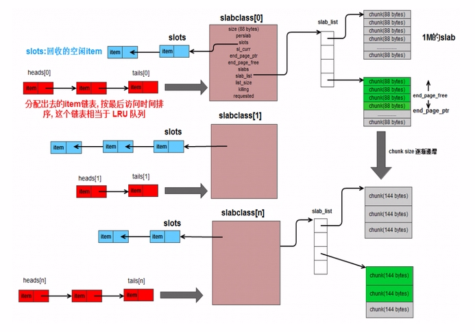
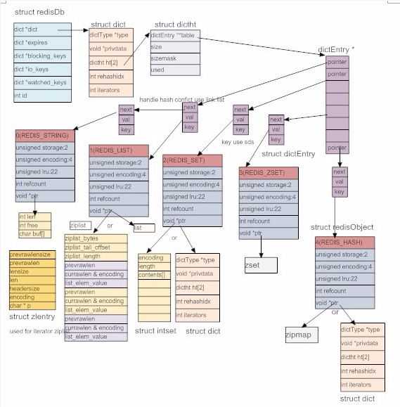
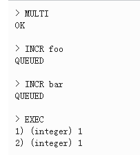

​    	memcached和redis，作为近些年最常用的缓存服务器，相信大家对它们再熟悉不过了。前两年还在学校时，我曾经读过它们的主要源码，如今写篇笔记从个人角度简单对比一下它们的实现方式，权当做复习，有理解错误之处，欢迎指正。

​    	文中使用的架构类的图片大多来自于网络，有部分图与最新实现有出入，文中已经指出。

# 1. 综述

​    	读一个软件的源码，首先要弄懂软件是用作干什么的，那memcached和redis是干啥的？众所周知，数据一般会放在数据库中，但是查询数据会相对比较慢，特别是用户很多时，频繁的查询，需要耗费大量的时间。怎么办呢？数据放在哪里查询快？那肯定是内存中。memcached和redis就是将数据存储在内存中，按照key-value的方式查询，可以大幅度提高效率。所以一般它们都用做缓存服务器，缓存常用的数据，需要查询的时候，直接从它们那儿获取，减少查询数据库的次数，提高查询效率。

# 2. 服务方式

   	memcached和redis怎么提供服务呢？它们是独立的进程，需要的话，还可以让他们变成daemon进程，所以我们的用户进程要使用memcached和redis的服务的话，就需要进程间通信了。考虑到用户进程和memcached和redis不一定在同一台机器上，所以还需要支持网络间通信。因此，memcached和redis自己本身就是网络服务器，用户进程通过与他们通过网络来传输数据，显然最简单和最常用的就是使用tcp连接了。另外，memcached和redis都支持udp协议。而且当用户进程和memcached和redis在同一机器时，还可以使用unix域套接字通信。

# 3. 事件模型

   	下面开始讲他们具体是怎么实现的了。首先来看一下它们的事件模型。

​    	自从epoll出来以后，几乎所有的网络服务器全都抛弃select和poll，换成了epoll。redis也一样，只不多它还提供对select和poll的支持，可以自己配置使用哪一个，但是一般都是用epoll。另外针对BSD，还支持使用kqueue。而memcached是基于libevent的，不过libevent底层也是使用epoll的，所以可以认为它们都是使用epoll。epoll的特性这里就不介绍了，网上介绍文章很多。

​    	它们都使用epoll来做事件循环，不过redis是单线程的服务器（redis也是多线程的，只不过除了主线程以外，其他线程没有event loop，只是会进行一些后台存储工作），而memcached是多线程的。 redis的事件模型很简单，只有一个event loop，是简单的reactor实现。不过redis事件模型中有一个亮点，我们知道epoll是针对fd的，它返回的就绪事件也是只有fd，redis里面的fd就是服务器与客户端连接的socket的fd，但是处理的时候，需要根据这个fd找到具体的客户端的信息，怎么找呢？通常的处理方式就是用红黑树将fd与客户端信息保存起来，通过fd查找，效率是lgn。不过redis比较特殊，redis的客户端的数量上限可以设置，即可以知道同一时刻，redis所打开的fd的上限，而我们知道，进程的fd在同一时刻是不会重复的（fd只有关闭后才能复用），所以redis使用一个数组，将fd作为数组的下标，数组的元素就是客户端的信息，这样，直接通过fd就能定位客户端信息，查找效率是O(1)，还省去了复杂的红黑树的实现（我曾经用c写一个网络服务器，就因为要保持fd和connect对应关系，不想自己写红黑树，然后用了STL里面的set，导致项目变成了c++的，最后项目使用g++编译，这事我不说谁知道？）。显然这种方式只能针对connection数量上限已确定，并且不是太大的网络服务器，像nginx这种http服务器就不适用，nginx就是自己写了红黑树。

  	 而memcached是多线程的，使用master-worker的方式，主线程监听端口，建立连接，然后顺序分配给各个工作线程。每一个从线程都有一个event loop，它们服务不同的客户端。master线程和worker线程之间使用管道通信，每一个工作线程都会创建一个管道，然后保存写端和读端，并且将读端加入event loop，监听可读事件。同时，每个从线程都有一个就绪连接队列，主线程连接连接后，将连接的item放入这个队列，然后往该线程的管道的写端写入一个connect命令，这样event loop中加入的管道读端就会就绪，从线程读取命令，解析命令发现是有连接，然后就会去自己的就绪队列中获取连接，并进行处理。多线程的优势就是可以充分发挥多核的优势，不过编写程序麻烦一点，memcached里面就有各种锁和条件变量来进行线程同步。

# 4. 内存分配

   	 memcached和redis的核心任务都是在内存中操作数据，内存管理自然是核心的内容。

 	首先看看他们的内存分配方式。memcached是有自己得内存池的，即预先分配一大块内存，然后接下来分配内存就从内存池中分配，这样可以减少内存分配的次数，提高效率，这也是大部分网络服务器的实现方式，只不过各个内存池的管理方式根据具体情况而不同。而redis没有自己得内存池，而是直接使用时分配，即什么时候需要什么时候分配，内存管理的事交给内核，自己只负责取和释放（redis既是单线程，又没有自己的内存池，是不是感觉实现的太简单了？那是因为它的重点都放在数据库模块了）。不过redis支持使用tcmalloc来替换glibc的malloc，前者是google的产品，比glibc的malloc快。

​    	由于redis没有自己的内存池，所以内存申请和释放的管理就简单很多，直接malloc和free即可，十分方便。而memcached是支持内存池的，所以内存申请是从内存池中获取，而free也是还给内存池，所以需要很多额外的管理操作，实现起来麻烦很多，具体的会在后面memcached的slab机制讲解中分析。 

# 5. 数据库实现

   	接下来看看他们的最核心内容，各自数据库的实现。

## 5.1 memcached数据库实现    

  	memcached只支持key-value，即只能一个key对于一个value。它的数据在内存中也是这样以key-value对的方式存储，它使用slab机制。

   	首先看memcached是如何存储数据的，即存储key-value对。如下图，每一个key-value对都存储在一个item结构中，包含了相关的属性和key和value的值。

 

​    	item是保存key-value对的，当item多的时候，怎么查找特定的item是个问题。所以memcached维护了一个hash表，它用于快速查找item。hash表适用开链法（与redis一样）解决键的冲突，每一个hash表的桶里面存储了一个链表，链表节点就是item的指针，如上图中的h_next就是指桶里面的链表的下一个节点。 hash表支持扩容（item的数量是桶的数量的1.5以上时扩容），有一个primary_hashtable，还有一个old_hashtable，其中正常适用primary_hashtable，但是扩容的时候，将old_hashtable = primary_hashtable，然后primary_hashtable设置为新申请的hash表（桶的数量乘以2），然后依次将old_hashtable 里面的数据往新的hash表里面移动，并用一个变量expand_bucket记录以及移动了多少个桶，移动完成后，再free原来的old_hashtable 即可（redis也是有两个hash表，也是移动，不过不是后台线程完成，而是每次移动一个桶）。扩容的操作，专门有一个后台扩容的线程来完成，需要扩容的时候，使用条件变量通知它，完成扩容后，它又考试阻塞等待扩容的条件变量。这样在扩容的时候，查找一个item可能会在primary_hashtable和old_hashtable的任意一个中，需要根据比较它的桶的位置和expand_bucket的大小来比较确定它在哪个表里。

   	item是从哪里分配的呢？从slab中。如下图，memcached有很多slabclass，它们管理slab，每一个slab其实是trunk的集合，真正的item是在trunk中分配的，一个trunk分配一个item。一个slab中的trunk的大小一样，不同的slab，trunk的大小按比例递增，需要新申请一个item的时候，根据它的大小来选择trunk，规则是比它大的最小的那个trunk。这样，不同大小的item就分配在不同的slab中，归不同的slabclass管理。 这样的缺点是会有部分内存浪费，因为一个trunk可能比item大，如图2，分配100B的item的时候，选择112的trunk，但是会有12B的浪费，这部分内存资源没有使用。





   

  	如上图，整个构造就是这样，slabclass管理slab，一个slabclass有一个slab_list，可以管理多个slab，同一个slabclass中的slab的trunk大小都一样。slabclass有一个指针slot，保存了未分配的item已经被free掉的item（不是真的free内存，只是不用了而已），有item不用的时候，就放入slot的头部，这样每次需要在当前slab中分配item的时候，直接取slot取即可，不用管item是未分配过的还是被释放掉的。

  	然后，每一个slabclass对应一个链表，有head数组和tail数组，它们分别保存了链表的头节点和尾节点。链表中的节点就是改slabclass所分配的item，新分配的放在头部，链表越往后的item，表示它已经很久没有被使用了。当slabclass的内存不足，需要删除一些过期item的时候，就可以从链表的尾部开始删除，没错，这个链表就是为了实现LRU。光靠它还不行，因为链表的查询是O（n）的，所以定位item的时候，使用hash表，这已经有了，所有分配的item已经在hash表中了，所以，hash用于查找item，然后链表有用存储item的最近使用顺序，这也是lru的标准实现方法。

 	 每次需要新分配item的时候，找到slabclass对于的链表，从尾部往前找，看item是否已经过期，过期的话，直接就用这个过期的item当做新的item。没有过期的，则需要从slab中分配trunk，如果slab用完了，则需要往slabclass中添加slab了。

   	memcached支持设置过期时间，即expire time，但是内部并不定期检查数据是否过期，而是客户进程使用该数据的时候，memcached会检查expire time，如果过期，直接返回错误。这样的优点是，不需要额外的cpu来进行expire time的检查，缺点是有可能过期数据很久不被使用，则一直没有被释放，占用内存。

  	memcached是多线程的，而且只维护了一个数据库，所以可能有多个客户进程操作同一个数据，这就有可能产生问题。比如，A已经把数据更改了，然后B也更改了改数据，那么A的操作就被覆盖了，而可能A不知道，A任务数据现在的状态时他改完后的那个值，这样就可能产生问题。为了解决这个问题，memcached使用了CAS协议，简单说就是item保存一个64位的unsigned int值，标记数据的版本，每更新一次（数据值有修改），版本号增加，然后每次对数据进行更改操作，需要比对客户进程传来的版本号和服务器这边item的版本号是否一致，一致则可进行更改操作，否则提示脏数据。

   以上就是memcached如何实现一个key-value的数据库的介绍。

## 5.2 redis数据库实现   

   	首先redis数据库的功能强大一些，因为不像memcached只支持保存字符串，redis支持string， list， set，sorted set，hash table 5种数据结构。例如存储一个人的信息就可以使用hash table，用人的名字做key，然后name super， age 24， 通过key 和 name，就可以取到名字super，或者通过key和age，就可以取到年龄24。这样，当只需要取得age的时候，不需要把人的整个信息取回来，然后从里面找age，直接获取age即可，高效方便。

  	为了实现这些数据结构，redis定义了抽象的对象redis object，如下图。每一个对象有类型，一共5种：字符串，链表，集合，有序集合，哈希表。 同时，为了提高效率，redis为每种类型准备了多种实现方式，根据特定的场景来选择合适的实现方式，encoding就是表示对象的实现方式的。然后还有记录了对象的lru，即上次被访问的时间，同时在redis 服务器中会记录一个当前的时间（近似值，因为这个时间只是每隔一定时间，服务器进行自动维护的时候才更新），它们两个只差就可以计算出对象多久没有被访问了。 然后redis object中还有引用计数，这是为了共享对象，然后确定对象的删除时间用的。最后使用一个void*指针来指向对象的真正内容。正式由于使用了抽象redis object，使得数据库操作数据时方便很多，全部统一使用redis object对象即可，需要区分对象类型的时候，再根据type来判断。而且正式由于采用了这种面向对象的方法，让redis的代码看起来很像c++代码，其实全是用c写的。

```c
//#define REDIS_STRING 0	// 字符串类型//#define REDIS_LIST 1		// 链表类型//#define REDIS_SET 2		// 集合类型(无序的)，可以求差集，并集等//#define REDIS_ZSET 3		// 有序的集合类型//#define REDIS_HASH 4		// 哈希类型//#define REDIS_ENCODING_RAW 0     /* Raw representation */ //raw  未加工//#define REDIS_ENCODING_INT 1     /* Encoded as integer *///#define REDIS_ENCODING_HT 2      /* Encoded as hash table *///#define REDIS_ENCODING_ZIPMAP 3  /* Encoded as zipmap *///#define REDIS_ENCODING_LINKEDLIST 4 /* Encoded as regular linked list *///#define REDIS_ENCODING_ZIPLIST 5 /* Encoded as ziplist *///#define REDIS_ENCODING_INTSET 6  /* Encoded as intset *///#define REDIS_ENCODING_SKIPLIST 7  /* Encoded as skiplist *///#define REDIS_ENCODING_EMBSTR 8  /* Embedded sds string encoding */

typedef struct redisObject {
    unsigned type:4;			// 对象的类型，包括 /* Object types */unsigned encoding:4;		// 底部为了节省空间，一种type的数据，// 可   以采用不同的存储方式unsigned lru:REDIS_LRU_BITS; /* lru time (relative to server.lruclock) */int refcount;         // 引用计数void *ptr;
} robj;
```

   	说到底redis还是一个key-value的数据库，不管它支持多少种数据结构，最终存储的还是以key-value的方式，只不过value可以是链表，set，sorted set，hash table等。和memcached一样，所有的key都是string，而set，sorted set，hash table等具体存储的时候也用到了string。 而c没有现成的string，所以redis的首要任务就是实现一个string，取名叫sds（simple dynamic string），如下的代码， 非常简单的一个结构体，len存储改string的内存总长度，free表示还有多少字节没有使用，而buf存储具体的数据，显然len-free就是目前字符串的长度。

```c
struct sdshdr {
    int len;
    int free;
    char buf[];
};
```

   	字符串解决了，所有的key都存成sds就行了，那么key和value怎么关联呢？key-value的格式在脚本语言中很好处理，直接使用字典即可，C没有字典，怎么办呢？自己写一个呗（redis十分热衷于造轮子）。看下面的代码，privdata存额外信息，用的很少，至少我们发现。 dictht是具体的哈希表，一个dict对应两张哈希表，这是为了扩容（包括rehashidx也是为了扩容）。dictType存储了哈希表的属性。redis还为dict实现了迭代器（所以说看起来像c++代码）。

   	哈希表的具体实现是和mc类似的做法，也是使用开链法来解决冲突，不过里面用到了一些小技巧。比如使用dictType存储函数指针，可以动态配置桶里面元素的操作方法。又比如dictht中保存的sizemask取size（桶的数量）-1，用它与key做&操作来代替取余运算，加快速度等等。总的来看，dict里面有两个哈希表，每个哈希表的桶里面存储dictEntry链表，dictEntry存储具体的key和value。

   	前面说过，一个dict对于两个dictht，是为了扩容（其实还有缩容）。正常的时候，dict只使用dictht[0]，当dict[0]中已有entry的数量与桶的数量达到一定的比例后，就会触发扩容和缩容操作，我们统称为rehash，这时，为dictht[1]申请rehash后的大小的内存，然后把dictht[0]里的数据往dictht[1]里面移动，并用rehashidx记录当前已经移动万的桶的数量，当所有桶都移完后，rehash完成，这时将dictht[1]变成dictht[0], 将原来的dictht[0]变成dictht[1]，并变为null即可。不同于memcached，这里不用开一个后台线程来做，而是就在event loop中完成，并且rehash不是一次性完成，而是分成多次，每次用户操作dict之前，redis移动一个桶的数据，直到rehash完成。这样就把移动分成多个小移动完成，把rehash的时间开销均分到用户每个操作上，这样避免了用户一个请求导致rehash的时候，需要等待很长时间，直到rehash完成才有返回的情况。不过在rehash期间，每个操作都变慢了点，而且用户还不知道redis在他的请求中间添加了移动数据的操作，感觉redis太贱了 :-D

```c
typedef struct dict {
    dictType *type;	// 哈希表的相关属性void *privdata;	// 额外信息
    dictht ht[2];	// 两张哈希表，分主和副，用于扩容int rehashidx; /* rehashing not in progress if rehashidx == -1 */ // 记录当前数据迁移的位置，在扩容的时候用的int iterators; /* number of iterators currently running */	// 目前存在的迭代器的数量
} dict;

typedef struct dictht {
    dictEntry **table;  // dictEntry是item，多个item组成hash桶里面的链表，table则是多个链表头指针组成的数组的指针unsigned long size;	// 这个就是桶的数量// sizemask取size - 1, 然后一个数据来的时候，通过计算出的hashkey, 让hashkey & sizemask来确定它要放的桶的位置// 当size取2^n的时候，sizemask就是1...111，这样就和hashkey % size有一样的效果，但是使用&会快很多。这就是原因unsigned long sizemask;  
    unsigned long used;		// 已经数值的dictEntry数量
} dictht;

typedef struct dictType {
    unsigned int (*hashFunction)(const void *key);	 // hash的方法void *(*keyDup)(void *privdata, const void *key);	// key的复制方法void *(*valDup)(void *privdata, const void *obj);	// value的复制方法int (*keyCompare)(void *privdata, const void *key1, const void *key2);	// key之间的比较void (*keyDestructor)(void *privdata, void *key);	// key的析构void (*valDestructor)(void *privdata, void *obj);	// value的析构
} dictType;

typedef struct dictEntry {
    void *key;
    union {
        void *val;
        uint64_t u64;
        int64_t s64;
    } v;
    struct dictEntry *next;
} dictEntry;
```

   有了dict，数据库就好实现了。所有数据读存储在dict中，key存储成dictEntry中的key（string），用void* 指向一个redis object，它可以是5种类型中的任何一种。如下图，结构构造是这样，不过这个图已经过时了，有一些与redis3.0不符合的地方。



   	五种type的对象，每一个都至少有两种底层实现方式。string有3种：REDIS_ENCODING_RAW, REDIS_ENCIDING_INT, REDIS_ENCODING_EMBSTR， list有：普通双向链表和压缩链表，压缩链表简单的说，就是讲数组改造成链表，连续的空间，然后通过存储字符串的大小信息来模拟链表，相对普通链表来说可以节省空间，不过有副作用，由于是连续的空间，所以改变内存大小的时候，需要重新分配，并且由于保存了字符串的字节大小，所有有可能引起连续更新（具体实现请详细看代码）。set有dict和intset（全是整数的时候使用它来存储）， sorted set有：skiplist和ziplist， hashtable实现有压缩列表和dict和ziplist。skiplist就是跳表，它有接近于红黑树的效率，但是实现起来比红黑树简单很多，所以被采用（奇怪，这里又不造轮子了，难道因为这个轮子有点难？）。 hash table可以使用dict实现，则改dict中，每个dictentry中key保存了key（这是哈希表中的键值对的key），而value则保存了value，它们都是string。 而set中的dict，每个dictentry中key保存了set中具体的一个元素的值，value则为null。图中的zset（有序集合）有误，zset使用skiplist和ziplist实现，首先skiplist很好理解，就把它当做红黑树的替代品就行，和红黑树一样，它也可以排序。怎么用ziplist存储zset呢？首先在zset中，每个set中的元素都有一个分值score，用它来排序。所以在ziplist中，按照分值大小，先存元素，再存它的score，再存下一个元素，然后score。这样连续存储，所以插入或者删除的时候，都需要重新分配内存。所以当元素超过一定数量，或者某个元素的字符数超过一定数量，redis就会选择使用skiplist来实现zset（如果当前使用的是ziplist，会将这个ziplist中的数据取出，存入一个新的skiplist，然后删除改ziplist，这就是底层实现转换，其余类型的redis object也是可以转换的）。 另外，ziplist如何实现hashtable呢？其实也很简单，就是存储一个key，存储一个value，再存储一个key，再存储一个value。还是顺序存储，与zset实现类似，所以当元素超过一定数量，或者某个元素的字符数超过一定数量时，就会转换成hashtable来实现。各种底层实现方式是可以转换的，redis可以根据情况选择最合适的实现方式，这也是这样使用类似面向对象的实现方式的好处。

   	需要指出的是，使用skiplist来实现zset的时候，其实还用了一个dict，这个dict存储一样的键值对。为什么呢？因为skiplist的查找只是lgn的（可能变成n），而dict可以到O(1)， 所以使用一个dict来加速查找，由于skiplist和dict可以指向同一个redis object，所以不会浪费太多内存。另外使用ziplist实现zset的时候，为什么不用dict来加速查找呢？因为ziplist支持的元素个数很少（个数多时就转换成skiplist了），顺序遍历也很快，所以不用dict了。

   	这样看来，上面的dict，dictType，dictHt，dictEntry，redis object都是很有考量的，它们配合实现了一个具有面向对象色彩的灵活、高效数据库。不得不说，redis数据库的设计还是很厉害的。

   	与memcached不同的是，redis的数据库不止一个，默认就有16个，编号0-15。客户可以选择使用哪一个数据库，默认使用0号数据库。 不同的数据库数据不共享，即在不同的数据库中可以存在同样的key，但是在同一个数据库中，key必须是唯一的。

   	redis也支持expire time的设置，我们看上面的redis object，里面没有保存expire的字段，那redis怎么记录数据的expire time呢？ redis是为每个数据库又增加了一个dict，这个dict叫expire dict，它里面的dict entry里面的key就是数对的key，而value全是数据为64位int的redis object，这个int就是expire time。这样，判断一个key是否过期的时候，去expire dict里面找到它，取出expire time比对当前时间即可。为什么这样做呢？ 因为并不是所有的key都会设置过期时间，所以，对于不设置expire time的key来说，保存一个expire time会浪费空间，而是用expire dict来单独保存的话，可以根据需要灵活使用内存（检测到key过期时，会把它从expire dict中删除）。

   	redis的expire 机制是怎样的呢？ 与memcahed类似，redis也是惰性删除，即要用到数据时，先检查key是否过期，过期则删除，然后返回错误。单纯的靠惰性删除，上面说过可能会导致内存浪费，所以redis也有补充方案，redis里面有个定时执行的函数，叫servercron，它是维护服务器的函数，在它里面，会对过期数据进行删除，注意不是全删，而是在一定的时间内，对每个数据库的expire dict里面的数据随机选取出来，如果过期，则删除，否则再选，直到规定的时间到。即随机选取过期的数据删除，这个操作的时间分两种，一种较长，一种较短，一般执行短时间的删除，每隔一定的时间，执行一次长时间的删除。这样可以有效的缓解光采用惰性删除而导致的内存浪费问题。

   	以上就是redis的数据的实现，与memcached不同，redis还支持数据持久化，这个下面介绍。

## 5.4 redis数据库持久化

   	redis和memcached的最大不同，就是redis支持数据持久化，这也是很多人选择使用redis而不是memcached的最大原因。 redis的持久化，分为两种策略，用户可以配置使用不同的策略。

### 5.4.1 RDB持久化

  	 用户执行save或者bgsave的时候，就会触发RDB持久化操作。RDB持久化操作的核心思想就是把数据库原封不动的保存在文件里。

   	那如何存储呢？如下图， 首先存储一个REDIS字符串，起到验证的作用，表示是RDB文件，然后保存redis的版本信息，然后是具体的数据库，然后存储结束符EOF，最后用检验和。关键就是databases，看它的名字也知道，它存储了多个数据库，数据库按照编号顺序存储，0号数据库存储完了，才轮到1，然后是2, 一直到最后一个数据库。


​    	每一个数据库存储方式如下，首先一个1字节的常量SELECTDB，表示切换db了，然后下一个接上数据库的编号，它的长度是可变的，然后接下来就是具体的key-value对的数据了。


```c
int rdbSaveKeyValuePair(rio *rdb, robj *key, robj *val,
                        long long expiretime, long long now)
{
    /* Save the expire time */if (expiretime != -1) {
        /* If this key is already expired skip it */if (expiretime < now) return 0;
        if (rdbSaveType(rdb,REDIS_RDB_OPCODE_EXPIRETIME_MS) == -1) return -1;
        if (rdbSaveMillisecondTime(rdb,expiretime) == -1) return -1;
    }

    /* Save type, key, value */if (rdbSaveObjectType(rdb,val) == -1) return -1;
    if (rdbSaveStringObject(rdb,key) == -1) return -1;
    if (rdbSaveObject(rdb,val) == -1) return -1;
    return 1;
}
```

 	由上面的代码也可以看出，存储的时候，先检查expire time，如果已经过期，不存就行了，否则，则将expire time存下来，注意，及时是存储expire time，也是先存储它的类型为REDIS_RDB_OPCODE_EXPIRETIME_MS，然后再存储具体过期时间。接下来存储真正的key-value对，首先存储value的类型，然后存储key（它按照字符串存储），然后存储value，如下图。


​	在rdbsaveobject中，会根据val的不同类型，按照不同的方式存储，不过从根本上来看，最终都是转换成字符串存储，比如val是一个linklist，那么先存储整个list的字节数，然后遍历这个list，把数据取出来，依次按照string写入文件。对于hash table，也是先计算字节数，然后依次取出hash table中的dictEntry，按照string的方式存储它的key和value，然后存储下一个dictEntry。 总之，RDB的存储方式，对一个key-value对，会先存储expire time（如果有的话），然后是value的类型，然后存储key（字符串方式），然后根据value的类型和底层实现方式，将value转换成字符串存储。这里面为了实现数据压缩，以及能够根据文件恢复数据，redis使用了很多编码的技巧，有些我也没太看懂，不过关键还是要理解思想，不要在意这些细节。

   	保存了RDB文件，当redis再启动的时候，就根据RDB文件来恢复数据库。由于以及在RDB文件中保存了数据库的号码，以及它包含的key-value对，以及每个key-value对中value的具体类型，实现方式，和数据，redis只要顺序读取文件，然后恢复object即可。由于保存了expire time，发现当前的时间已经比expire time大了，即数据已经超时了，则不恢复这个key-value对即可。

   	保存RDB文件是一个很巨大的工程，所以redis还提供后台保存的机制。即执行bgsave的时候，redis fork出一个子进程，让子进程来执行保存的工作，而父进程继续提供redis正常的数据库服务。由于子进程复制了父进程的地址空间，即子进程拥有父进程fork时的数据库，子进程执行save的操作，把它从父进程那儿继承来的数据库写入一个temp文件即可。在子进程复制期间，redis会记录数据库的修改次数（dirty）。当子进程完成时，发送给父进程SIGUSR1信号，父进程捕捉到这个信号，就知道子进程完成了复制，然后父进程将子进程保存的temp文件改名为真正的rdb文件（即真正保存成功了才改成目标文件，这才是保险的做法）。然后记录下这一次save的结束时间。

​    	这里有一个问题，在子进程保存期间，父进程的数据库已经被修改了，而父进程只是记录了修改的次数（dirty），被没有进行修正操作。似乎使得RDB保存的不是实时的数据库，有点不太高大上的样子。 不过后面要介绍的AOF持久化，就解决了这个问题。

   	除了客户执行sava或者bgsave命令，还可以配置RDB保存条件。即在配置文件中配置，在t时间内，数据库被修改了dirty次，则进行后台保存。redis在serve cron的时候，会根据dirty数目和上次保存的时间，来判断是否符合条件，符合条件的话，就进行bg save，注意，任意时刻只能有一个子进程来进行后台保存，因为保存是个很费io的操作，多个进程大量io效率不行，而且不好管理。

### 5.4.2 AOF持久化

   	首先想一个问题，保存数据库一定需要像RDB那样把数据库里面的所有数据保存下来么？有没有别的方法？

   	RDB保存的只是最终的数据库，它是一个结果。结果是怎么来的？是通过用户的各个命令建立起来的，所以可以不保存结果，而只保存建立这个结果的命令。 redis的AOF就是这个思想，它不同RDB保存db的数据，它保存的是一条一条建立数据库的命令。

   	我们首先来看AOF文件的格式，它里面保存的是一条一条的命令，首先存储命令长度，然后存储命令，具体的分隔符什么的可以自己深入研究，这都不是重点，反正知道AOF文件存储的是redis客户端执行的命令即可。

   	redis server中有一个sds  aof_buf, 如果aof持久化打开的话，每个修改数据库的命令都会存入这个aof_buf（保存的是aof文件中命令格式的字符串），然后event loop没循环一次，在server cron中调用flushaofbuf，把aof_buf中的命令写入aof文件（其实是write，真正写入的是内核缓冲区），再清空aof_buf，进入下一次loop。这样所有的数据库的变化，都可以通过aof文件中的命令来还原，达到了保存数据库的效果。

   	需要注意的是，flushaofbuf中调用的write，它只是把数据写入了内核缓冲区，真正写入文件时内核自己决定的，可能需要延后一段时间。 不过redis支持配置，可以配置每次写入后sync，则在redis里面调用sync，将内核中的数据写入文件，这不过这要耗费一次系统调用，耗费时间而已。还可以配置策略为1秒钟sync一次，则redis会开启一个后台线程（所以说redis不是单线程，只是单eventloop而已），这个后台线程会每一秒调用一次sync。这里要问了，RDB的时候为什么没有考虑sync的事情呢？因为RDB是一次性存储的，不像AOF这样多次存储，RDB的时候调用一次sync也没什么影响，而且使用bg save的时候，子进程会自己退出（exit），这时候exit函数内会冲刷缓冲区，自动就写入了文件中。

   	再来看，如果不想使用aof_buf保存每次的修改命令，也可以使用aof持久化。redis提供aof_rewrite，即根据现有的数据库生成命令，然后把命令写入aof文件中。很奇特吧？对，就是这么厉害。进行aof_rewrite的时候，redis变量每个数据库，然后根据key-value对中value的具体类型，生成不同的命令，比如是list，则它生成一个保存list的命令，这个命令里包含了保存该list所需要的的数据，如果这个list数据过长，还会分成多条命令，先创建这个list，然后往list里面添加元素，总之，就是根据数据反向生成保存数据的命令。然后将这些命令存储aof文件，这样不就和aof append达到同样的效果了么？

   	aof格式也支持后台模式。执行aof_bgrewrite的时候，也是fork一个子进程，然后让子进程进行aof_rewrite，把它复制的数据库写入一个临时文件，然后写完后用新号通知父进程。父进程判断子进程的退出信息是否正确，然后将临时文件更名成最终的aof文件。好了，问题来了。在子进程持久化期间，可能父进程的数据库有更新，怎么把这个更新通知子进程呢？难道要用进程间通信么？是不是有点麻烦呢？你猜redis怎么做的？它根本不通知子进程。什么，不通知？那更新怎么办？ 在子进程执行aof_bgrewrite期间，父进程会保存所有对数据库有更改的操作的命令（增，删除，改等），把他们保存在aof_rewrite_buf_blocks中，这是一个链表，每个block都可以保存命令，存不下时，新申请block，然后放入链表后面即可，当子进程通知完成保存后，父进程将aof_rewrite_buf_blocks的命令append 进aof文件就可以了。多么优美的设计，想一想自己当初还考虑用进程间通信，别人直接用最简单的方法就完美的解决了问题，有句话说得真对，越优秀的设计越趋于简单，而复杂的东西往往都是靠不住的。

   	至于aof文件的载入，也就是一条一条的执行aof文件里面的命令而已。不过考虑到这些命令就是客户端发送给redis的命令，所以redis干脆生成了一个假的客户端，它没有和redis建立网络连接，而是直接执行命令即可。首先搞清楚，这里的假的客户端，并不是真正的客户端，而是存储在redis里面的客户端的信息，里面有写和读的缓冲区，它是存在于redis服务器中的。所以，如下图，直接读入aof的命令，放入客户端的读缓冲区中，然后执行这个客户端的命令即可。这样就完成了aof文件的载入。

```
// 创建伪客户端
fakeClient = createFakeClient();

while(命令不为空) {
   // 获取一条命令的参数信息 argc， argv
   ...

    // 执行
    fakeClient->argc = argc;
    fakeClient->argv = argv;
    cmd->proc(fakeClient);
}
```

   	整个aof持久化的设计，个人认为相当精彩。其中有很多地方，值得膜拜。

## 5.5 redis的事务

   	redis另一个比memcached强大的地方，是它支持简单的事务。事务简单说就是把几个命令合并，一次性执行全部命令。对于关系型数据库来说，事务还有回滚机制，即事务命令要么全部执行成功，只要有一条失败就回滚，回到事务执行前的状态。redis不支持回滚，它的事务只保证命令依次被执行，即使中间一条命令出错也会继续往下执行，所以说它只支持简单的事务。

   	首先看redis事务的执行过程。首先执行multi命令，表示开始事务，然后输入需要执行的命令，最后输入exec执行事务。 redis服务器收到multi命令后，会将对应的client的状态设置为REDIS_MULTI，表示client处于事务阶段，并在client的multiState结构体里面保持事务的命令具体信息（当然首先也会检查命令是否能否识别，错误的命令不会保存），即命令的个数和具体的各个命令，当收到exec命令后，redis会顺序执行multiState里面保存的命令，然后保存每个命令的返回值，当有命令发生错误的时候，redis不会停止事务，而是保存错误信息，然后继续往下执行，当所有的命令都执行完后，将所有命令的返回值一起返回给客户。redis为什么不支持回滚呢？网上看到的解释出现问题是由于客户程序的问题，所以没必要服务器回滚，同时，不支持回滚，redis服务器的运行高效很多。在我看来，redis的事务不是传统关系型数据库的事务，要求CIAD那么非常严格，或者说redis的事务都不是事务，只是提供了一种方式，使得客户端可以一次性执行多条命令而已，就把事务当做普通命令就行了，支持回滚也就没必要了。

   

​    	我们知道redis是单event loop的，在真正执行一个事物的时候（即redis收到exec命令后），事物的执行过程是不会被打断的，所有命令都会在一个event loop中执行完。但是在用户逐个输入事务的命令的时候，这期间，可能已经有别的客户修改了事务里面用到的数据，这就可能产生问题。所以redis还提供了watch命令，用户可以在输入multi之前，执行watch命令，指定需要观察的数据，这样如果在exec之前，有其他的客户端修改了这些被watch的数据，则exec的时候，执行到处理被修改的数据的命令的时候，会执行失败，提示数据已经dirty。 这是如何是实现的呢？ 原来在每一个redisDb中还有一个dict watched_keys，watched_kesy中dictentry的key是被watch的数据库的key，而value则是一个list，里面存储的是watch它的client。同时，每个client也有一个watched_keys，里面保存的是这个client当前watch的key。在执行watch的时候，redis在对应的数据库的watched_keys中找到这个key（如果没有，则新建一个dictentry），然后在它的客户列表中加入这个client，同时，往这个client的watched_keys中加入这个key。当有客户执行一个命令修改数据的时候，redis首先在watched_keys中找这个key，如果发现有它，证明有client在watch它，则遍历所有watch它的client，将这些client设置为REDIS_DIRTY_CAS，表面有watch的key被dirty了。当客户执行的事务的时候，首先会检查是否被设置了REDIS_DIRTY_CAS，如果是，则表明数据dirty了，事务无法执行，会立即返回错误，只有client没有被设置REDIS_DIRTY_CAS的时候才能够执行事务。 需要指出的是，执行exec后，该client的所有watch的key都会被清除，同时db中该key的client列表也会清除该client，即执行exec后，该client不再watch任何key（即使exec没有执行成功也是一样）。所以说redis的事务是简单的事务，算不上真正的事务。

   	以上就是redis的事务，感觉实现很简单，实际用处也不是太大。

## 5.6 redis的发布订阅频道

   	redis支持频道，即加入一个频道的用户相当于加入了一个群，客户往频道里面发的信息，频道里的所有client都能收到。

   	实现也很简单，也watch_keys实现差不多，redis server中保存了一个pubsub_channels的dict，里面的key是频道的名称（显然要唯一了），value则是一个链表，保存加入了该频道的client。同时，每个client都有一个pubsub_channels，保存了自己关注的频道。当用用户往频道发消息的时候，首先在server中的pubsub_channels找到改频道，然后遍历client，给他们发消息。而订阅，取消订阅频道不够都是操作pubsub_channels而已，很好理解。

   	同时，redis还支持模式频道。即通过正则匹配频道，如有模式频道p*, *1,  则向普通频道p1发送消息时，会匹配p*，*1，除了往普通频道发消息外，还会往p*，*1模式频道中的client发消息。注意，这里是用发布命令里面的普通频道来匹配已有的模式频道，而不是在发布命令里制定模式频道，然后匹配redis里面保存的频道。实现方式也很简单，在redis server里面有个pubsub_patterns的list（这里为什么不用dict？因为pubsub_patterns的个数一般较少，不需要使用dict，简单的list就好了），它里面存储的是pubsubPattern结构体，里面是模式和client信息，如下所示，一个模式，一个client，所以如果有多个clint监听一个pubsub_patterns的话，在list面会有多个pubsubPattern，保存client和pubsub_patterns的对应关系。 同时，在client里面，也有一个pubsub_patterns list，不过里面存储的就是它监听的pubsub_patterns的列表（就是sds），而不是pubsubPattern结构体。

```c
typedef struct pubsubPattern {
    redisClient *client;	// 监听的client
    robj *pattern;			// 模式
} pubsubPattern;
```

   	当用户往一个频道发送消息的时候，首先会在redis server中的pubsub_channels里面查找该频道，然后往它的客户列表发送消息。然后在redis server里面的pubsub_patterns里面查找匹配的模式，然后往client里面发送消息。 这里并没有去除重复的客户，在pubsub_channels可能已经给某一个client发过message了，然后在pubsub_patterns中可能还会给用户再发一次（甚至更多次）。 估计redis认为这是客户程序自己的问题，所以不处理。

```c
/* Publish a message */int pubsubPublishMessage(robj *channel, robj *message) {
    int receivers = 0;
    dictEntry *de;
    listNode *ln;
    listIter li;

    /* Send to clients listening for that channel */
    de = dictFind(server.pubsub_channels,channel);
    if (de) {
        list *list = dictGetVal(de);
        listNode *ln;
        listIter li;

        listRewind(list,&li);
        while ((ln = listNext(&li)) != NULL) {
            redisClient *c = ln->value;

            addReply(c,shared.mbulkhdr[3]);
            addReply(c,shared.messagebulk);
            addReplyBulk(c,channel);
            addReplyBulk(c,message);
            receivers++;
        }
    }
    /* Send to clients listening to matching channels */if (listLength(server.pubsub_patterns)) {
        listRewind(server.pubsub_patterns,&li);
        channel = getDecodedObject(channel);
        while ((ln = listNext(&li)) != NULL) {
            pubsubPattern *pat = ln->value;

            if (stringmatchlen((char*)pat->pattern->ptr,
                                sdslen(pat->pattern->ptr),
                                (char*)channel->ptr,
                                sdslen(channel->ptr),0)) {
                addReply(pat->client,shared.mbulkhdr[4]);
                addReply(pat->client,shared.pmessagebulk);
                addReplyBulk(pat->client,pat->pattern);
                addReplyBulk(pat->client,channel);
                addReplyBulk(pat->client,message);
                receivers++;
            }
        }
        decrRefCount(channel);
    }
    return receivers;
}
```

 

# 6. 总结

   	总的来看，redis比memcached的功能多很多，实现也更复杂。 不过memcached更专注于保存key-value数据（这已经能满足大多数使用场景了），而redis提供更丰富的数据结构及其他的一些功能。不能说redis比memcached好，不过从源码阅读的角度来看，redis的价值或许更大一点。 