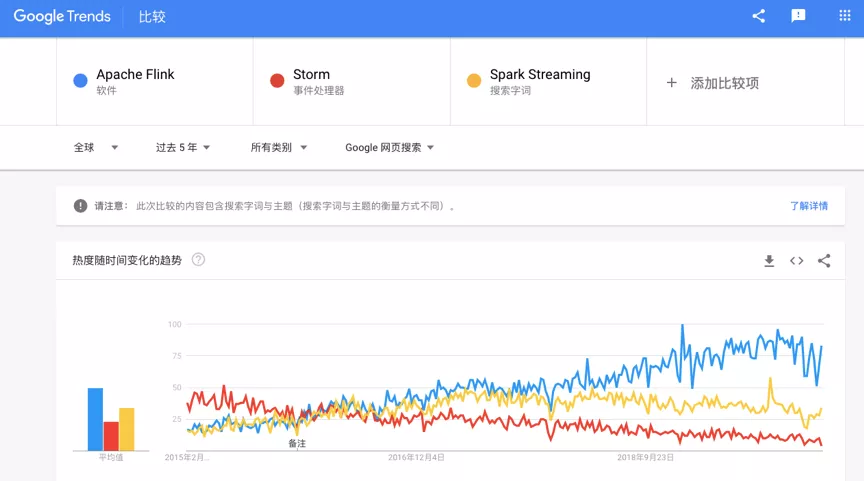

> 以下文章来源于阿里巴巴中间件，作者简锋

`每个人的时间都是有限的，在有限的时间里选择一项值得投入的技术会变得尤为重要。`

笔者从 2008 年开始工作到现在也有 12 个年头了，一路走来都在和数据打交道，做过很多大数据底层框架内核的开发（Hadoop，Pig，Hive，Tez，Spark），也做过多年上层数据计算框架（Livy,  Zeppelin）以及数据应用开发，包括数据处理，数据分析以及机器学习。现在是 Apache Member 以及多个 Apache 项目的 PMC 。2018 年加入阿里巴巴实时计算团队专注在 Flink 的研发。

今天我想结合自己过去的职业经历来聊聊如何评估一项技术是否值得学习。我一直在大数据这个圈子，从最初的 Hadoop 到后来的 Hadoop 生态项目 Pig，Hive，Tez，然后又到新一代的计算引擎 Spark ，再到最近在做的 Flink ，大数据计算引擎贯穿我的整个职业生涯。我个人来说是比较幸运的，在每个阶段都在做比较火的技术，当时更多的是凭着自己的兴趣和直觉在选择技术类型。现在回过头来看我觉得需要从下面 3 个大的纬度来评估一项技术是否值得学习。

1. 技术深度
2. 生态广度
3. 进化能力

<!-- more -->

  

# 技术深度

技术深度是指这项技术的根基是否扎实，护城河是否够宽够深，是否很容易被其他技术所替代。通俗的来说就是这项技术是否解决了其他技术所不能解决的有重要价值的问题。这里有两个要点：

 

1、这个问题没有人能解，是这项技术首先解决了这个问题。

2、解决这个问题能够带来重大价值。

 

拿我职业生涯开始阶段学习的 Hadoop 为例。当时 Hadoop 刚出来的时候是一项革命性的技术，因为当时除了 Google 宣称自己内部有一套 GFS 和 MapReduce 系统外，业界其他公司都没有一套完整的海量数据解决方案。而随着互联网技术的发展，数据量与日俱增，处理海量数据的能力迫在眉睫。Hadoop 的诞生正好解决了这一燃眉之急。

随着技术的发展， Hadoop 的处理海量数据能力的优势慢慢被人习惯，相反 Hadoop 存在的缺陷被人不断诟病（性能差，MapReduce 编写复杂等等）。而这时候Spark应运而生，解决了 Hadoop MapReduce 计算引擎的顽疾。Spark 远超过 Hadoop 的计算性能以及极其优雅简单的 API 迎合了当时用户的需求，受到了广大大数据工程师的热捧。

现在我在阿里巴巴从事的是关于 Flink 的研发工作，主要原因是我看到了工业界对实时性的需求以及 Flink 在实时计算这个领域的霸主地位。之前大数据遇到的最大挑战在于数据规模大（所以大家会称之为“大数据”），经过工业界多年的努力和实践，规模大这个问题基本已经解决了。接下来几年，更大的挑战在于速度，也就是实时性。而大数据的实时性并不是指简单的传输数据或者处理数据的实时性，而是从端到端的实时，任何一个步骤速度慢了，就影响整个大数据系统的实时性。

在 Flink 看来， Everything is stream 。Flink 的以 Stream 为核心的架构是业界独一无二的，由此而产生的性能优越，高扩展性，端到端 Exactly Once 等特性，更是使得 Flink 在流计算领域是当之无愧的王者。

 

目前主流的流计算引擎有 3 个：Flink、Storm 和 SparkStreaming 。

 

> 注：Spark Streaming 只能选择搜索字词，理论上这样的对比是不严谨的。但作为趋势，我们更关注的是其变化曲线，实际影响应该不大。

 

从上面的 Google trends 曲线可以看出，Flink 处在一个快速增长期， Storm 的热度在逐年下降，而 Spark Streaming 几乎进入了平台期。这就证明了 Flink 在流计算领域的根基之深，目前来看还没有谁可以超越 Flink 在流计算领域的霸主地位。

 

# 生态广度

一项技术只有技术深度是不够的，因为一项技术只能专注于做好一件事情，如果要解决实际生活中的复杂问题，必定要和其他技术整合联动，这就要求这项技术具有足够宽的生态广度。生态的广度有 2 个纬度可以衡量：

1. 上下游生态。上下游生态指从数据流的角度来说的数据上下游。
2. 垂直领域生态。垂直领域生态是指某个细分领域或者应用场景的整合。

 

 

当 Hadoop 刚出来的时候只有 2 个基本的组件：HDFS 和 MapReduce ，分别解决了海量存储和分布式计算的问题。但随着发展，需要解决的问题越来越复杂，HDFS 和 MapReduce 已经不能很方便的解决一些复杂问题，这时候 Hadoop 的其他生态项目应运而生，比如 Pig，Hive，HBase 等等从垂直领域生态这个角度解决了 Hadoop 不容易或者不能解决的问题。

Spark 亦是如此，一开始的 Spark 是要替换原来的 MapReduce 计算引擎，后来 Spark 发展了各种语言接口，各种上层框架，比如 Spark SQL，Spark Structured Streaming，MLlib，GraphX 等等，大大丰富了 Spark 的使用场景，扩展了Spark的垂直领域生态。Spark 对各种 Data Source 的支持，更是让 Spark 这个计算引擎和存储结成了联盟，建立了强大的上下游生态系统，为端到端的解决方案奠定了基础。

我现在做的 Flink 项目的生态仍然处于起步阶段，当时我加入阿里巴巴正不仅仅是看到了 Flink 作为流计算引擎的霸主地位，更是因为看到了 Flink 生态的机会。大家如果从我的职业生涯来看，会发现些许变化，我在从一开始专注于大数据的核心框架层慢慢在往周边生态项目发展。一个主要的原因是我对整个大数据行业的判断：大数据上半场战斗集中在底层框架，目前已经接近尾声，未来的底层大数据生态圈中将不再有那么多的新的技术和框架，每个细分领域都将优胜劣汰，走向成熟，更加集中化。下半场战斗的重点讲从底层走向上层，走向生态。之前的大数据创新更偏向于 IAAS 和 PAAS ，未来你将看到更多 SAAS 类型的大数据产品和创新。

 

每次谈到大数据的生态，我都拿出上面这张图。这张图基本上把你日常需要处理的大数据场景都包括进来。从最左边的数据生产者，到数据收集，数据处理，然后再到数据应用（BI + AI）。你会发现 Flink 可以应用在每一个步骤。不仅涉及到大数据，也涉及到 AI ，但是 Flink 的强项在于流计算处理，在其他领域的生态仍在起步阶段，我个人正在做的工作就是完善 Flink 在上面这张图上端到端的能力。

# 进化能力

一项技术如果技术深度和生态广度都没有问题，那么至少说明这项技术在当下是值得学习的。但是投资一项技术还需要从时间这个纬度上考量。你肯定不希望自己学习的技术很快就被淘汰，每年都要去学习一项新技术。所以一项值得投资学习的技术必定需要具有持久的进化能力。

我最初学的 Hadoop 到现在已经 10 多年了，现在仍然被广泛使用着。虽然现在有很多公有云厂商在抢占 Hadoop 的市场，但你不得不承认如果一家公司要成立一个大数据部门，第一件事恐怕就是建一个 Hadoop 集群吧。当我们现在谈论 Hadoop 的时候，他已经不是当初的 Hadoop 了，他更多的是 Hadoop 生态圈的统称。大家有空可以看看 [Cloudera CPO Arun 的这篇文章](https://medium.com/@acmurthy/hadoop-is-dead-long-live-hadoop-f22069b264ac)，我对其中的观点非常认同。

Spark 项目就更不用多说了。Spark 经过 14，15 年爆发，现在已经进入平稳期。但是 Spark 仍在进化，仍在拥抱变化。Spark on K8s 就是 Spark 拥抱云原生的最好佐证。现在 Spark 社区炙手可热的Delta，MLFlow 更是 Spark 的强大的进化能力的佐证。现在的 Spark 也不仅仅是当年要取代 MapReduce 的那个 Spark ，更多是一个适用于多种场景的通用计算引擎。

我从 18 年加入阿里巴巴到现在差不多 1 年半时间，在这一年半的时间了，我正好见证了 Flink 的进化能力。

首先， Flink 经过几个大版本的发布，融入了 Blink 的大部分功能，将 Flink SQL 的能力提升了一大截。

其次， Flink 对 K8s 的支持，对 Python 的支持，对 AI 的支持都在向人们证明这Flink自身强大的进化能力。

 

# 小 Tips

除了以上的 3 大维度，在这里我还想分享下我在评估一项新技术时候的一些小技巧。

1. 利用 Google trends 。Google trends 能很好的反映一项技术的发展势头，上面提到的趋势图很好的比较了 3 大流计算引擎 Flink ， Spark Streaming 和 Storm ，我们不难得出结论：Flink 是流计算领域的王者。
2. 查看 GitHub 上的awesome。一项技术受欢迎的一个指标是 GitHub 上的 awesome list，你可以看看这个 awesome list 的 GitHub star 数。此外你可以抽一个周末的时间看看这个 awesome list 上的内容，因为上面基本上是关于这项技术的精华内容，通过这些内容你大致可以判断出这项技术的价值。
3. 看看技术网站上是否有一些技术布道者为这项技术背书（我个人经常会看medium.com）。技术圈里通常有这样一群人，他们对技术很执着，也很有品位。如果一项技术真的很好，那么就会有技术布道者无偿的为这项技术背书，分享如何这项技术的使用心得。

# 总结

每个人的时间都是有限的，在有限的时间里选择一项值得投入的技术会变得尤为重要。

以上是我对如何评估一项技术是否值得学习的一些思考，也算是对我自己事业生涯在技术选型方面的一个小小的总结和回顾，希望我的这些思考能对大家的职业生涯有所帮助。

**作者信息：**

章剑锋（简锋），开源界老兵，Github ID：@zjffdu，Apache Member，曾就职于 Hortonworks，目前在阿里巴巴计算平台事业部任高级技术专家，并同时担任 Apache Tez、Livy 、Zeppelin 三个开源项目的 PMC ，以及 Apache Pig 的 Committer。有幸很早就接触了大数据和开源，希望可以在开源领域为大数据和数据科学做点贡献。