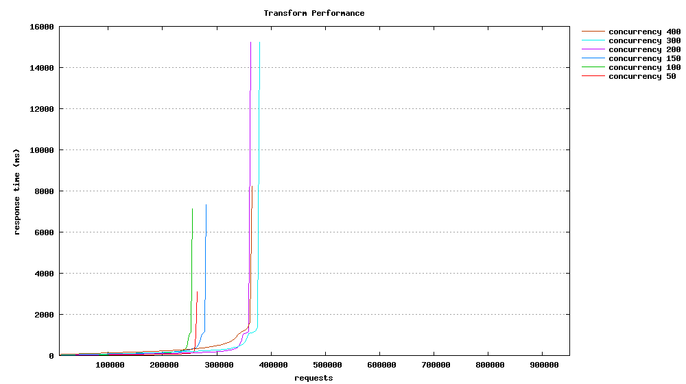

[Apache Beach](http://httpd.apache.org/docs/2.2/programs/ab.html) (ab)是Apache自带的一个性能测试工具，专门用来测试网站的性能， 不仅限于Apache web服务器。

它可以同时模拟多个并发请求，测试Web服务器的最大承载压力，同时也可以根据Apache Bench提供的测试结果对服务器性能参数进行调整。它可以记录测试数据，其它工具比如Gnuplot可以利用测试数据进行分析。它也可以提供一个summary，可以直观显示当前测试的web服务器的性能。

## 安装ab
  ab是Apache httpd的一部分。不同的发行版提供了不同的安装方法。
  比如在笔者使用的redhat 6.4上可以查看此工具在哪个包里：

```bash
#yum provides /usr/bin/ab
......
httpd-tools-2.2.15-30.el6.centos.x86_64 : Tools for use with the Apache HTTP
                                        : Server
Repo        : updates
Matched from:
Filename    : /usr/bin/ab
......
```

它被打包在httpd-tools包里，安装httpd-tools:

```bash
yum install httpd-tools
```

安装成功后查看帮助：

```bash
ab -h
```

或

```bash
man ab
```

## 运行ab
  一个最简单的ab例子就是：

```bash
# ab -n 100 -c 10 http://www.google.com/
```

注意网址后面要加"/"或者明确的path如"https://www.google.com/?gfe_rd=cr&ei=_BvfU77ZGMeL8QfugIHAAw".
"-c"是并发数，可以模拟同时有多少个clients并发访问。
"-n"表示总的请求数。每个client发送的请求数为此数字除以client数（上面的数字）。
"-t"可以指定测试的最大时间，如果还不到此数请求已经发完，那么测试也会结束。当使用-t参数时，ab内部默认最大的请求数为50000，为了同时使用"-n"指定的参数，可以将"-t"参数放在"-n"参数之前， 如果想了解更多的信息， 可以查看这篇[文章](http://100continue.iteye.com/blog/1325398).

## 实际运行ab
  我使用apache ab要测试的是一个tomcat搭建的集群，上面跑着CPU密集型的一个应用程序，前面使用nginx作为load balancer。
  此应用的一个主要的服务通过RESTful service提供， 并且是POST类型的。 Request body是一个XML。
  我想随机的替换body中的一个属性，以便测试动态请求对服务器的影响。 但是Apache ab只能提供静态的数据，所以我下载了它的代码并改造了一下。
  **首先创建了一个request.xml， 并将其中的那个属性改为占位符** 修改ab.c文件，将发送请求中的占位符用随机数代替
  修改的代码可重用性不高，在这里就不贴了。

写了一个脚本，可以测试不同的并发数：

```shell
for var in {4,20,50,100,150,200,300}
do
        ab -g plot/biz$var.dat -r -c ${var} -n ${total} -H 'Accept:application/xml'  -p request.xml -T 'application/xml' http://localhost:8080/app/biz

done
```

## 使用Gnuplot生成图表
  在上一步中生成了测试数据，我们可以通过Gnuplot这一强大的工具生成漂亮的图表了。
  在生成图表之前，我们还需要处理一下获得的数据，
  如果直接使用测试生成报表，我们可能得到这样一个图表：
  

相应的Gnuplot文件为：

```yaml
#output as png image
set terminal png size 1000,560

#save file to "domain.png"
set output "biz.png"

#graph title
set title "Biz Performance"
set key invert reverse Left outside

#nicer aspect ratio for image size
#set size 1,0.7

# y-axis grid
set grid y

#x-axis label
set xlabel "requests"

#y-axis label
set ylabel "response time (ms)"
#plot data from "biz.dat" using column 9 with smooth sbezier lines
#and title of "Biz Performance" for the given data
plot "biz4.dat" using 9 smooth sbezier with lines title "concurrency 4", \
"biz20.dat" using 9 smooth sbezier with lines title "concurrency 20", \
"biz50.dat" using 9 smooth sbezier with lines title "concurrency 50", \
"biz100.dat" using 9 smooth sbezier with lines title "concurrency 100", \
"biz150.dat" using 9 smooth sbezier with lines title "concurrency 150", \
"biz200.dat" using 9 smooth sbezier with lines title "concurrency 200", \
"biz300.dat" using 9 smooth sbezier with lines title "concurrency 300"
```

这张图有参考价值，我们可以看到大部分的请求的相应时间落在那个数值段中，但是不能以时间序列显示服务器的性能。 它是以"总用时“ (ttime) 进行排序，所以一般它会一条上升的曲线来显示。
这篇[文章](http://www.bradlanders.com/2013/04/15/apache-bench-and-gnuplot-youre-probably-doing-it-wrong/)中指出了一种按照时间序列显示数据的方法。 Apapche ab生成的测试数据中已经包含了时间戳，可以修改Gnuplot生成按时间序列显示的响应时间图：
[

Gnuplot文件为：

```yaml
# Let's output to a jpeg file
set terminal jpeg size 500,500
# This sets the aspect ratio of the graph
set size 1, 1
# The file we'll write to
set output "graphs/timeseries.jpg"
# The graph title
set title "Benchmark testing"
# Where to place the legend/key
set key left top
# Draw gridlines oriented on the y axis
set grid y
# Specify that the x-series data is time data
set xdata time
# Specify the *input* format of the time data
set timefmt "%s"
# Specify the *output* format for the x-axis tick labels
set format x "%S"
# Label the x-axis
set xlabel 'seconds'
# Label the y-axis
set ylabel "response time (ms)"
# Tell gnuplot to use tabs as the delimiter instead of spaces (default)
set datafile separator '\t'
# Plot the data
plot "data/testing.tsv" every ::2 using 2:5 title 'response time' with points
exit
```

为了得到按时间序列显示的吞吐率图表，我们可以处理一下得到的测试数据：

```shell
for var in {4,20,50,100,150,200,300}
do
   start_time=`awk '{print $6}' plot/biz$var.dat | grep -v 'wait' | sort | uniq -c|head -1|awk '{print $2}'`
  awk '{print $6}' plot/biz$var.dat | grep -v 'wait' | sort | uniq -c|awk -v t=$start_time '{print $2-t,$1}' > plot/epochtime$var.dat
done
```

然后根据一下的Gnuplot配置生成图表。

```yaml
#output as png image
set terminal png  size 1000,560

set output "throughput.png"

#graph title
set title "Throughput"

set key invert reverse Left outside

#nicer aspect ratio for image size
#set size 1,0.6

# y-axis grid
set grid y


#x-axis label
set xlabel "time"

#y-axis label
set ylabel "responses per second"
plot "epochtime4.dat" using 1:2 with lines title "concurrency 4", \
"epochtime20.dat" using 1:2 with lines title "concurrency 20", \
"epochtime50.dat" using 1:2 with lines title "concurrency 50", \
"epochtime100.dat" using 1:2 with lines title "concurrency 100", \
"epochtime150.dat" using 1:2 with lines title "concurrency 150", \
"epochtime200.dat" using 1:2 with lines title "concurrency 200", \
"epochtime300.dat" using 1:2 with lines title "concurrency 300"
```

