## **概念** 

### **模型**

#### **节点**

在具体的工程项目中，一个节点往往是一个操作系统上的进程。在本文的模型中，认为节点是一个完整的、不可分的整体，如果某个程序进程实际上由若干相对独立部分构成，则在模型中可以将一个进程划分为多个节点。

#### **异常**

1. **机器宕机**：机器宕机是最常见的异常之一。在大型集群中每日宕机发生的概率为千分之一左右，在实践中，一台宕机的机器恢复的时间通常认为是24 小时，一般需要人工介入重启机器。
2. **网络异常**：消息丢失，两片节点之间彼此完全无法通信，即出现了“网络分化”；消息乱序，有一定的概率不是按照发送时的顺序依次到达目的节点，考虑使用序列号等机制处理网络消息的乱序问题，使得无效的、过期的网络消息不影响系统的正确性；数据错误；不可靠的TCP，TCP 协议为应用层提供了可靠的、面向连接的传输服务，但在分布式系统的协议设计中不能认为所有网络通信都基于TCP 协议则通信就是可靠的。TCP协议只能保证同一个TCP 链接内的网络消息不乱序，TCP 链接之间的网络消息顺序则无法保证。
3. **分布式三态**：如果某个节点向另一个节点发起RPC(Remote procedure call)调用，即某个节点A 向另一个节点B 发送一个消息，节点B 根据收到的消息内容完成某些操作，并将操作的结果通过另一个消息返回给节点A，那么这个RPC 执行的结果有三种状态：“成功”、“失败”、“超时（未知）”，称之为分布式系统的三态。
4. **存储数据丢失**:对于有状态节点来说，数据丢失意味着状态丢失，通常只能从其他节点读取、恢复存储的状态。
5. ***异常处理原则\***：被大量工程实践所检验过的异常处理黄金原则是：任何在设计阶段考虑到的异常情况一定会在系统实际运行中发生，但在系统实际运行遇到的异常却很有可能在设计时未能考虑，所以，除非需求指标允许，在系统设计时不能放过任何异常情况。

###  **副本**

副本（replica/copy）指在分布式系统中为数据或服务提供的冗余。对于数据副本指在不同的节点上持久化同一份数据，当出现某一个节点的存储的数据丢失时，可以从副本上读到数据。数据副本是分布式系统解决数据丢失异常的唯一手段。另一类副本是服务副本，指数个节点提供某种相同的服务，这种服务一般并不依赖于节点的本地存储，其所需数据一般来自其他节点。

副本协议是贯穿整个分布式系统的理论核心。

#### **副本一致性**

分布式系统通过副本控制协议，使得从系统外部读取系统内部各个副本的数据在一定的约束条件下相同，称之为副本一致性(consistency)。副本一致性是针对分布式系统而言的，不是针对某一个副本而言。

1. **强一致性(strong consistency)**：任何时刻任何用户或节点都可以读到最近一次成功更新的副本数据。强一致性是程度最高的一致性要求，也是实践中最难以实现的一致性。
2. **单调一致性(monotonic consistency)**：任何时刻，任何用户一旦读到某个数据在某次更新后的值，这个用户不会再读到比这个值更旧的值。单调一致性是弱于强一致性却非常实用的一种一致性级别。因为通常来说，用户只关心从己方视角观察到的一致性，而不会关注其他用户的一致性情况。
3. **会话一致性(session consistency)**：任何用户在某一次会话内一旦读到某个数据在某次更新后的值，这个用户在这次会话过程中不会再读到比这个值更旧的值。会话一致性通过引入会话的概念，在单调一致性的基础上进一步放松约束，会话一致性只保证单个用户单次会话内数据的单调修改，对于不同用户间的一致性和同一用户不同会话间的一致性没有保障。实践中有许多机制正好对应会话的概念，例如php 中的session 概念。
4. **最终一致性(eventual consistency)**：最终一致性要求一旦更新成功，各个副本上的数据最终将达 到完全一致的状态，但达到完全一致状态所需要的时间不能保障。对于最终一致性系统而言，一个用户只要始终读取某一个副本的数据，则可以实现类似单调一致性的效果，但一旦用户更换读取的副本，则无法保障任何一致性。
5. **弱一致性(week consistency)**：一旦某个更新成功，用户无法在一个确定时间内读到这次更新的值，且即使在某个副本上读到了新的值，也不能保证在其他副本上可以读到新的值。弱一致性系统一般很难在实际中使用，使用弱一致性系统需要应用方做更多的工作从而使得系统可用。

### **衡量分布式系统的指标**

1. **性能**：系统的吞吐能力，指系统在某一时间可以处理的数据总量，通常可以用系统每秒处理的总的数据量来衡量；系统的响应延迟，指系统完成某一功能需要使用的时间；系统的并发能力，指系统可以同时完成某一功能的能力，通常也用QPS(query per second)来衡量。上述三个性能指标往往会相互制约，追求高吞吐的系统，往往很难做到低延迟；系统平均响应时间较长时，也很难提高QPS。
2. **可用性**：系统的可用性(availability)指系统在面对各种异常时可以正确提供服务的能力。系统的可用性可以用系统停服务的时间与正常服务的时间的比例来衡量，也可以用某功能的失败次数与成功次数的比例来衡量。可用性是分布式的重要指标，衡量了系统的鲁棒性，是系统容错能力的体现。
3. **可扩展性**：系统的可扩展性(scalability)指分布式系统通过扩展集群机器规模提高系统性能（吞吐、延迟、并发）、存储容量、计算能力的特性。好的分布式系统总在追求“线性扩展性”，也就是使得系统的某一指标可以随着集群中的机器数量线性增长。
4. **一致性**：分布式系统为了提高可用性，总是不可避免的使用副本的机制，从而引发副本一致性的问题。越是强的一致的性模型，对于用户使用来说使用起来越简单。

## **分布式系统原理**

### 数据分布方式**

所谓分布式系统顾名思义就是利用多台计算机协同解决单台计算机所不能解决的计算、存储等问题。单机系统与分布式系统的最大的区别在于问题的规模，即计算、存储的数据量的区别。将一个单机问题使用分布式解决，首先要解决的就是如何将问题拆解为可以使用多机分布式解决，使得分布式系统中的每台机器负责原问题的一个子集。由于无论是计算还是存储，其问题输入对象都是数据，所以如何拆解分布式系统的输入数据成为分布式系统的基本问题。

#### **哈希方式**

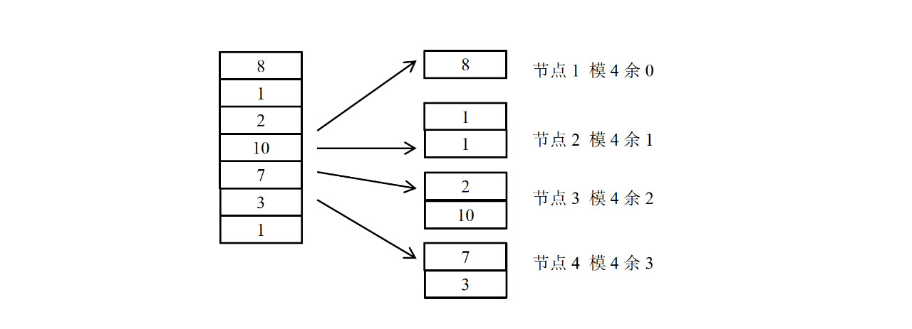

哈希分布数据的缺点同样明显，突出表现为可扩展性不高，一旦集群规模需要扩展，则几乎所有的数据需要被迁移并重新分布。工程中，扩展哈希分布数据的系统时，往往使得集群规模成倍扩展，按照数据重新计算哈希，这样原本一台机器上的数据只需迁移一半到另一台对应的机器上即可完成扩展。

针对哈希方式扩展性差的问题，一种思路是不再简单的将哈希值与机器做除法取模映射，而是将对应关系作为元数据由专门的元数据服务器管理.同时，哈希值取模个数往往大于机器个数，这样同一台机器上需要负责多个哈希取模的余数。但需要以较复杂的机制维护大量的元数据。哈希分布数据的另一个缺点是，一旦某数据特征值的数据严重不均，容易出现“数据倾斜”（data skew）问题。

哈希分布数据的另一个缺点是，一旦某数据特征值的数据严重不均，容易出现“数据倾斜”（data skew）问题

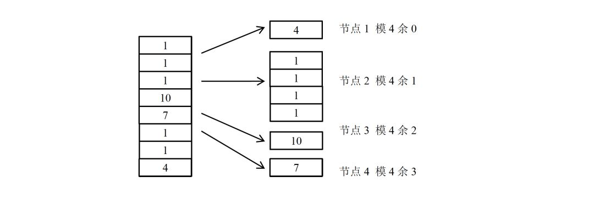

#### **按数据范围分布**

按数据范围分布是另一个常见的数据分布式，将数据按特征值的值域范围划分为不同的区间，使得集群中每台（组）服务器处理不同区间的数据。


工程中，为了数据迁移等负载均衡操作的方便，往往利用动态划分区间的技术，使得每个区间中服务的数据量尽量的一样多。当某个区间的数据量较大时，通过将区间“分裂”的方式拆分为两个区间，使得每个数据区间中的数据量都尽量维持在一个较为固定的阈值之下。

一般的，往往需要使用专门的服务器在内存中维护数据分布信息，称这种数据的分布信息为一种元信息。甚至对于大规模的集群，由于元信息的规模非常庞大，单台 计算机无法独立维护，需要使用多台机器作为元信息服务器。

#### **按数据量分布**

数据量分布数据与具体的数据特征无关，而是将数据视为一个顺序增长的文件，并将这个文件按照某一较为固定的大小划分为若干数据块（chunk），不同的数据块分布到不同的服务器上。与按数据范围分布数据的方式类似的是，按数据量分布数据也需要记录数据块的具体分布情况，并将该分布信息作为元数据使用元数据服务器管理。

由于与具体的数据内容无关，按数据量分布数据的方式一般没有数据倾斜的问题，数据总是被均匀切分并分布到集群中。当集群需要重新负载均衡时，只需通过迁移数据块即可完成。集群扩容也没有太大的限制，只需将部分数据库迁移到新加入的机器上即可以完成扩容。按数据量划分数据的缺点是需要管理较为复杂的元信息，与按范围分布数据的方式类似，当集群规模较大时，元信息的数据量也变得很大，高效的管理元信息成为新的课题。

#### **一致性哈希**

一致性哈希（consistent hashing）是另一个种在工程中使用较为广泛的数据分布方式。一致性哈希最初在P2P 网络中作为分布式哈希表（DHT）的常用数据分布算法。一致性哈希的基本方式是使用一个哈希函数计算数据或数据特征的哈希值，令该哈希函数的输出值域为一个封闭的环，即哈希函数输出的最大值是最小值的前序。将节点随机分布到这个环上，每个节点负责处理从自己开始顺时针至下一个节点的全部哈希值域上的数据。


使用一致性哈希的方式需要将节点在一致性哈希环上的位置作为元信息加以管理，这点比直接使用哈希分布数据的方式要复杂。然而，节点的位置信息只于集群中的机器规模相关，其元信息的量通常比按数据范围分布数据和按数据量分布数据的元信息量要小很多。

为此一种常见的改进算法是引入虚节点（virtual node）的概念，系统初始时就创建许多虚节点，虚节点的个数一般远大于未来集群中机器的个数，将虚节点均匀分布到一致性哈希值域环上，其功能与基本一致性哈希算法中的节点相同。为每个节点分配若干虚节点。操作数据时，首先通过数据的哈希值在环上找到对应的虚节点，进而查找元数据找到对应的真实节点。使用虚节点改进有多个优点。首先，一旦某个节点不可用，该节点将使得多个虚节点不可用，从而使得多个相邻的真实节点负载失效节点的压里。同理，一旦加入一个新节点，可以分配多个虚节点，从而使得新节点可以 负载多个原有节点的压力，从全局看，较容易实现扩容时的负载均衡。

#### **副本与数据分布**

分布式系统容错、提高可用性的基本手段就是使用副本。对于数据副本的分布方式主要影响系统的可扩展性。一种基本的数据副本策略是以机器为单位，若干机器互为副本，副本机器之间的数据完全相同。这种策略适用于上述各种数据分布方式。其优点是非常简单，其缺点是恢复数据的效率不高、可扩展性也不高。

更合适的做法不是以机器作为副本单位，而是将数据拆为较合理的数据段，以数据段为单位作为副本。实践中，常常使得每个数据段的大小尽量相等且控制在一定的大小以内。数据段有很多不同的称谓，segment，fragment，chunk，partition 等等。数据段的选择与数据分布方式直接相关。对于哈希分数据的方式，每个哈希分桶后的余数可以作为一个数据段，为了控制数据段的大小，常常使得分桶个数大于集群规模。一旦将数据分为数据段，则可以以数据段为单位管理副本，从而副本与机器不再硬相关，每台机器都可以负责一定数据段的副本。


一旦副本分布与机器无关，数据丢失后的恢复效率将非常高。这是因为，一旦某台机器的数据丢失，其上数据段的副本将分布在整个集群的所有机器中，而不是仅在几个副本机器中，从而可以从整个集群同时拷贝恢复数据，而集群中每台数据源机器都可以以非常低的资源做拷贝。作为恢复数据源的机器即使都限速1MB/s，若有100 台机器参与恢复，恢复速度也能达到100MB/s。再者，副本分布与机器无关也利于集群容错。如果出现机器宕机，由于宕机机器上的副本分散于整个集群，其压力也自然分散到整个集群。最后，副本分布与机器无关也利于集群扩展。理论上，设集群规模 为N 台机器，当加入一台新的机器时，只需从各台机器上迁移1/N – 1/N+1 比例的数据段到新机器即实现了新的负载均衡。由于是从集群中各机器迁移数据，与数据恢复同理，效率也较高。工程中，完全按照数据段建立副本会引起需要管理的元数据的开销增大，副本维护的难度也相应增大。一种折中的做法是将某些数据段组成一个数据段分组，按数据段分组为粒度进行副本管理。这样做可以将副本粒度控制在一个较为合适的范围内。

#### **本地化计算**

在分布式系统中，数据的分布方式也深深影响着计算的分布方式。在分布式系统中计算节点和保存计算数据的存储节点可以在同一台物理机器上，也可以位于不同的物理机器。如果计算节点和存储节点位于不同的物理机器则计算的数据需要通过网络传输，此种方式的开销很大，甚至网络带宽会成为系统的总体瓶颈。另一种思路是，将计算尽量调度到与存储节点在同一台物理机器上的计算节点上进行，这称之为本地化计算。本地化计算是计算调度的一种重要优化，其体现了一种重要的分布式调度思想：“移动数据不如移动计算”。

#### **数据分布方式的选择**

在实际工程实践中，可以根据需求及实施复杂度合理选择数据分布方式。另外，数据分布方式是可以灵活组合使用的，往往可以兼备各种方式的优点，收到较好的综合效果。

例：数据倾斜问题，在按哈希分数据的基础上引入按数据量分布数据的方式，解决该数据倾斜问题。按用户id 的哈希值分数据，当某个用户id 的数据量特别大时，该用户的数据始终落在某一台机器上。此时，引入按数据量分布数据的方式，统计用户的数据量，并按某一阈值将用户的数据切为多个均匀的数据段，将这些数据段分布到集群中去。由于大部分用户的数据量不会超过阈值，所以元数据中仅仅保存超过阈值的用户的数据段分布信息，从而可以控制元数据的规模。这种哈希分布数据方式与按数据量分布数据方式组合使用的方案，在某真实系统中使用，取得了较好的效果。

### **基本副本协议**

副本控制协议指按特定的协议流程控制副本数据的读写行为，使得副本满足一定的可用性和一致性要求的分布式协议。副本控制协议要具有一定的对抗异常状态的容错能力，从而使得系统具有一定的可用性，同时副本控制协议要能提供一定一致性级别。由CAP 原理（在2.9 节详细分析）可知，要设计一种满足强一致性，且在出现任何网络异常时都可用的副本协议是不可能的。为此，实际中的副本控制协议总是在可用性、一致性与性能等各要素之间按照具体需求折中。

副本控制协议可以分为两大类：“中心化(centralized)副本控制协议”和“去中心化(decentralized)副本控制协议”。

#### **中心化副本控制协议**

中心化副本控制协议的基本思路是由一个中心节点协调副本数据的更新、维护副本之间的一致性。图给出了中心化副本协议的通用架构。中心化副本控制协议的优点是协议相对较为简单，所有的副本相关的控制交由中心节点完成。并发控制将由中心节点完成，从而使得一个分布式并发控制问题，简化为一个单机并发控制问题。所谓并发控制，即多个节点同时需要修改副本数据时，需要解决“写写”、“读写”等并发冲突。单机系统上常用加锁等方式进行并发控制。对于分布式并发控制，加锁也是一个常用的方法，但如果没有中心节点统一进行锁管理，就需要完全分布式化的锁系统，会使得协议非常复杂。中心化副本控制协议的缺点是系统的可用性依赖于中心化节点，当中心节点异常或与中心节点通信中断时，系统将失去某些服务（通常至少失去更新服务），所以中心化副本控制协议的缺点正是存在一定的停服务时间。


#### **primary-secondary 协议**

在primary-secondary 类型的协议中，副本被分为两大类，其中有且仅有一个副本作为primary 副本，除primary 以外的副本都作为secondary 副本。维护primary 副本的节点作为中心节点，中心节点负责维护数据的更新、并发控制、协调副本的一致性。

Primary-secondary 类型的协议一般要解决四大类问题：数据更新流程、数据读取方式、Primary 副本的确定和切换、数据同步（reconcile）。

##### 数据更新基本流程

1. 数据更新都由primary 节点协调完成。
2. 外部节点将更新操作发给primary 节点
3. primary 节点进行并发控制即确定并发更新操作的先后顺序
4. primary 节点将更新操作发送给secondary 节点
5. primary 根据secondary 节点的完成情况决定更新是否成功并将结果返回外部节点


在工程实践中，如果由primary 直接同时发送给其他N 个副本发送数据，则每个 secondary 的更新吞吐受限于primary 总的出口网络带宽，最大为primary 网络出口带宽的1/N。为了解决这个问题，有些系统（例如，GFS），使用接力的方式同步数据，即primary 将更新发送给第一 个secondary 副本，第一个secondary 副本发送给第二secondary 副本，依次类推。

##### **数据读取方式**

数据读取方式也与一致性高度相关。如果只需要最终一致性，则读取任何副本都可以满足需求。如果需要会话一致性，则可以为副本设置版本号，每次更新后递增版本号，用户读取副本时验证版本号，从而保证用户读到的数据在会话范围内单调递增。使用primary-secondary 比较困难的是实现强一致性。

1. 由于数据的更新流程都是由primary 控制的，primary 副本上的数据一定是最新的，所以 如果始终只读primary 副本的数据，可以实现强一致性。如果只读primary 副本，则secondary 副本将不提供读服务。实践中，如果副本不与机器绑定，而是按照数据段为单位维护副本，仅有primary 副本提供读服务在很多场景下并不会造出机器资源浪费。

将副本分散到集群中个，假设primary 也是随机的确定的，那么每台机器上都有一些数据的primary 副本，也有另一些数据段的secondary 副本。从而某台服务器实际都提供读写服务。

1. 由primary 控制节点secondary 节点的可用性。当primary 更新某个secondary 副本不成功时，primary 将该secondary 副本标记为不可用，从而用户不再读取该不可用的副本。不可用的 secondary 副本可以继续尝试与primary 同步数据，当与primary 完成数据同步后，primary 可以副本标记为可用。这种方式使得所有的可用的副本，无论是primary 还是secondary 都是可读的，且在一个确定的时间内，某secondary 副本要么更新到与primary 一致的最新状态，要么被标记为不可用，从而符合较高的一致性要求。这种方式依赖于一个中心元数据管理系统，用于记录哪些副本可用，哪些副本不可用。某种意义上，该方式通过降低系统的可用性来提高系统的一致性。

##### **primary 副本的确定与切换**

在primary-secondary 类型的协议中，另一个核心的问题是如何确定primary 副本，尤其是在原primary 副本所在机器出现宕机等异常时，需要有某种机制切换primary 副本，使得某个secondary 副本成为新的primary 副本。

通常的，在primary-secondary 类型的分布式系统中，哪个副本是primary 这一信息都属于元信息，由专门的元数据服务器维护。执行更新操作时，首先查询元数据服务器获取副本的primary 信息，从而进一步执行数据更新流程。

由于分布式系统中可靠的发现节点异常是需要一定的探测时间的，这样的探测时间通常是10 秒级别，这也意味着一旦primary 异常，最多需要10 秒级别的发现时间，系统才能开始primary 的切换，在这10 秒时间内，由于没有primary，系统不能提供更 新服务，如果系统只能读primary 副本，则这段时间内甚至不能提供读服务。从这里可以看到，primary-backup 类副本协议的最大缺点就是由于primary 切换带来的一定的停服务时间。

##### **数据同步**

不一致的secondary 副本需要与primary 进行同步（reconcile）。

通常不一致的形式有三种：一、由于网络分化等异常，secondary 上的数据落后于primary 上的数据。二、在某些协议下，secondary 上的数据有可能是脏数据，需要被丢弃。所谓脏数据是由于primary 副本没有进行某一更新操作，而secondary 副本上反而进行的多余的修改操作，从而造成secondary 副本数据错误。三、secondary 是一个新增加的副本，完全没有数据，需要从其他副本上拷贝数据。

对于第一种secondary 数据落后的情况，常见的同步方式是回放primary 上的操作日志（通常是redo 日志），从而追上primary 的更新进度。对于脏数据的情况，较好的做法是设计的分布式协议不产生脏数据。如果协议一定有产生脏数据的可能，则也应该使得产生脏数据的概率降到非常低得情况，从而一旦发生脏数据的情况可以简单的直接丢弃有脏数据的副本，这样相当于副本没有数据。另外，也可以设计一些基于undo 日志的方式从而可以删除脏数据。如果secondary 副本完全没有数据，则常见的做法是直接拷贝primary 副本的数据，这种方法往往比回放日志追更新进度的方法快很多。但拷贝数据时primary 副本需要能够继续提供更新服务，这就要求primary 副本支持快照(snapshot)功能。即对某一刻的副本数据形成快照，然后拷贝快照，拷贝完成后使用回放日志的方式追快照形成后的更新操作。

#### **去中心化副本控制协议**

去中心化副本控制协议没有中心节点，协议中所有的节点都是完全对等的，节点之间通过平等协商达到一致。从而去中心化协议没有因为中心化节点异常而带来的停服务等问题。

去中心化协议的最大的缺点是协议过程通常比较复杂。尤其当去中心化协议需要实现强一致性时，协议流程变得复杂且不容易理解。由于流程的复杂，去中心化协议的效率或者性能一般也较中心化协议低。一个不恰当的比方就是，中心化副本控制协议类似专制制度，系统效率高但高度依赖于中心节点，一旦中心节点异常，系统受到的影响较大；去中心化副本控制协议类似民主制度，节点集体协商，效率低下，但个别节点的异常不会对系统总体造成太大影响。


### **Lease 机制**

Lease 机制是最重要的分布式协议，广泛应用于各种实际的分布式系统中。

#### **基于lease 的分布式cache 系统**

基本的问题背景如下：在一个分布式系统中，有一个中心服务器节点，中心服务器存储、维护着一些数据，这些数据是系统的元数据。系统中其他的节点通过访问中心服务器节点读取、修改其上的元数据。由于系统中各种操作都依赖于元数据，如果每次读取元数据的操作都访问中心服务器 节点，那么中心服务器节点的性能成为系统的瓶颈。为此，设计一种元数据cache，在各个节点上 cache 元数据信息，从而减少对中心服务器节点的访问，提高性能。另一方面，系统的正确运行严格依赖于元数据的正确，这就要求各个节点上cache 的数据始终与中心服务器上的数据一致，cache 中的数据不能是旧的脏数据。最后，设计的cache 系统要能最大可能的处理节点宕机、网络中断等异常，最大程度的提高系统的可用性。

为此，利用lease 机制设计一套cache 系统，其基本原理为如下。中心服务器在向各节点发送数据时同时向节点颁发一个lease。每个lease 具有一个有效期，和信用卡上的有效期类似，lease 上的 有效期通常是一个明确的时间点，例如12:00:10，一旦真实时间超过这个时间点，则lease 过期失效。这样lease 的有效期与节点收到lease 的时间无关，节点可能收到lease 时该lease 就已经过期失效。这里首先假设中心服务器与各节点的时钟是同步的，在下节中讨论时钟不同步对lease 的影响。中心服务器发出的lease 的含义为：在lease 的有效期内，中心服务器保证不会修改对应数据的值。因此，节点收到数据和lease 后，将数据加入本地Cache，一旦对应的lease 超时，节点将对应的本地cache 数据删除。中心服务器在修改数据时，首先阻塞所有新的读请求，并等待之前为该数据发出的所有lease 超时过期，然后修改数据的值。

基于lease 的cache，客户端节点读取元数据

1. 判断元数据是否已经处于本地cache 且lease 处于有效期内1.1 是：直接返回cache 中的元数据1.2 否：向中心服务器节点请求读取元数据信息1.2.1 服务器收到读取请求后，返回元数据及一个对应的lease 1.2.2 客户端是否成功收到服务器返回的数据  1.2.2.1 失败或超时：退出流程，读取失败，可重试1.2.2.2 成功：将元数据与该元数据的lease 记录到内存中，返回元数据
2. 基于lease 的cache，客户端节点修改元数据流程2.1 节点向服务器发起修改元数据请求。2.2 服务器收到修改请求后，阻塞所有新的读数据请求，即接收读请求，但不返回数据。2.3 服务器等待所有与该元数据相关的lease 超时。2.4 服务器修改元数据并向客户端节点返回修改成功。

上述机制可以保证各个节点上的cache 与中心服务器上的中心始终一致。这是因为中心服务器节点在发送数据的同时授予了节点对应的lease，在lease 有效期内，服务器不会修改数据，从而客户端节点可以放心的在lease 有效期内cache 数据。上述lease 机制可以容错的关键是：服务器一旦 发出数据及lease，无论客户端是否收到，也无论后续客户端是否宕机，也无论后续网络是否正常，服务器只要等待lease 超时，就可以保证对应的客户端节点不会再继续cache 数据，从而可以放心的修改数据而不会破坏cache 的一致性。

上述基础流程有一些性能和可用性上的问题，但可以很容易就优化改性。优化点一：服务器在修改元数据时首先要阻塞所有新的读请求，造成没有读服务。这是为了防止发出新的lease 从而引起不断有新客户端节点持有lease 并缓存着数据，形成“活锁”。优化的方法很简单，服务器在进入修改数据流程后，一旦收到读请求则只返回数据但不颁发lease。从而造成在修改流程执行的过程中，客户端可以读到元数据，只是不能缓存元数据。进一步的优化是，当进入修改流程，服务器颁发的lease 有效期限选择为已发出的lease 的最大有效期限。这样做，客户端可以继续在服务器进入修改流程后继续缓存元数据，但服务器的等待所有lease 过期的时间也不会因为颁发新的lease 而不断延长。

最后，cache 机制与多副本机制的区别。Cache 机制与多副本机制的相似之处都 是将一份数据保存在多个节点上。但Cache 机制却要简单许多，对于cache 的数据，可以随时删除丢弃，并命中cache 的后果仅仅是需要访问数据源读取数据；然而副本机制却不一样，副本是不能随意丢弃的，每失去一个副本，服务质量都在下降，一旦副本数下降到一定程度，则往往服务将不再可用。

##### **lease 机制的分析**

lease 的定义：Lease 是由颁发者授予的在某一有效期内的承诺。颁发者一旦发出lease，则无论接受方是否收到，也无论后续接收方处于何种状态，只要lease 不过期，颁发者一定严守承诺；另一方面，接收方在lease 的有效期内可以使用颁发者的承诺，但一旦lease 过期，接收方一定不能继续使用颁发者的承诺。

Lease 机制具有很高的容错能力。首先，通过引入有效期，Lease 机制能否非常好的容错网络异常。Lease 颁发过程只依赖于网络可以单向通信，即使接收方无法向颁发者发送消息，也不影响lease 的颁发。由于lease 的有效期是一个确定的时间点，lease 的语义与发送lease 的具体时间无关，所以 同一个lease 可以被颁发者不断重复向接受方发送。即使颁发者偶尔发送lease 失败，颁发者也可以 简单的通过重发的办法解决。一旦lease 被接收方成功接受，后续lease 机制不再依赖于网络通信，即使网络完全中断lease 机制也不受影响。再者，Lease 机制能较好的容错节点宕机。如果颁发者宕机，则宕机的颁发者通常无法改变之前的承诺，不会影响lease 的正确性。在颁发者机恢复后，如果颁发者恢复出了之前的lease 信息，颁发者可以继续遵守lease 的承诺。如果颁发者无法恢复lease 信息，则只需等待一个最大的lease 超时时间就可以使得所有的lease 都失效，从而不破坏lease机制。

例如上节中的cache 系统的例子中，一旦服务器宕机，肯定不会修改元数据，重新恢复后，只需等待一个最大的lease 超时时间，所有节点上的缓存信息都将被清空。对于接受方宕机的情况，颁发者 不需要做更多的容错处理，只需等待lease 过期失效，就可以收回承诺，实践中也就是收回之前赋予的权限、身份等。最后，lease 机制不依赖于存储。颁发者可以持久化颁发过的lease 信息，从而在 宕机恢复后可以使得在有效期的lease 继续有效。但这对于lease 机制只是一个优化，如之前的分析，即使颁发者没有持久化lease 信息，也可以通过等待一个最大的lease 时间的方式使得之前所有颁发 的lease 失效，从而保证机制继续有效。

Lease 机制依赖于有效期，这就要求颁发者和接收者的时钟是同步的。一方面，如果颁发者的 时钟比接收者的时钟慢，则当接收者认为lease 已经过期的时候，颁发者依旧认为lease 有效。接收者可以用在lease 到期前申请新的lease 的方式解决这个问题。另一方面，如果颁发者的时钟比接收 者的时钟快，则当颁发者认为lease 已经过期的时候，接收者依旧认为lease 有效，颁发者可能将lease 颁发给其他节点，造成承诺失效，影响系统的正确性。对于这种时钟不同步，实践中的通常做法是将颁发者的有效期设置得比接收者的略大，只需大过时钟误差就可以避免对lease 的有效性的影响。

##### **基于lease 机制确定节点状态**

分布式协议依赖于对节点状态认知的全局一致性，即一旦节点Q 认为某个节点 A 异常，则节点A 也必须认为自己异常，从而节点A 停止作为primary，避免“双主”问题的出现。解决这种问题有两种思路，第一、设计的分布式协议可以容忍“双主”错误，即不依赖于对节点状 态的全局一致性认识，或者全局一致性状态是全体协商后的结果；第二、利用lease 机制。对于第一 种思路即放弃使用中心化的设计，而改用去中心化设计，超过本节的讨论范畴。下面着重讨论利用 lease 机制确定节点状态。

由中心节点向其他节点发送lease，若某个节点持有有效的lease，则认为该节点正常可以提供服 务。用于例2.3.1 中，节点A、B、C 依然周期性的发送heart beat 报告自身状态，节点Q 收到heart beat 后发送一个lease，表示节点Q 确认了节点A、B、C 的状态，并允许节点在lease 有效期内正常工 作。节点Q 可以给primary 节点一个特殊的lease，表示节点可以作为primary 工作。一旦节点Q 希望切换新的primary，则只需等前一个primary 的lease 过期，则就可以安全的颁发新的lease 给新的 primary 节点，而不会出现“双主”问题。

在实际系统中，若用一个中心节点发送lease 也有很大的风险，一旦该中心节点宕机或网络异常，则所有的节点没有lease，从而造成系统高度不可用。为此，实际系统总是使用多个中心节点互为副本，成为一个小的集群，该小集群具有高可用性，对外提供颁发lease 的功能。chubby 和zookeeper 都是基于这样的设计。

##### **lease 的有效期时间选择**

工程中，常选择的lease 时长是10 秒级别，这是一个经过验证的经验值，实践中可以作为参考并综合选择合适的时长。

### **Quorum 机制**

先做这样的约定：更新操作（write）是一系列顺序的过程，通过其他机制确定更新操作的顺序（例如primary-secondary 架构中由primary 决定顺序），每个更新操作记为wi， i 为更新操作单调递增的序号，每个wi 执行成功后副本数据都发生变化，称为不同的数据版本，记 作vi。假设每个副本都保存了历史上所有版本的数据。

#### **write-all-read-one**

Write-all-read-one（简称WARO）是一种最简单的副本控制规则，顾名思义即在更新时写所有的副本，只有在所有的副本上更新成功，才认为更新成功，从而保证所有的副本一致，这样在读取数据时可以读任一副本上的数据。

由于更新操作需要在所有的N 个副本上都成功，更新操作才能成 功，所以一旦有一个副本异常，更新操作失败，更新服务不可用。对于更新服务，虽然有N 个副本， 但系统无法容忍任何一个副本异常。另一方面，N 个副本中只要有一个副本正常，系统就可以提供读服务。对于读服务而言，当有N 个副本时，系统可以容忍N-1 个副本异常。从上述分析可以发现WARO 读服务的可用性较高，但更新服务的可用性不高，甚至虽然使用了副本，但更新服务的可用性等效于没有副本。

#### **Quorum 定义**

在Quorum 机制下，当某次更新操作wi 一旦在所有N 个副本中的W 个副本上都成功，则就称 该更新操作为“成功提交的更新操作”，称对应的数据为“成功提交的数据”。令R>N-W，由于更新 操作wi 仅在W 个副本上成功，所以在读取数据时，最多需要读取R 个副本则一定能读到wi 更新后 的数据vi 。如果某次更新wi 在W 个副本上成功，由于W+R>N，任意R 个副本组成的集合一定与 成功的W个副本组成的集合有交集，所以读取R 个副本一定能读到wi 更新后的数据vi。如图 2-10， Quorum 机制的原理可以文森图表示。


某系统有5 个副本，W=3，R=3，最初5 个副本的数据一致，都是v1，某次更新操作 w2 在前3 副本上成功，副本情况变成（v2 v2 v2 v1 v1）。此时，任意3 个副本组成的集合中一定包括 v2。在上述定义中，令W=N，R=1，就得到WARO，即WARO 是Quorum 机制的一种特例。与分析WARO 相似，分析Quorum 机制的可用性。限制Quorum 参数为W+R=N+1。由于更新 操作需要在W 个副本上都成功，更新操作才能成功，所以一旦N-W+1 个副本异常，更新操作始终无法在W 个副本上成功，更新服务不可用。另一方面，一旦N-R+1 个副本异常，则无法保证一定可以读到与W 个副本有交集的副本集合，则读服务的一致性下降。

再次强调：仅仅依赖quorum 机制是无法保证强一致性的。因为仅有quorum 机制时无法确定最新已成功提交的版本号，除非将最新已提交的版本号作为元数据由特定的元数据服务器或元数据集群管理，否则很难确定最新成功提交的版本号。在下一节中，将讨论在哪些情况下，可以仅仅 通过quorum 机制来确定最新成功提交的版本号。

Quorum 机制的三个系统参数N、W、R 控制了系统的可用性，也是系统对用户的服务承诺：数据最多有N 个副本，但数据更新成功W 个副本即返回用户成功。对于一致性要求较高的Quorum 系统，系统还应该承诺任何时候不读取未成功提交的数据，即读取到的数据都是曾经在W 个副本上成功的数据。

#### **读取最新成功提交的数据**

Quorum 机制只需成功更新N 个副本中的W 个，在读取R 个副本时，一定可以读到最新的成功提交的数据。但由于有不成功的更新情况存在，仅仅读取R 个副本却不一定能确定哪个版本的数据 是最新的已提交的数据。对于一个强一致性Quorum 系统，若存在个数据少于W 个，假设为X 个，则继续读取其他副本，直若成功读取到W 个 该版本的副本，则该数据为最新的成功提交的数据；如果在所有副本中该数据的个数肯定不满 足W 个，则R 中版本号第二大的为最新的成功提交的副本。例：在读取到（v2 v1 v1）时，继续读取剩余的副本，若读到剩余两个副本 为（v2 v2）则v2 是最新的已提交的副本；若读到剩余的两个副本为（v2 v1）或（v1 v1）则v1 是最新成功提交的版本；若读取后续两个副本有任一超时或失败，则无法判断哪个版本是最新的成功提交的版本。

可以看出，在单纯使用Quorum 机制时，若要确定最新的成功提交的版本，最多需要读取R+ （W-R-1）=N 个副本，当出现任一副本异常时，读最新的成功提交的版本这一功能都有可能不可用。实际工程中，应该尽量通过其他技术手段，回避通过Quorum 机制读取最新的成功提交的版本。例如，当quorum 机制与primary-secondary 控制协议结合使用时，可以通过读取primary 的方式读取到最新的已提交的数据。

#### **基于Quorum 机制选择primary副本**

读取数据时依照一致性要求的不同可以有不同的做法：如果需要强一致性的立刻读取到最新的成功提交的数据，则可以简单的只读取primary 副本上的数据即可，也可以通过上节的方式读取；如果需要会话一致性，则可以根据之前已经读到的数据版本号在各个副本上进行选择性读取；如果只需要弱一致性，则可以选择任意副本读取。

在primary-secondary 协议中，当primary 异常时，需要选择出一个新的primary，之后secondary 副本与primary 同步数据。通常情况下，选择新的primary 的工作是由某一中心节点完成的，在引入 quorum 机制后，常用的primary 选择方式与读取数据的方式类似，即中心节点读取R 个副本，选择 R 个副本中版本号最高的副本作为新的primary。新primary 与至少W 个副本完成数据同步后作为新的primary 提供读写服务。首先，R 个副本中版本号最高的副本一定蕴含了最新的成功提交的数据。再者，虽然不能确定最高版本号的数是一个成功提交的数据，但新的primary 在随后与secondary 同 步数据，使得该版本的副本个数达到W，从而使得该版本的数据成为成功提交的数据。

例：在N=5，W=3，R=3 的系统中，某时刻副本最大版本号为（v2 v2 v1 v1 v1），此时v1 是系统的最新的成功提交的数据，v2 是一个处于中间状态的未成功提交的数据。假设此刻原primary 副本异常，中心节点进行primary 切换工作。这类“中间态”数据究竟作为“脏数据”被删除，还是作为新的数据被同步后成为生效的数据，完全取决于这个数据能否参与新primary 的选举。下面分别分析这两种情况。


第一、如图 2-12，若中心节点与其中3 个副本通信成功，读取到的版本号为（v1 v1 v1），则任 选一个副本作为primary，新primary 以v1 作为最新的成功提交的版本并与其他副本同步，当与第1、第2 个副本同步数据时，由于第1、第2 个副本版本号大于primary，属于脏数据，可以按照2.2.2.4 节中介绍的处理脏数据的方式解决。实践中，新primary 也有可能与后两个副本完成同步后就提供数据服务，随后自身版本号也更新到v2，如果系统不能保证之后的v2 与之前的v2 完全一样，则新 primary 在与第1、2 个副本同步数据时不但要比较数据版本号还需要比较更新操作的具体内容是否一样。


第二、若中心节点与其他3 个副本通信成功，读取到的版本号为（v2 v1 v1），则选取版本号为 v2 的副本作为新的primary，之后，一旦新primary 与其他2 个副本完成数据同步，则符合v2 的副 本个数达到W 个，成为最新的成功提交的副本，新primary 可以提供正常的读写服务。

### **日志技术**

日志技术是宕机恢复的主要技术之一。日志技术最初使用在数据库系统中。严格来说日志技术不是一种分布式系统的技术，但在分布式系统的实践中，却广泛使用了日志技术做宕机恢复，甚 至如BigTable 等系统将日志保存到一个分布式系统中进一步增强了系统容错能力。

#### **Redo Log 与Check point**

设计一个高速的单机查询系统，将数据全部存放在内存中以实现高速的数据查询，每次更新操作更新一小部分数据（例如 key-value 中的某一个key）。现在问题为利用日志技术实现该内存查询系统的宕机恢复。与数据库的事务不同的是，这个问题模型中的每个成功的更新操作都会生效。这也等效为数据库的每个事务只有一个更新操作，且每次更新操作都可以也必须立即提交（Auto commit）。

- ##### Redo Log

1. 将更新操作的结果（例如Set K1=1，则记录K1=1）以追加写（append）的方式写入磁盘的 日志文件
2. 按更新操作修改内存中的数据
3. 返回更新成功

从Redo Log 的流程可以看出，Redo 写入日志的是更新操作完成后的结果（虽然本文不讨论Undo Log，这点是与Undo Log 的区别之一），且由于是顺序追加写日志文件，在磁盘等对顺序写有力的 存储设备上效率较高。

用Redo Log 进行宕机恢复非常简单，只需要“回放”日志即可。

流程2.5.2：Redo Log 的宕机恢复

1. 从头读取日志文件中的每次更新操作的结果，用这些结果修改内存中的数据。

从Redo Log 的宕机恢复流程也可以看出，只有写入日志文件的更新结果才能在宕机后恢复。这也是为什么在Redo Log 流程中需要先更新日志文件再更新内存中的数据的原因。假如先更新内存中的数据，那么用户立刻就能读到更新后的数据，一旦在完成内存修改与写入日志之间发生宕机，那么最后一次更新操作无法恢复，但之前用户可能已经读取到了更新后的数据，从而引起不一致的问题。

- ##### Check point

。在简化的模型下，check point 技术的过程即将内存中的数据以某种易于重新加载的数据组织方式完整的dump 到磁盘，从而减少宕机恢复时需要回放的日志数据。

流程：check point

1. 向日志文件中记录“Begin Check Point”
2. 将内存中的数据以某种易于重新加载的数据组织方式dump 到磁盘上
3. 向日志文件中记录“End Check Point” 在check point 流程中，数据可以继续按照流程2.5.1 被更新，这段过程中新更新的数据可以dump 到磁盘也可以不dump 到磁盘，具体取决于实现。例如，check point 开始时k1=v1，check point 过程 中某次更新为k1 = v2，那么dump 到磁盘上的k1 的值可以是v1 也可以是v2。

流程：基于check point 的宕机恢复流程

1. 将dump 到磁盘的数据加载到内存。
2. 从后向前扫描日志文件，寻找最后一个“End Check Point”日志。
3. 从最后一个“End Check Point”日志向前找到最近的一个“Begin Check Point”日志，并回 放该日志之后的所有更新操作日志。

- #### No Undo/No Redo log

若数据维护在磁盘中，某批更新由若干个更新操作组成，这些更新操作需要原子生效，即要么同时生效，要么都不生效。


0/1 目录技术中有两个目录结构，称为目录0(Directory 0)和目录1(Directory 1)。另有一个结构称为主记录（Master record）记录当前正在使用的目录称为活动目录。主记录中要么记录使用目录0，要么记录使用目录1。目录0 或目录1 中记录了各个数据的在日志文件中的位置。0/1 目录的数据更新过程始终在非活动目录上进行，只是在数据生效前，将主记录中的0、1 值反转，从而切换主记录。

流程：0/1 目录数据更新流程

1. 将活动目录完整拷贝到非活动目录。
2. 对于每个更新操作，新建一个日志项纪录操作后的值，并在非活动目录中将相应数据的位置修改为新建的日志项的位置。
3. 原子性修改主记录：反转主记录中的值，使得非活动目录生效。

0/1 目录的更新流程非常简单，通过0、1 目录的主记录切换使得一批修改的生效是原子的。0/1 目录将批量事务操作的原子性通过目录手段归结到主记录的原子切换。由于多条记录的原子修改一般较难实现而单条记录的原子修改往往可以实现，从而降低了问题实现的难度。在工程中0/1 目录的思想运用非常广泛，其形式也不局限在上述流程中，可以是内存中的两个数据结构来回切换，也可以是磁盘上的两个文件目录来回生效切换。

### **两阶段提交协议**

两阶段提交协议是一种经典的强一致性中心化副本控制协议。虽然在工程中该协议有较多的问题，但研究该协议能很好的理解分布式系统的几个典型问题。

#### **流程描述**

两阶段提交协议是一种典型的“中心化副本控制”协议。在该协议中，参与的节点分为两类：一个中心化协调者节点（coordinator）和N 个参与者节点（participant）。每个参与者节点即上文背景介绍中的管理数据库副本的节点。

两阶段提交的思路比较简单，在第一阶段，协调者询问所有的参与者是否可以提交事务（请参与者投票），所有参与者向协调者投票。在第二阶段，协调者根据所有参与者的投票结果做出是否事务可以全局提交的决定，并通知所有的参与者执行该决定。在一个两阶段提交流程中，参与者不能改变自己的投票结果。两阶段提交协议的可以全局提交的前提是所有的参与者都同意提交事务，只要有一个参与者投票选择放弃(abort)事务，则事务必须被放弃。

流程：两阶段提交协调者流程

1. 写本地日志“begin_commit”，并进入WAIT 状态；
2. 向所有参与者发送“prepare 消息”；
3. 等待并接收参与者发送的对“prepare 消息”的响应；3.1 若收到任何一个参与者发送的“vote-abort 消息”；3.1.1 写本地“global-abort”日志，进入ABORT；3.1.2 向所有的参与者发送“global-abort 消息”；3.1.3 进入ABORT 状态；3.2 若收到所有参与者发送的“vote-commit”消息；3.2.1 写本地“global-commit”日志，进入COMMIT 状态；3.1.2 向所有的参与者发送“global-commit 消息”；
4. 等待并接收参与者发送的对“global-abort 消息”或“global-commit 消息”的确认响应消息，一旦收到所有参与者的确认消息，写本地“end_transaction” 日志流程结束。

流程：两阶段提交协调者流程

1. 写本地日志“init”记录，进入INIT 状态
2. 等待并接受协调者发送的“prepare 消息”，收到后  2.1 若参与者可以提交本次事务 2.1.1 写本地日志“ready”，进入READY 状态 2.1.2 向协调者发送“vote-commit”消息 2.1.4 等待协调者的消息2.1.4.1 若收到协调者的“global-abort”消息2.1.4.1.1 写本地日志“abort”，进入ABORT 状态2.1.4.1.2 向协调者发送对“global-abort”的确认消息  2.1.4.2 若收到协调者的“global-commit”消息2.1.4.1.1 写本地日志“commit”，进入COMMIT 状态   2.1.4.1.2 向协调者发送对“global-commit”的确认消息  2.2 若参与者无法提交本次事务 2.2.1 写本地日志“abort”，进入ABORT 状态 2.2.2 向协调者发送“vote-abort”消息 2.2.3 流程对该参与者结束 2.2.4 若后续收到协调者的“global-abort”消息可以响应
3. 即使流程结束，但任何时候收到协调者发送的“global-abort”消息或“global-commit”消息也都要发送一个对应的确认消息。

#### **异常处理**

##### 宕机恢复

1. 协调者宕机恢复 协调者宕机恢复后，首先通过日志查找到宕机前的状态。如果日志中最后是“begin_commit”记录，说明宕机前协调者处于WAIT 状态，协调者可能已经发送过“prepare 消息”也可能还没发送，但协调者一定还没有发送过“global-commit 消息”或“global-abort 消息”，即事务的全局状态还没有确定。此时，协调者可以重新发送“prepare 消息” 继续两阶段提交流程，即使参与者已经发送过对“prepare 消息”的响应，也不过是再次重传之前的响应而不会影响协议的一致性。如果日志中最后是“global-commit”或“global-abort”记录，说明宕机前协调者处于COMMIT 或ABORT 状态。此时协调者只需重新向所有的参与者发送“global-commit 消息”或“global-abort 消息”就可以继续两阶段提交流程。
2. 参与者宕机恢复参与者宕机恢复后，首先通过日志查找宕机前的状态。如果日志中最后是“init”记录，说明参与者处于INIT 状态，还没有对本次事务做出投票选择，参与者可以继续流程等待协调者发送的“prepare 消息”。如果日志中最后是“ready”记录，说明参与者处于REDAY 状态，此时说明参与者已经就本次 事务做出了投票选择，但宕机前参与者是否已经向协调者发送“vote-commit”消息并不可知。所以此时参与者可以向协调者重发“vote-commit”，并继续协议流程。如果日志中最后是“commit”或“abort”记录，说明参与者已经收到过协调者的“global-commit 消息”（处于COMMIT 状态）或者“global-abort 消息”（处于ABORT 状态）。至于是否向协调者发 送过对“global-commit”或“global-abort”的确认消息则未知。但即使没有发送过确认消息，由于协调者会不断重发“global-commit”或“global-abort”，只需在收到这些消息时发送确认消息既可，不影响协议的全局一致性。

#### **协议分析**

两阶段提交协议在工程实践中真正使用的较少，主要原因有以下几点：

1. 两阶段提交协议的容错能力较差。从上文的分析可以看出，两阶段提交协议在某些情况下存在流程无法执行下去的情况，且也无法判断流程状态。在工程中好的分布式协议往往总是可以在即使发生异常的情况下也能执行下去。例如，回忆Lease 机制（2.3 ），一旦lease 发出，无论出现任何异常，Lease 服务器节点总是可以通过时间判定出Lease 是否有效，也可以用等待Lease 超时的方法收回Lease 权限，整个Lease 协议的流程不存在任何流程被阻塞而无法执行下去的情况。与Lease 机制的简单有效相比，两阶段提交的协议显得较为复杂且容错能力差。
2. 两阶段提交协议的性能较差。一次成功的两阶段提交协议流程中，协调者与每个参与者 之间至少需要两轮交互4 个消息“prepare”、“vote-commit”、“global-commit”、“确认global-commit”。过多的交互次数会降低性能。另一方面，协调者需要等待所有的参与者的投票结果，一旦存在较慢的参与者，会影响全局流程执行速度。

虽然存在一些改进的两阶段提交协议可以提高容错能力和性能，然而这类协议依旧是在工程中使用较少的一类协议，其理论价值大于实践意义。

### **MVCC**

MVCC(Multi-version Cocurrent Control，多版本并发控制)技术。MVCC 技术最初也是在数据库系统中被提出，但这种思想并不局限于单机的分布式系统，在分布式系统中同样有效。

MVCC 即多个不同版本的数据实现并发控制的技术，其基本思想是为每次事务生成 一个新版本的数据，在读数据时选择不同版本的数据即可以实现对事务结果的完整性读取。在使用MVCC 时，每个事务都是基于一个已生效的基础版本进行更新，事务可以并行进行，从而可以产生一种图状结构。


基础数据的版本为1，同时产生了两个事务：事务A 与事务B。这两个事务都各自对数据进行了一些本地修改（这些修改只有事务自己可见，不影响真正的数据），之后事务A 首先提交，生成数据版本2；基于数据版本2，又发起了事务C，事务C 继续提交，生成了数据版 本3；最后事务B 提交，此时事务B 的结果需要与事务C 的结果合并，如果数据没有冲突，即事务 B 没有修改事务A 与事务C 修改过的变量，那么事务B 可以提交，否则事务B 提交失败。MVCC 的流程过程非常类似于SVN 等版本控制系统的流程，或者说SVN 等版本控制系统就是 使用的MVCC 思想。事务在基于基础数据版本做本地修改时，为了不影响真正的数据，通常有两种做法，一是将基础数据版本中的数据完全拷贝出来再修改，SVN 即使用了这种方法，SVN check out 即是拷贝的过程；二是每个事务中只记录更新操作，而不记录完整的数据，读取数据时再将更新操作应用到用基础版本的数据从而计算出结果，这个过程也类似SVN 的增量提交。

### **Paxos协议**

Paxos 协议是少数在工程实践中证实的强一致性、高可用的去中心化分布式协议。Paxos 协议的流程较为复杂，但其基本思想却不难理解，类似于人类社会的投票过程。Paxos 协议中，有一组完全对等的参与节点（称为accpetor），这组节点各自就某一事件做出决议，如果某个决议获得了超过半数节点的同意则生效。Paxos 协议中只要有超过一半的节点正常，就可以工作，能很好对抗宕机、网络分化等异常情况。

#### **角色**

Proposer：提案者。Proposer 可以有多个，Proposer 提出议案（value）。所谓value，在工程中可以是任何操作，例如“修改某个变量的值为某个值”、“设置当前primary 为某个节点”等等。Paxos 协议中统一将这些操作抽象为value。不同的Proposer 可以提出不同的甚至矛盾的value，例如某个Proposer 提议“将变量X 设置为1”，另一个Proposer 提议“将变量X 设置为2”，但对同一轮Paxos 过程，最多只有一个value 被批准。Acceptor：批准者。Acceptor 有N 个，Proposer 提出的value 必须获得超过半数(N/2+1)的Acceptor 批准后才能通过。Acceptor 之间完全对等独立。Learner：学习者。Learner 学习被批准的value。所谓学习就是通过读取各个Proposer 对value 的选择结果，如果某个value 被超过半数Proposer 通过，则Learner 学习到了这个value。回忆（2.4 ） 不难理解，这里类似Quorum 机制，某个value 需要获得W=N/2 + 1 的Acceptor 批准，从而学习者需要至少读取N/2+1 个Accpetor，至多读取N 个Acceptor 的结果后，能学习到一个通过的value。上述三类角色只是逻辑上的划分，实践中一个节点可以同时充当这三类角色。

#### **流程**

Paxos 协议一轮一轮的进行，每轮都有一个编号。每轮Paxos 协议可能会批准一个value，也可 能无法批准一个value。如果某一轮Paxos 协议批准了某个value，则以后各轮Paxos 只能批准这个 value。上述各轮协议流程组成了一个Paxos 协议实例，即一次Paxos 协议实例只能批准一个value，这也是Paxos 协议强一致性的重要体现。每轮Paxos 协议分为阶段，准备阶段和批准阶段，在这两个阶段Proposer 和Acceptor 有各自的处理流程。

流程：Proposer 的流程 （准备阶段）

1. 向所有的Acceptor 发送消息“Prepare(b)”；这里b 是Paxos 的轮数，每轮递增
2. 如果收到任何一个Acceptor 发送的消息“Reject(B)”，则对于这个Proposer 而言本轮Paxos 失败，将轮数b 设置为B+1 后重新步骤1；（批准阶段，根据收到的Acceptor 的消息作出不同选择）
3. 如果接收到的Acceptor 的“Promise(b, v_i)”消息达到N/2+1 个（N 为Acceptor 总数，除法取整， 下同）；v_i 表示Acceptor 最近一次在i 轮批准过value v。3.1 如果收到的“Promise(b, v)”消息中，v 都为空，Proposer 选择一个value v，向所有Acceptor 广播Accept(b, v)；3.2 否则，在所有收到的“Promise(b, v_i)”消息中，选择i 最大的value v，向所有Acceptor 广播消息Accept(b，v)；
4. 如果收到Nack(B)，将轮数b 设置为B+1 后重新步骤1；

流程：Accpetor 流程 （准备阶段）

1. 接受某个Propeser 的消息Prepare(b)。参数B 是该Acceptor 收到的最大Paxos 轮数编号；V 是Acceptor 批准的value，可以为空 1.1 如果b>B，回复Promise(b, V_B)，设置B=b; 表示保证不再接受编号小于b 的提案。1.2 否则，回复Reject(B) （批准阶段）
2. 接收Accept(b, v)， 2.1 如果b < B, 回复Nack(B)，暗示proposer 有一个更大编号的提案被这个Acceptor 接收了 2.2 否则设置V=v。表示这个Acceptor 批准的Value 是v。广播Accepted 消息。

#### **例子**

基本例子里有5 个Acceptor，1 个Proposer，不存在任何网络、宕机异常。我们着重考察各个Accpetor 上变量B 和变量V 的变化，及Proposer 上变量b 的变化。

1. 初始状态

   

2. Proposer 向所有Accpetor 发送“Prepare(1)”，所有Acceptor 正确处理，并回复Promise(1, NULL)

   

3. Proposer 收到5 个Promise(1, NULL)，满足多余半数的Promise 的value 为空，此时发送 Accept(1, v1)，其中v1 是Proposer 选择的Value。

   

4. 此时，v1 被超过半数的Acceptor 批准，v1 即是本次Paxos 协议实例批准的Value。如果Learner 学习value，学到的只能是v1

在同一个Paxos 实例中，批准的Value 是无法改变的，即使后续Proposer 以更高的序号发起Paxos 协议也无法改变value。Paxos 协议的核心就在于“批准的value 无法改变”，这也是整个协议正确性的基础。

Paxos 协议是被人为设计出来，其设计过程也是协议的推导过程。Paxos 协议利用了Quorom 机 制，选择的W=R=N/2+1。简单而言，协议就是Proposer 更新Acceptor 的过程，一旦某个Acceptor 成功更新了超过半数的Acceptor，则更新成功。Learner 按Quorum 去读取Acceptor，一旦某个value 在超过半数的Proposer 上被成功读取，则说明这是一个被批准的value。协议通过引入轮次，使得高轮次的提议抢占低轮次的提议来避免死锁。协议设计关键点是如何满足“在一次Paxos 算法实例过程中只批准一个Value”这一约束条件。

### **CAP**

CAP 理论的定义很简单，CAP 三个字母分别代表了分布式系统中三个相互矛盾的属性：

- Consistency (一致性)：CAP 理论中的副本一致性特指强一致性（1.3.4 ）；
- Availiablity(可用性)：指系统在出现异常时已经可以提供服务；
- Tolerance to the partition of network (分区容忍)：指系统可以对网络分区（1.1.4.2 ）这种异常情 况进行容错处理；

CAP 理论指出：无法设计一种分布式协议，使得同时完全具备CAP 三个属性，即1)该种协议下的副本始终是强一致性，2)服务始终是可用的，3)协议可以容忍任何网络分区异常；分布式系统协议只能在CAP 这三者间所有折中。

热力学第二定律说明了永动机是不可能存在的，不要去妄图设计永动机。与之类似，CAP 理论的意义就在于明确提出了不要去妄图设计一种对CAP 三大属性都完全拥有的完美系统，因为这种系统在理论上就已经被证明不存在。

- Lease 机制: Lease 机制牺牲了部分异常情况下的A，从而获得了完全的C 与很好的P。
- Quorum 机制: Quorum 机制，在CAP 三大因素中都各做了折中，有一定的C，有较好 的A，也有较好的P，是一种较为平衡的分布式协议。
- 两阶段提交协议: 两阶段提交系统具有完全的C，很糟糕的A，很糟糕的P。
- Paxos 协议：同样是强一致性协议，Paxos 在CAP 三方面较之两阶段提交协议要优秀得多。Paxos 协议具有 完全的C，较好的A，较好的P。Paxos 的A 与P 的属性与Quorum 机制类似，因为Paxos 的协议本 身就具有Quorum 机制的因素。

## 分布式服务框架

目前业界比较流行的分布式服务框架有：阿里的Dubbo、Spring Cloud。这里不对这些分布式服务框架做对比，简单的说说他们都做了些什么，能使我们掉用远程服务就像掉用本地服务那么简单高效。除下述内容外，分布式系统涉及到的东西还有很多，如：分布式锁、定时调度、数据分片、性能问题、各种中间件的使用等。

### 服务

服务是对使用用户有功能输出的模块，以技术框架作为基础，能实现用户的需求。比如日志记录服务、权限管理服务、后台服务、配置服务、缓存服务、存储服务、消息服务等，这些服务可以灵活的组合在一起，也可以独立运行。服务需要有接口，与系统进行对接。面向服务的开发，应该是把服务拆分开发，把服务组合运行。更加直接的例子如：历史详情、留言板、评论、评级服务等。他们之间能独立运行，也要能组合在一起作为一个整体。

### 注册中心

注册中心对整个分布式系统起着最为核心的整合作用，支持对等集群，需要提供**CRUD**接口，支持订阅发布机制且可靠性要求非常之高，一般拿zookeeper集群来做为注册中心。
 分布式环境中服务提供方的服务会在多台服务器上部署，每台服务器会向注册中心提供服务方标识、服务列表、地址、对应端口、序列化协议等信息。注册中心记录下服务和服务地址的映射关系，一般一个服务会对应多个地址,这个过程我们称之为**服务发布**或**服务注册**。服务调用方会根据服务方标识、服务列表从注册中心获取所需服务的信息（**地址端口信息、序列化协议等**），这些信息会缓存至本地。当服务需要调用其它服务时，直接在这里找到服务的地址，进行调用，这个过程我们称之为**服务发现**。


注册中心

下面是以zookeeper作为注册中心的简单实现：

```java
/**
     * 创建node节点
     * @param node
     * @param data
     */
    public boolean createNode(String node, String data) {
        try {
            byte[] bytes = data.getBytes();
            //同步创建临时顺序节点
            String path = zk.create(ZkConstant.ZK_RPC_DATA_PATH+"/"+node+"-", bytes, ZooDefs.Ids.OPEN_ACL_UNSAFE, CreateMode.EPHEMERAL_SEQUENTIAL);
            log.info("create zookeeper node ({} => {})", path, data);
        }catch (KeeperException e) {
        	log.error("", e);
            return false;
        }catch (InterruptedException ex){
        	log.error("", ex);
            return false;
        }
        return true;
    }

```

如下面zookeeper中写入的临时顺序节点信息：


<center>子节点1</center>


<center>子节点2</center>

- com.black.blackrpc.test.HelloWord （发布服务时对外的名称）
- 00000000010，00000000011          （zk 顺序节点id）
- 127.0.0.1:8888，127.0.0.1:8889    （服务地址端口）
- Protostuff                        （序列化方式） 1.0                               （权值，负载均衡策略使用）

这里使用的是zookeeper的临时顺序节点，为什么使用临时顺序节点。主要是考虑以下两点：

**一、** 当服务提供者异常下线时，与zookeeper的连接会中断，zookeeper服务器会主动删除临时节点，同步给服务消费者。这样就能避免服务消费者去请求异常的服务器。

> 校稿注： 一般消费方也会在实际发起请求前，对当前获取到的服务提供方节点进行心跳，避免请求连接有问题的节点

**二、** zk下面是不允许创建2个名称相同的zk子节点的，通过顺序节点就能避免创建相同的名称。当然也可以不用顺序节点的方式,直接以com.black.blackrpc.test.HelloWord创建节点，在该节点下创建数据节点。

下面是zk的数据同步过程：

```java
/**
     * 同步节点 （通知模式）
     * syncNodes会通过级联方式，在每次watcher被触发后，就会再挂上新的watcher。完成了类似链式触发的功能
     */
	public boolean syncNodes() {
        try {
            List<String> nodeList = zk.getChildren(ZkConstant.ZK_RPC_DATA_PATH, new Watcher() {
                @Override
                public void process(WatchedEvent event) {
                    if (event.getType() == Event.EventType.NodeChildrenChanged) {
                    	syncNodes();
                    }
                }
            });
            Map<String,List<String>> map =new HashMap<String,List<String>>();
            for (String node : nodeList) {
                byte[] bytes = zk.getData(ZkConstant.ZK_RPC_DATA_PATH + "/" + node, false, null);
                String key =node.substring(0, node.lastIndexOf(ZkConstant.DELIMITED_MARKER));
                String value=new String(bytes);
                Object object =map.get(key);
                if(object!=null){
                	((List<String>)object).add(value);
                }else {
                	List<String> dataList = new ArrayList<String>();
                	dataList.add(value);
                	map.put(key,dataList);
                }
                log.info("node: [{}] data: [{}]",node,new String(bytes));
            }
            /**修改连接的地址缓存*/
            if(MapUtil.isNotEmpty(map)){
                log.debug("invoking service cache updateing....");
            	InvokingServiceCache.updataInvokingServiceMap(map);
            }
            return true;
        } catch (KeeperException | InterruptedException e) {
        	log.error(e.toString());
            return false;
        }
    }
```

当数据同步到本地时，一般会写入到本地文件中，防止因zookeeper集群异常下线而无法获取服务提者信息。

### 通讯与协议

服务消费者无论是与注册中心还是与服务提供者，都需要存在网络连接传输数据，而这就涉及到通讯。笔者之前也做过这方面的工作，当时使用的是**java BIO**简单的写了一个通讯包，使用场景没有多大的并发,阻塞式的**BIO**也未暴露太多问题。**java BIO**因其建立连接之后会阻塞线程等待数据，这种方式必须以一连接一线程的方式，即客户端有连接请求时服务器端就需要启动一个线程进行处理。当连接数过大时，会建立相当多的线程，性能直线下降。

- **Java NIO** : 同步非阻塞，服务器实现模式为一个请求一个线程，即客户端发送的连接请求都会注册到多路复用器上，多路复用器轮询到连接有I/O请求时才启动一个线程进行处理。

- **Java AIO** : 异步非阻塞，服务器实现模式为一个有效请求一个线程，客户端的I/O请求都是由OS先完成了再通知服务器应用去启动线程进行处理， **BIO、NIO、AIO**适用场景分析:

- **BIO** 用于连接数目比较小且固定的架构，这种方式对服务器资源要求比较高，并发局限于应用中，但程序直观简单易理解。

- **NIO** 适用于连接数目多且连接比较短（轻操作）的架构，比如聊天服务器，并发局限于应用中，编程比较复杂，目前主流的通讯框架 **Netty、Apache Mina、Grizzl、NIO Framework**都是基于其实现的。

- **AIO** 用于连接数目多且连接比较长（重操作）的架构，比如图片服务器，文件传输等，充分调用OS参与并发操作，编程比较复杂。
   (有兴趣可以看看这篇文章：[BIO与NIO、AIO的区别](https://blog.csdn.net/ty497122758/article/details/78979302) )

  ​        作为基石的通讯，其实要考虑很多东西。如：丢包粘包的情况，心跳机制，断连重连，消息缓存重发，资源的优雅释放，长连接还是短连接等。

下面是**Netty**建立服务端，客户端的简单实现：

```java
import io.netty.bootstrap.ServerBootstrap;
import io.netty.channel.ChannelInitializer;
import io.netty.channel.ChannelPipeline;
import io.netty.channel.EventLoopGroup;
import io.netty.channel.nio.NioEventLoopGroup;
import io.netty.channel.socket.SocketChannel;
import io.netty.channel.socket.nio.NioServerSocketChannel;
import io.netty.handler.codec.LengthFieldBasedFrameDecoder;
import io.netty.handler.codec.LengthFieldPrepender;
import io.netty.handler.codec.bytes.ByteArrayDecoder;
import io.netty.handler.codec.bytes.ByteArrayEncoder;
import org.slf4j.Logger;
import org.slf4j.LoggerFactory;
/***
 * netty tcp 服务端
 * @author v_wangshiyu
 *
 */
public class NettyTcpService {
	private static final Logger log = LoggerFactory.getLogger(NettyTcpService.class);
	private String host;
	private int port;

    public NettyTcpService(String address) throws Exception{
        String str[] = address.split(":");
        this.host=str[0];
        this.port=Integer.valueOf(str[1]);
    }
	
	public NettyTcpService(String host,int port) throws Exception{
		this.host=host;
		this.port=port;
	}
    /**用于分配处理业务线程的线程组个数 */  
	private static final int BIZGROUPSIZE = Runtime.getRuntime().availableProcessors()*2; //默认  
    /** 业务出现线程大小*/  
	private static final int BIZTHREADSIZE = 4;  
    /* 
     * NioEventLoopGroup实际上就是个线程,
     * NioEventLoopGroup在后台启动了n个NioEventLoop来处理Channel事件, 
     * 每一个NioEventLoop负责处理m个Channel, 
     * NioEventLoopGroup从NioEventLoop数组里挨个取出NioEventLoop来处理Channel
     */  
    private static final EventLoopGroup bossGroup = new NioEventLoopGroup(BIZGROUPSIZE);  
    private static final EventLoopGroup workerGroup = new NioEventLoopGroup(BIZTHREADSIZE);  
      
    public void start() throws Exception {
    	log.info("Netty Tcp Service Run...");
        ServerBootstrap b = new ServerBootstrap();  
        b.group(bossGroup, workerGroup);  
        b.channel(NioServerSocketChannel.class);  
        b.childHandler(new ChannelInitializer<SocketChannel>() {  
            @Override  
            public void initChannel(SocketChannel ch) throws Exception {  
                ChannelPipeline pipeline = ch.pipeline();  
                pipeline.addLast("frameDecoder", new LengthFieldBasedFrameDecoder(Integer.MAX_VALUE, 0, 4, 0, 4));  
                pipeline.addLast("frameEncoder", new LengthFieldPrepender(4));  
                pipeline.addLast("decoder", new ByteArrayDecoder());  
                pipeline.addLast("encoder", new ByteArrayEncoder());  
              //  pipeline.addLast(new Encoder());
              //  pipeline.addLast(new Decoder());
                pipeline.addLast(new TcpServerHandler());
            }  
        });  
        b.bind(host, port).sync();  
        log.info("Netty Tcp Service Success!");
    }  
    /**
     * 停止服务并释放资源
     */
    public void shutdown() {  
        workerGroup.shutdownGracefully();  
        bossGroup.shutdownGracefully();  
    }
} 
```

```java
import org.slf4j.Logger;
import org.slf4j.LoggerFactory;
import io.netty.channel.ChannelHandlerContext;
import io.netty.channel.SimpleChannelInboundHandler;
/**
 * 服务端处理器
 */
public class TcpServerHandler extends SimpleChannelInboundHandler<Object>{
	private static final Logger log = LoggerFactory.getLogger(TcpServerHandler.class);
	
	@Override
	protected void channelRead0(ChannelHandlerContext ctx, Object msg) throws Exception {
		byte[] data=(byte[])msg;
		}
}
```

```java
import org.slf4j.Logger;
import org.slf4j.LoggerFactory;

import io.netty.bootstrap.Bootstrap;
import io.netty.channel.Channel;
import io.netty.channel.ChannelInitializer;
import io.netty.channel.ChannelOption;
import io.netty.channel.ChannelPipeline;
import io.netty.channel.EventLoopGroup;
import io.netty.channel.nio.NioEventLoopGroup;
import io.netty.channel.socket.nio.NioSocketChannel;
import io.netty.handler.codec.LengthFieldBasedFrameDecoder;
import io.netty.handler.codec.LengthFieldPrepender;
import io.netty.handler.codec.bytes.ByteArrayDecoder;
import io.netty.handler.codec.bytes.ByteArrayEncoder;
import io.netty.util.concurrent.Future;
/**
 * netty tcp 客户端
 * @author v_wangshiyu
 *
 */
public class NettyTcpClient {
	private static final Logger log = LoggerFactory.getLogger(NettyTcpClient.class);
	private String host;  
	private int port;  
	private Bootstrap bootstrap;  
	private Channel channel;
	private EventLoopGroup group;

	public NettyTcpClient(String host,int port){
		bootstrap=getBootstrap();
		channel= getChannel(host,port);
		this.host=host;
		this.port=port;
	}
	
    public String getHost() {
		return host;
	}
	
	public int getPort() {
		return port;
	}

	/** 
     * 初始化Bootstrap 
     * @return 
     */  
    public final Bootstrap getBootstrap(){  
    	group = new NioEventLoopGroup();  
        Bootstrap b = new Bootstrap();  
        b.group(group).channel(NioSocketChannel.class);  
        b.handler(new ChannelInitializer<Channel>() {  
            @Override  
            protected void initChannel(Channel ch) throws Exception {  
                ChannelPipeline pipeline = ch.pipeline();  
                 // pipeline.addLast(new Encoder());
                 // pipeline.addLast(new Decoder());
                pipeline.addLast("frameDecoder", new LengthFieldBasedFrameDecoder(Integer.MAX_VALUE, 0, 4, 0, 4));  
                pipeline.addLast("frameEncoder", new LengthFieldPrepender(4));  
                pipeline.addLast("decoder", new ByteArrayDecoder());  
                pipeline.addLast("encoder", new ByteArrayEncoder());  
                
                pipeline.addLast("handler", new TcpClientHandler());
            }  
        });  
        b.option(ChannelOption.SO_KEEPALIVE, true);  
        return b;  
    }  
  
    /**
     * 连接，获取Channel
     * @param host
     * @param port
     * @return
     */
    public final Channel getChannel(String host,int port){  
        Channel channel = null;  
        try {  
            channel = bootstrap.connect(host, port).sync().channel();  
            return channel;
        } catch (Exception e) {  
        	log.info(String.format("connect Server(IP[%s],PORT[%s]) fail!", host,port));  
            return null;  
        }
    }  
  
    /**
     * 发送消息
     * @param msg
     * @throws Exception
     */
    public boolean sendMsg(Object msg) throws Exception {  
        if(channel!=null){
            channel.writeAndFlush(msg).sync();  
            log.debug("msg flush success");
            return true;
        }else{  
        	log.debug("msg flush fail,connect is null");
            return false;
        }  
    }

    /**
     * 连接断开
     * 并且释放资源
     * @return
     */
    public boolean disconnectConnect(){
    	//channel.close().awaitUninterruptibly();
    	Future<?> future =group.shutdownGracefully();//shutdownGracefully释放所有资源，并且关闭所有当前正在使用的channel
    	future.syncUninterruptibly();
    	return true;
    }
}

import org.slf4j.Logger;
import org.slf4j.LoggerFactory;
import io.netty.channel.ChannelHandlerContext;
import io.netty.channel.SimpleChannelInboundHandler;
/**
 * 客户端处理器
 */
public class TcpClientHandler extends SimpleChannelInboundHandler<Object>{
	private static final Logger log = LoggerFactory.getLogger(TcpClientHandler.class);
	@Override
	protected void channelRead0(ChannelHandlerContext ctx, Object msg) throws Exception {
		byte[] data=(byte[])msg;
	}
}

```

说到通讯就不能不说协议，通信时所遵守的规则，访问什么，传输的格式等都属于协议。作为一个开发人员，应该都了解TCP/IP协议，它是一个网络通信模型，以及一整套网络传输协议家族，是互联网的基础通信架构。也都应该用过http（超文本传输协议），Web服务器传输超文本到本地浏览器的传送协议，该协议建立在TCP/IP协议之上。分布式服务框架服务间的调用也会规定协议。为了支持不同场景，分布式服务框架会存在多种协议，如**Dubbo**就支持7种协议：**dubbo协议(默认)**，**rmi协议**，**hessian协议**，**http协议**，**webservice协议**，**thrift协议**，**memcached协议**，**redis协议**每种协议应对的场景不尽相同，具体场景具体对待。
 (这里详细介绍了Dubbo 的协议：[Dubbo 的7种协议](https://blog.csdn.net/xiaojin21cen/article/details/79834222) )

### 服务路由

分布式服务上线时都是集群组网部署，集群中会存在某个服务的多实例，消费者如何从服务列表中选择合适的服务提供者进行调用，这就涉及到服务路由。分布式服务框架需要能够满足用户灵活的路由需求。

#### 透明化路由

很多开源的RPC框架调用者需要配置服务提供者的地址信息，尽管可以通过读取数据库的服务地址列表等方式避免硬编码地址信息，但是消费者依然要感知服务提供者的地址信息，这违反了透明化路由原则。而基于服务注册中心的服务订阅发布，消费者通过主动查询和被动通知的方式获取服务提供者的地址信息，而不再需要通过硬编码方式得到提供者的地址信息，只需要知道当前系统发布了那些服务，而不需要知道服务具体存在于什么位置，这就是透明化路由。  

#### 负载均衡

负载均衡策略是服务的重要属性，分布式服务框架通常会提供多种负载均衡策略，同时支持用户扩展负载均衡策略。

##### 随机

通常在对等集群组网中，采用随机算法进行负债均衡，随机路由算法消息分发还是比较均匀的，采用JDK提供的**java.util.Random**或者**java.security.SecureRandom**在指定服务提供者列表中生成随机地址。消费者基于随机生成的服务提供者地址进行远程调用。

```java
/**
 * 随机
 */
public class RandomStrategy implements ClusterStrategy {
	@Override
	public RemoteServiceBase select(List<RemoteServiceBase> list) {
		int MAX_LEN = list.size();
        int index = RandomUtil.nextInt(MAX_LEN);
        return list.get(index);
	}
}
```

随机还是存在缺点的，可能出现部分节点的碰撞的概率较高，另外硬件配置差异较大时，会导致各节点负载不均匀。为避免这些问题，需要对服务列表加权，性能好的机器接收的请求的概率应该高于一般机器。

```java
/**
 * 加权随机
 */
public class WeightingRandomStrategy implements ClusterStrategy {
	@Override
	public RemoteServiceBase select(List<RemoteServiceBase> list) {
		 //存放加权后的服务提供者列表
        List<RemoteServiceBase> weightingList = new ArrayList<RemoteServiceBase>();
        for (RemoteServiceBase remoteServiceBase : list) {
            //扩大10倍
            int weight = (int) (remoteServiceBase.getWeight()*10);
            for (int i = 0; i < weight; i++) {
            	weightingList.add(remoteServiceBase);
            }
        }
        int MAX_LEN = weightingList.size();
        int index = RandomUtil.nextInt(MAX_LEN);
        return weightingList.get(index);
	}
}
```

##### 轮询

逐个请求服务地址，到达边界之后，继续绕接。主要缺点：慢的提供者会累积请求。例如第二台机器很慢，但没挂。当请求第二台机器时被卡在那。久而久之，所有请求都卡在第二台机器上。 轮询策略实现非常简单，顺序循环遍历服务提供者列表，达到边界之后重新归零开始，继续顺序循环。

```java
/**
 * 轮询
 */
public class PollingStrategy implements ClusterStrategy {
	//计数器
    private int index = 0;
    private Lock lock = new ReentrantLock();
	@Override
	public RemoteServiceBase select(List<RemoteServiceBase> list) {
		RemoteServiceBase service = null;
	        try {
	            lock.tryLock(10, TimeUnit.MILLISECONDS);
	            //若计数大于服务提供者个数,将计数器归0
	            if (index >= list.size()) {
	                index = 0;
	            }
	            service = list.get(index);
	            index++;
	        } catch (InterruptedException e) {
	            e.printStackTrace();
	        } finally {
	            lock.unlock();
	        }
	      //兜底,保证程序健壮性,若未取到服务,则直接取第一个
	        if (service == null) {
	            service = list.get(0);
	        }		
        return service;
	}
}
```

加权轮询的话，需要给服务地址添加权重。

```java
/**
 * 加权轮询
 */
public class WeightingPollingStrategy implements ClusterStrategy {
	//计数器
    private int index = 0;
    //计数器锁
    private Lock lock = new ReentrantLock();
    @Override
    public RemoteServiceBase select(List<RemoteServiceBase> list) {
    	RemoteServiceBase service = null;
        try {
            lock.tryLock(10, TimeUnit.MILLISECONDS);
            //存放加权后的服务提供者列表
            List<RemoteServiceBase> weightingList = new ArrayList<RemoteServiceBase>();
            for (RemoteServiceBase remoteServiceBase : list) {
                //扩大10倍
                int weight = (int) (remoteServiceBase.getWeight()*10);
                for (int i = 0; i < weight; i++) {
                	weightingList.add(remoteServiceBase);
                }
            }
            //若计数大于服务提供者个数,将计数器归0
            if (index >= weightingList.size()) {
                index = 0;
            }
            service = weightingList.get(index);
            index++;
            return service;

        } catch (InterruptedException e) {
            e.printStackTrace();
        } finally {
            lock.unlock();
        }
        //兜底,保证程序健壮性,若未取到服务,则直接取第一个
        return list.get(0);
    }
}
```

##### 服务调用时延

消费者缓存所有服务提供者的调用时延，周期性的计算服务调用平均时延。然后计算每个服务提供者服务调用时延与平均时延的差值，根据差值大小动态调整权重，保证服务时延大的服务提供者接收更少的消息，防止消息堆积。 该策略的特点：保证处理能力强的服务接受更多的消息，通过动态的权重分配消除服务调用时延的震荡范围，使所有服务的调用时延接近平均值，实现负载均衡。

##### 一致性哈希

相同参数的请求总是发送到统一服务提供者，当某一台服务提供者宕机时，原本发往跟提供者的请求，基于虚拟节点，平摊到其他提供者，不会引起剧烈变动，平台提供默认的虚拟节点数，可以通过配置文件修改虚拟节点个数。一致性Hash环工作原理如下图所示：

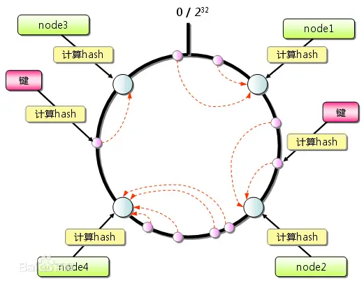一致性哈希


#### 路由规则

负载均衡只能保证服务提供者压力的平衡，但是在一些业务场景中需要设置一些过滤规则，比较常用的是基本表达式的条件路由。
 通过IP条件表达式配置黑白名单访问控制：consumerIP != 192.168.1.1。
 只暴露部分服务提供者，防止这个集群服务都被冲垮，导致其他服务也不可用。例如providerIP = 192.168.3*。 读写分离：method=find*,list*,get*,query*=>providerIP=192.168.1.*。 前后台分离：app=web*=>providerIP=192.168.1.*,app=java*=>providerIP=192.168.2.*。 灰度升级：将WEB前台应用理由到新的服务版本上：app=web*=>provicerIP=192.168.1.*。

由于篇幅原因这里不细说，还是丢个说的比较详细的文章地址： [服务路由](https://blog.csdn.net/zhengzhaoyang122/article/details/80842859)

### 序列化与反序列化

把对象转换为字节序列的过程称为序列化，把字节序列恢复为对象的过程称为反序列化。运程调用的时候，我们需要先将Java对象进行序列化，然后通过网络，IO进行传输，当到达目的地之后，再进行反序列化获取到我们想要的结果对象。分布式系统中，传输的对象会很多，这就要求序列化速度快，产生字节序列小的序列化技术。
 序列化技术：**Serializable, xml, Jackson, MessagePack, fastjson, Protocol Buffer, Thrift,Gson, Avro,Hessian**等

- **Serializable** 是java自带的序列化技术，无法跨平台，序列化和反序列化的速度相对较慢。
- **XML**技术多平台支持好，常用于与银行交互的报文，但是其字节序列产生较大，不太适合用作分布式通讯框架。
- **Fastjson**是Java语言编写的高性能的JSON处理器,由阿里巴巴公司开发,字节序列为json串，可读性好，序列化也速度非常的快。
- **Protocol Buffer** 序列化速度非常快，字节序列较小，但是可读性较差。
   ( 这里就不一一介绍，有兴趣可以看看这篇文章：[序列化技术比较](https://www.jianshu.com/p/937883b6b2e5) )
   一般分布式服务框架会内置多种序列化协议可供选择，如**Dubbo** 支持的7种协议用到的序列化技术就不完全相同。

### 服务调用

本地环境下，使用某个接口很简单，直接调用就行。分布式环境下就不是那么简单了，消费者方只会存在接口的定义，没有具体的实现。想要像本地环境下直接调用远程接口那就得耗费一些功夫了，需要用到**远程代理**。
 下面是我盗的图：


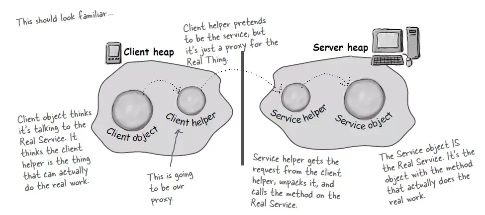<center>远程代理</center>


通信时序如下：

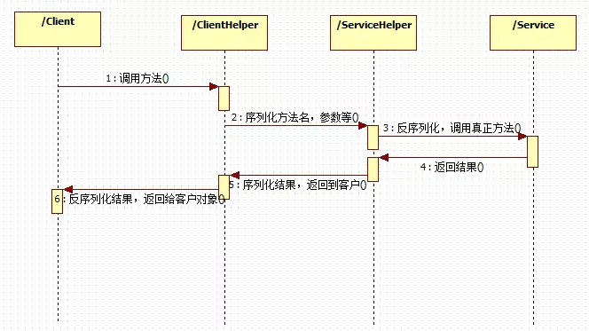通信时序


消费者端没有具体的实现，需要调用接口时会动态的去创建一个代理类。与spirng集成的情况，那直接在bean构建的时候注入代理类。

下面是构建代理类：

```java
import java.lang.reflect.Proxy;
public class JdkProxy {
    public static Object getInstance(Class<?> cls){       
    	JdkMethodProxy invocationHandler = new JdkMethodProxy();
        Object newProxyInstance = Proxy.newProxyInstance(  
                cls.getClassLoader(),  
                new Class[] { cls }, 
                invocationHandler); 
        return (Object)newProxyInstance;
    }
}
```
```java
import java.lang.reflect.InvocationHandler;
import java.lang.reflect.Method;

public class JdkMethodProxy implements InvocationHandler {
	
    @Override
    public Object invoke(Object proxy, Method method, Object[] parameters)  throws Throwable {        
        //如果传进来是一个已实现的具体类
        if (Object.class.equals(method.getDeclaringClass())) {  
            try {  
                return method.invoke(this, parameters);  
            } catch (Throwable t) {  
                t.printStackTrace();  
            }  
        //如果传进来的是一个接口
        } else {  
        	//实现接口的核心方法 
            //return RemoteInvoking.invoking(serviceName, serializationType, //timeOut,loadBalanceStrategy,method, parameters);
        }  
        return null;
    }
}
```

代理会做很多事情，对请求服务的名称及参数信息的的序列化、通过路由选择最为合适服务提供者、建立通讯连接发送请求信息（或者直接发起http请求）、最后返回获取到的结果。当然这里面需要考虑很多问题，如调用超时，请求异常，通讯连接的缓存，同步服务调用还是异步服务调用等等。

- **同步服务调用**：客户端发起远程服务调用请求，用户线程完成消息序列化之后，将消息投递到通信框架，然后同步阻塞，等待通信线程发送请求并接收到应答之后，唤醒同步等待的用户线程，用户线程获取到应答之后返回。

- **异步服务调用**：基于JAVA的**Future**机制，客户端发起远程服务调用请求，该请求会被标上**requestId**,同时建立一个与**requestId**对应 **Future**，客户端通过**Future** 的 get方法获取结果时会被阻塞。服务端收到请求应达会回传**requestId**，通过**requestId**去解除对应**Future**的阻塞，同时set对应结果，最后客户端获取到结果。

构建Future，以requestId为key，put到线程安全的map中。get结果时需要写入timeOut超时时间，防止由于结果的未返回而导致的长时间的阻塞。

```java
SyncFuture<RpcResponse> syncFuture =new SyncFuture<RpcResponse>();
SyncFutureCatch.syncFutureMap.put(rpcRequest.getRequestId(), syncFuture);
try {
	RpcResponse rpcResponse= syncFuture.get(timeOut,TimeUnit.MILLISECONDS);		
    return rpcResponse.getResult();
}catch (Exception e){
	throw e;
}finally {
	SyncFutureCatch.syncFutureMap.remove(rpcRequest.getRequestId());
}
```

结果返回时通过回传的requestId获取对应Future写入Response,Future线程解除阻塞。

```java
log.debug("Tcp Client receive head："+headAnalysis+"Tcp Client receive data：" +rpcResponse);
SyncFuture<RpcResponse> syncFuture= SyncFutureCatch.syncFutureMap.get(rpcResponse.getRequestId());
if(syncFuture!=null){
		syncFuture.setResponse(rpcResponse);
}
```

```java
import java.util.concurrent.CountDownLatch;
import java.util.concurrent.Future;
import java.util.concurrent.TimeUnit;

public class SyncFuture<T> implements Future<T> {
    // 因为请求和响应是一一对应的，因此初始化CountDownLatch值为1。
    private CountDownLatch latch = new CountDownLatch(1);
    // 需要响应线程设置的响应结果
    private T response;
    // Futrue的请求时间，用于计算Future是否超时
    private long beginTime = System.currentTimeMillis();
    public SyncFuture() {
    }
    @Override
    public boolean cancel(boolean mayInterruptIfRunning) {
        return false;
    }
    @Override
    public boolean isCancelled() {
        return false;
    }
    @Override
    public boolean isDone() {
        if (response != null) {
            return true;
        }
        return false;
    }
    // 获取响应结果，直到有结果才返回。
    @Override
    public T get() throws InterruptedException {
        latch.await();
        return this.response;
    }
    // 获取响应结果，直到有结果或者超过指定时间就返回。
    @Override
    public T get(long timeOut, TimeUnit unit) throws InterruptedException {
        if (latch.await(timeOut, unit)) {
            return this.response;
        }
        return null;
    }
    // 用于设置响应结果，并且做countDown操作，通知请求线程
    public void setResponse(T response) {
        this.response = response;
        latch.countDown();
    }
    public long getBeginTime() {
        return beginTime;
    }
}
```

```java
SyncFuture<RpcResponse> syncFuture =new SyncFuture<RpcResponse>();
SyncFutureCatch.syncFutureMap.put(rpcRequest.getRequestId(), syncFuture);
RpcResponse rpcResponse= syncFuture.get(timeOut,TimeUnit.MILLISECONDS);
SyncFutureCatch.syncFutureMap.remove(rpcRequest.getRequestId());
```

除了同步服务调用，异步服务调用，还有并行服务调用，泛化调用等调用形式
 ( 这里就不做介绍，有兴趣可以看看这篇文章：[服务框架多形式的服务调用：同步、异步、并用、泛化](http://www.voidcn.com/article/p-fdoonxif-mr.html) )

## 高可用

简单的介绍了下分布式服务框架，下面来说下分布式系统的高可用。一个系统设计开发出来，三天两晚就出个大问题，导致无法使用，那这个系统也不是什么好系统。业界流传一句话："我们系统支持X个9的可靠性"。这个X是代表一个数字，X个9表示在系统1年时间的使用过程中，系统可以正常使用时间与总时间（1年）之比。
 3个9：(1-99.9%)*365*24=8.76小时，表示该系统在连续运行1年时间里最多可能的业务中断时间是8.76小时，4个9即52.6分钟，5个9即5.26分钟。要做到如此高的可靠性，是非常大的挑战。一个大型分布式项目可能是由几十上百个项目构成，涉及到的服务成千上万，主链上的一个流程就需要流转多个团队维护的项目。拿4个9的可靠性来说，平摊到每个团队的时间可能不到10分钟。这10分钟内需要顶住压力，以最快的时间找到并解决问题，恢复系统的可用。
 下面说说为了提高系统的可靠性都有哪些方案：

- **服务检测**：某台服务器与注册中心的连接中断，其提供的服务也无响应时，系统应该能主动去重启该服务，使其能正常对外提供。
- **故障隔离**：集群环境下，某台服务器能对外提供服务，但是因为其他原因，请求结果始终异常。这时就需要主动将该节点从集群环境中剔除，避免继续对后面的请求造成影响，非高峰时期再尝试修复该问题。至于机房故障的情况，只能去屏蔽整个机房了。目前饿了么做的是异地多活，即便单边机房挂了，流量也可以全量切换至另外一边机房，保证系统的可用。
- **监控**：包含业务监控、服务异常监控、db中间件性能的监控等，系统出现异常的时候能及时的通知到开发人员。等到线下报上来的时候，可能影响已经很大了。
- **压测**：产线主链路的压测是必不可少的，单靠集成测试，有些高并发的场景是无法覆盖到的，压测能暴露平常情况无法出现的问题，也能直观的提现系统的吞吐能力。当业务激增时，可以考虑直接做系统扩容。
- **sop方案与演练**：产线上随时都可能会发生问题，抱着出现问题时再想办法解决的态度是肯定不行的，时间根本来不及。提前做好对应问题的sop方案，能节省大量时间，尽快的恢复系统的正常。当然平常的演练也是不可少的，一旦产线故障可以做到从容不迫的去应对和处理。

除了上述方案外，还可以考虑**服务策略**的使用：

### 降级策略

业务高峰期，为了保证核心服务，需要停掉一些不太重要的业务，如双十一期间不允许发起退款(*￣▽￣)、只允许查看3个月之内的历史订单等业务的降级，调用服务接口时，直接返回的空结果或异常等服务的降级,都属于分布式系统的降级策略。服务降级是可逆操作，当系统压力恢复到一定值不需要降级服务时，需要去除降级，将服务状态恢复正常。 服务降级主要包括**屏蔽降级**和**容错降级**：
 **屏蔽降级**:分布式服务框架直接屏蔽对远程接口的请求，不发起对远程服务的调用，直接返回空结果、抛出指定异常、执行本地模拟接口实现等方式。
 **容错降级**：非核心服务不可调用时，可以对故障服务做业务放通，保证主流程不受影响。如请求超时、消息解码异常、系统拥塞保护异常， 服务提供方系统异常等情况。 笔者之前就碰到过因双方没有做容错降级导致的系统故障的情况。午高峰时期，对方调用我们的一个非核心查询接口，我们系统因为bug问题一直异常，导致对方调用这个接口的页面异常而无法跳转到主流程页面，影响了产线的生产。当时对方紧急发版才使系统恢复正常。

### 限流策略

说到限流，最先想到的就是秒杀活动了，一场秒杀活动的流量可能是正常流量的几百至几千倍，如此高的流量系统根本无法处理，只能通过限流来避免系统的崩溃。服务的限流本质和秒杀活动的限流是一样的，都是限制请求的流入，防止服务提供方因大量的请求而崩溃。
 限流算法：**令牌桶、漏桶、计数器算法**
 上述算法适合单机的限流，但涉及到整个集群的限流时，得考虑使用缓存中间件了。例如：某个服务1分钟内只允许请求2次，或者一天只允许使用1000次。由于负载均衡存在，可能集群内每台机器都会收到请求，这种时候就需要缓存来记录调用方某段时间内的请求次数，再做限流处理。redis就很适合做此事。 [限流算法的实现](https://www.jianshu.com/p/76cc8ba5ca91)

### 熔断策略

熔断本质上是一种过载保护机制，这一概念来源于电子工程中的断路器，当电流过大时，保险丝会熔断，从而保护整个电路。同样在分布式系统中，当被调用的远程服务无法使用时，如果没有过载保护，就会导致请求的资源阻塞在远程服务器上耗尽资源。很多时候，刚开始可能只是出现了局部小规模的故障，然而由于种种原因，故障影响范围越来越大，最终导致全局性的后果。当下游服务因访问压力过大而响应变慢或失败，上游服务为了保护自己以及系统整体的可用性，可以暂时切断对下游服务的调用。
 **熔断器的设计思路**
 **Closed**：初始状态，熔断器关闭，正常提供服务
 **Open**: 失败次数，失败百分比达到一定的阈值之后，熔断器打开，停止访问服务
 **Half-Open**：熔断一定时间之后，小流量尝试调用服务，如果成功则恢复，熔断器变为**Closed**状态

## 数据一致性

一个系统设计开发出来，必须保证其运行的数据准确和一致性。拿支付系统来说：用户银行卡已经扣款成功，系统里却显示失败，没有给用户的虚拟帐户充值上，这会引起客诉。说的再严重点，用户发起提现，资金已经转到其银行账户，系统却没扣除对应虚拟帐号的余额，直接导致资金损失了。如果这时候用户一直发起提现，那就酸爽了。

### CAP原则

说到数据一致性，就不得不说到**CAP原则**。**CAP原则**中指出任何一个分布式系统中，**Consistency（一致性 C）**、 **Availability（可用性 A）**、**Partition tolerance（分区容错性P）**，三者不可兼得。传统单机数据库基于**ACID特性（原子性（Atomicity）、一致性（Consistency）、隔离性（Isolation）、持久性（Durability））** ，放弃了分区容错性，能做到可用性和一致性。对于一个分布式系统而言，分区容错性是一个最基本的要求。既然是一个分布式系统，那么分布式系统中的组件必然需要被部署到不同的节点，会出现节点与节点之间的网络通讯，而网络问题又是一定会出现的异常情况，**分区容错性**也就成为了一个分布式系统必然需要面对和解决的问题。系统架构师往往需要把精力花在如何根据业务特点在**一致性**和**可用性**之间寻求平衡。

集中式系统，通过数据库事务的控制，能做到数据的强一致性。但是分布式系统中，涉及多服务间的调用，通过分布式事务的方案：**两阶段提交（2PC）**、**三阶段提交（3PC）**、**补偿事务（TCC）**等虽然能实现数据的强一致，但是都是通过牺牲可用性来实现。

### BASE理论

**BASE理论**是对**CAP原则**中一致性和可用性权衡的结果：**Basically Available（基本可用）、Soft state（软状态）和Eventually consistent（最终一致性）**。BASE理论，其来源于对大规模互联网系统分布式实践的总结，是基于**CAP原则**逐步演化而来的。其最核心思想是：即使无法做到强一致性，但每个应用都可以根据自身业务特点，采用适当的方式来使系统达到最终一致性。
- **基本可用**
 基本可用是指分布式系统在出现不可预知故障的时候，允许损失部分可用性，这不等价于系统不可用。
- **软状态**
 软状态指允许系统中的数据存在中间状态，并认为该中间状态的存在不会影响系统的整体可用性，即允许系统在不同节点的数据副本之间进行数据同步的过程存在延时
- **最终一致性**
 最终一致性强调的是所有的数据副本，在经过一段时间的同步之后，最终都能够达到一致的状态。因此，最终一致性的本质是需要系统保证最终数据能够达到一致，而不需要实时保证系统数据的强一致性。

总的来说，**BASE理论**面向的是大型高可用可扩展的分布式系统，和传统的事物**ACID特性**是相反的，它完全不同于**ACID**的强一致性模型，而是通过牺牲强一致性来获得可用性，并允许数据在一段时间内是不一致的，但最终达到一致状态。同时，在实际的分布式场景中，不同业务单元和组件对数据一致性的要求是不同的，因此在具体的分布式系统架构设计过程中，ACID特性和BASE理论往往又会结合在一起。

下面2篇文章对分布式事务和数据一致性这块有较深的讲解。
- [聊聊分布式事务，再说说解决方案 ](https://www.cnblogs.com/savorboard/p/distributed-system-transaction-consistency.html)
- [微服务下的数据一致性的几种实现方式之概述 ](https://www.jianshu.com/p/b264a196b177)

## 微服务下的数据一致性的几种实现方式之概述

### 传统应用的事务管理

#### 本地事务

再介绍微服务下的数据一致性之前，先简单地介绍一下事务的背景。传统单机应用使用一个RDBMS作为数据源。应用开启事务，进行CRUD，提交或回滚事务，统统发生在本地事务中，由资源管理器（RM）直接提供事务支持。数据的一致性在一个本地事务中得到保证。

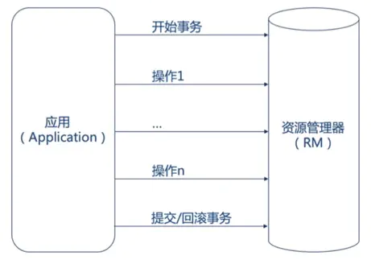

#### 分布式事务

#####两阶段提交（2PC）

当应用逐渐扩展，出现一个应用使用多个数据源的情况，这个时候本地事务已经无法满足数据一致性的要求。由于多个数据源的同时访问，事务需要跨多个数据源管理，分布式事务应运而生。其中最流行的就是两阶段提交（2PC），分布式事务由事务管理器（TM）统一管理。

两阶段提交分为准备阶段和提交阶段。


<center>两阶段提交-commit</center>

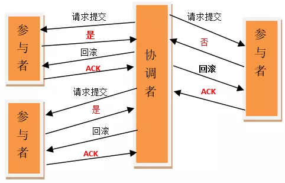

<center>两阶段提交-rollback</center>

然而两阶段提交也不能完全保证数据一致性问题，并且有同步阻塞的问题，所以其优化版本三阶段提交（3PC）被发明了出来。

#####三阶段提交（3PC）

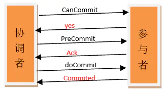

<center>三阶段提交</center>

然而3PC也只能保证绝大多数情况下的数据一致性。

具体分布式事务2PC和3PC的详细介绍请见[关于分布式事务、两阶段提交协议、三阶提交协议](https://cloud.tencent.com/developer/article/1334942)。分布式事务不是本文的重点，故不展开。

###微服务下的事务管理

那么，分布式事务2PC或者3PC是否适合于微服务下的事务管理呢？答案是否定的，原因有三点：

1. 由于微服务间无法直接进行数据访问，微服务间互相调用通常通过RPC（dubbo）或Http API（SpringCloud）进行，所以已经无法使用TM统一管理微服务的RM。
2. 不同的微服务使用的数据源类型可能完全不同，如果微服务使用了NoSQL之类不支持事务的数据库，则事务根本无从谈起。
3. 即使微服务使用的数据源都支持事务，那么如果使用一个大事务将许多微服务的事务管理起来，这个大事务维持的时间，将比本地事务长几个数量级。如此长时间的事务及跨服务的事务，将为产生很多锁及数据不可用，严重影响系统性能。

由此可见，传统的分布式事务已经无法满足微服务架构下的事务管理需求。那么，既然无法满足传统的ACID事务，在微服务下的事务管理必然要遵循新的法则－－BASE理论。

BASE理论由eBay的架构师Dan Pritchett提出，BASE理论是对CAP理论的延伸，核心思想是即使无法做到强一致性，应用应该可以采用合适的方式达到最终一致性。BASE是指基本可用（Basically Available）、软状态（ Soft State）、最终一致性（ Eventual Consistency）。

`基本可用`：指分布式系统在出现故障的时候，允许损失部分可用性，即保证核心可用。

`软状态`：允许系统存在中间状态，而该中间状态不会影响系统整体可用性。分布式存储中一般一份数据至少会有三个副本，允许不同节点间副本同步的延时就是软状态的体现。

`最终一致性`：最终一致性是指系统中的所有数据副本经过一定时间后，最终能够达到一致的状态。弱一致性和强一致性相反，最终一致性是弱一致性的一种特殊情况。

BASE中的`最终一致性`是对于微服务下的事务管理的根本要求，既基于微服务的事务管理无法达到强一致性，但必须保证最重一致性。那么，有哪些方法可以保证微服务下的事务管理的最终一致性呢，按照实现原理分主要有两类，事件通知型和补偿型，其中事件通知型又可分为可靠事件通知模式及最大努力通知模式，而补偿型又可分为TCC模式、和业务补偿模式两种。这四种模式都可以达到微服务下的数据最终一致性。

### 实现微服务下数据一致性的方式

#### 可靠事件通知模式

##### 同步事件

可靠事件通知模式的设计理念比较容易理解，即是主服务完成后将结果通过事件（常常是消息队列）传递给从服务，从服务在接受到消息后进行消费，完成业务，从而达到主服务与从服务间的消息一致性。首先能想到的也是最简单的就是同步事件通知，业务处理与消息发送同步执行，实现逻辑见下方代码及时序图。

```cpp
public void trans() {
    try {
    // 1. 操作数据库
        bool result = dao.update(data);// 操作数据库失败，会抛出异常
    // 2. 如果数据库操作成功则发送消息
        if(result){
            mq.send(data);// 如果方法执行失败，会抛出异常
        }
    } catch (Exception e) {
        roolback();// 如果发生异常，就回滚
    }
}
```

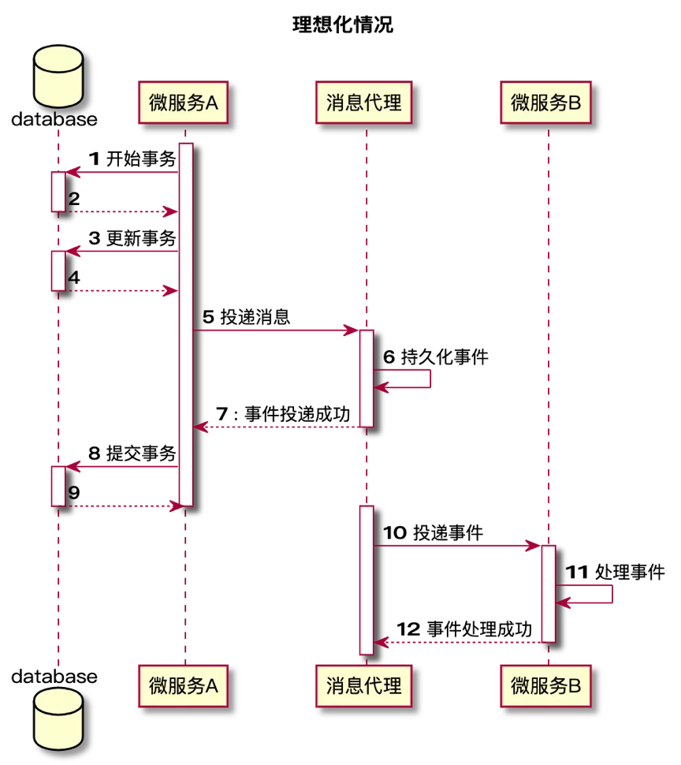

上面的逻辑看上去天衣无缝，如果数据库操作失败则直接退出，不发送消息；如果发送消息失败，则数据库回滚；如果数据库操作成功且消息发送成功，则业务成功，消息发送给下游消费。然后仔细思考后，同步消息通知其实有两点不足的地方。

1. 在微服务的架构下，有可能出现网络IO问题或者服务器宕机的问题，如果这些问题出现在时序图的第7步，使得消息投递后无法正常通知主服务（网络问题），或无法继续提交事务（宕机），那么主服务将会认为消息投递失败，会滚主服务业务，然而实际上消息已经被从服务消费，那么就会造成主服务和从服务的数据不一致。具体场景可见下面两张时序图。

   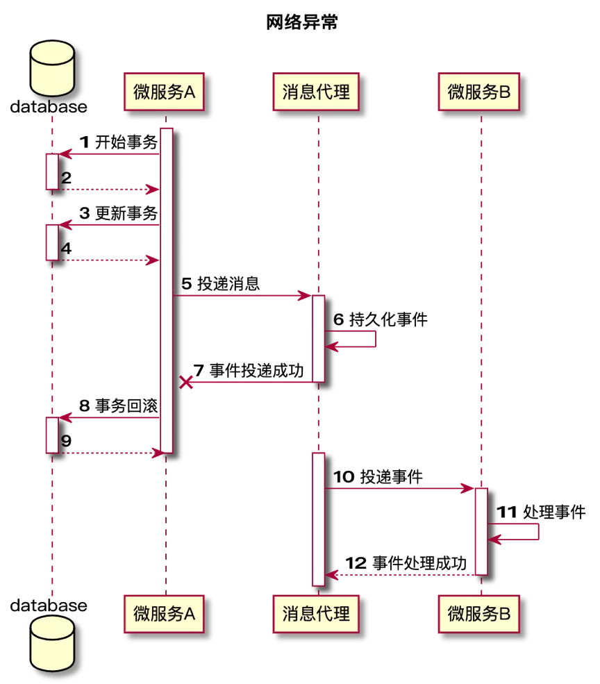


1. 事件服务（在这里就是消息服务）与业务过于耦合，如果消息服务不可用，会导致业务不可用。应该将事件服务与业务解耦，独立出来异步执行，或者在业务执行后先尝试发送一次消息，如果消息发送失败，则降级为异步发送。

##### 异步事件

###### 本地事件服务

为了解决3.1.1中描述的同步事件的问题，异步事件通知模式被发展了出来，既业务服务和事件服务解耦，事件异步进行，由单独的事件服务保证事件的可靠投递。


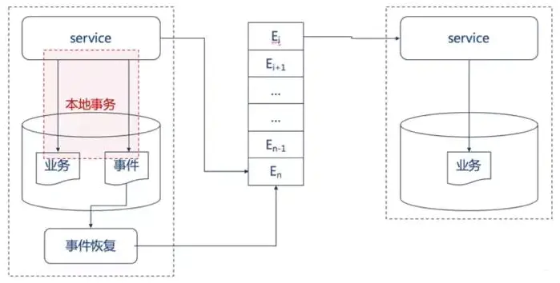

*异步事件通知－本地事件服务*

当业务执行时，在同一个本地事务中将事件写入本地事件表，同时投递该事件，如果事件投递成功，则将该事件从事件表中删除。如果投递失败，则使用事件服务定时地异步统一处理投递失败的事件，进行重新投递，直到事件被正确投递，并将事件从事件表中删除。这种方式最大可能地保证了事件投递的实效性，并且当第一次投递失败后，也能使用异步事件服务保证事件至少被投递一次。

然而，这种使用本地事件服务保证可靠事件通知的方式也有它的不足之处，那便是业务仍旧与事件服务有一定耦合（第一次同步投递时），更为严重的是，本地事务需要负责额外的事件表的操作，为数据库带来了压力，在高并发的场景，由于每一个业务操作就要产生相应的事件表操作，几乎将数据库的可用吞吐量砍了一半，这无疑是无法接受的。正是因为这样的原因，可靠事件通知模式进一步地发展－外部事件服务出现在了人们的眼中。

###### 外部事件服务

外部事件服务在本地事件服务的基础上更进了一步，将事件服务独立出主业务服务，主业务服务不在对事件服务有任何强依赖。


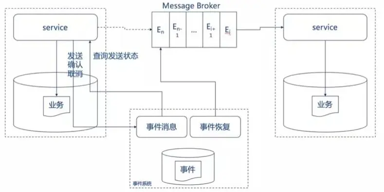


*异步事件通知－外部事件服务*


业务服务在提交前，向事件服务发送事件，事件服务只记录事件，并不发送。业务服务在提交或回滚后通知事件服务，事件服务发送事件或者删除事件。不用担心业务系统在提交或者会滚后宕机而无法发送确认事件给事件服务，因为事件服务会定时获取所有仍未发送的事件并且向业务系统查询，根据业务系统的返回来决定发送或者删除该事件。

外部事件虽然能够将业务系统和事件系统解耦，但是也带来了额外的工作量：外部事件服务比起本地事件服务来说多了两次网络通信开销（提交前、提交／回滚后），同时也需要业务系统提供单独的查询接口给事件系统用来判断未发送事件的状态。

###### 可靠事件通知模式的注意事项

可靠事件模式需要注意的有两点，1. 事件的正确发送； 2. 事件的重复消费。
 通过异步消息服务可以确保事件的正确发送，然而事件是有可能重复发送的，那么就需要消费端保证同一条事件不会重复被消费，简而言之就是保证事件消费的`幂等性`。

如果事件本身是具备幂等性的状态型事件，如订单状态的通知（已下单、已支付、已发货等），则需要判断事件的顺序。一般通过时间戳来判断，既消费过了新的消息后，当接受到老的消息直接丢弃不予消费。如果无法提供全局时间戳，则应考虑使用全局统一的序列号。

对于不具备幂等性的事件，一般是动作行为事件，如扣款100，存款200，则应该将事件id及事件结果持久化，在消费事件前查询事件id，若已经消费则直接返回执行结果；若是新消息，则执行，并存储执行结果。

#### 最大努力通知模式

相比可靠事件通知模式，最大努力通知模式就容易理解多了。最大努力通知型的特点是，业务服务在提交事务后，进行有限次数（设置最大次数限制）的消息发送，比如发送三次消息，若三次消息发送都失败，则不予继续发送。所以有可能导致消息的丢失。同时，主业务方需要提供查询接口给从业务服务，用来恢复丢失消息。最大努力通知型对于时效性保证比较差（既可能会出现较长时间的软状态），所以对于数据一致性的时效性要求比较高的系统无法使用。这种模式通常使用在不同业务平台服务或者对于第三方业务服务的通知，如银行通知、商户通知等，这里不再展开。

#### 业务补偿模式

接下来介绍两种补偿模式，补偿模式比起事件通知模式最大的不同是，补偿模式的上游服务依赖于下游服务的运行结果，而事件通知模式上游服务不依赖于下游服务的运行结果。首先介绍业务补偿模式，业务补偿模式是一种纯补偿模式，其设计理念为，业务在调用的时候正常提交，当一个服务失败的时候，所有其依赖的上游服务都进行业务补偿操作。举个例子，小明从杭州出发，去往美国纽约出差，现在他需要定从杭州去往上海的火车票，以及从上海飞往纽约的飞机票。如果小明成功购买了火车票之后发现那天的飞机票已经售空了，那么与其在上海再多待一天，小明还不如取消去上海的火车票，选择飞往北京再转机纽约，所以小明就取消了去上海的火车票。这个例子中购买杭州到上海的火车票是服务a，购买上海到纽约的飞机票是服务b，业务补偿模式就是在服务b失败的时候，对服务a进行补偿操作，在例子中就是取消杭州到上海的火车票。

补偿模式要求每个服务都提供补偿借口，且这种补偿一般来说是`不完全补偿`，既即使进行了补偿操作，那条取消的火车票记录还是一直存在数据库中可以被追踪（一般是有相信的状态字段“已取消”作为标记），毕竟已经提交的线上数据一般是不能进行物理删除的。

业务补偿模式最大的缺点是软状态的时间比较长，既数据一致性的时效性很低，多个服务常常可能处于数据不一致的情况。

#### TCC/Try Confirm Cancel模式

TCC模式是一种优化了的业务补偿模式，它可以做到`完全补偿`，既进行补偿后不留下补偿的纪录，就好像什么事情都没有发生过一样。同时，TCC的软状态时间很短，原因是因为TCC是一种两阶段型模式（已经忘了两阶段概念的可以回顾一下1.2.1），只有在所有的服务的第一阶段（try）都成功的时候才进行第二阶段确认（Confirm）操作，否则进行补偿(Cancel)操作，而在try阶段是不会进行真正的业务处理的。


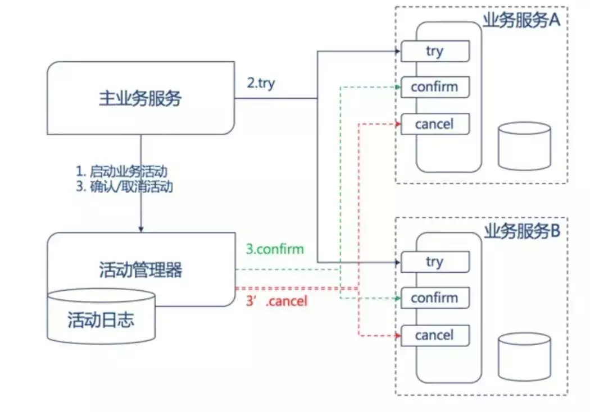


*TCC模式*


TCC模式的具体流程为两个阶段：

1. Try，业务服务完成所有的业务检查，预留必需的业务资源
2. 如果Try在所有服务中都成功，那么执行Confirm操作，Confirm操作不做任何的业务检查（因为try中已经做过），只是用Try阶段预留的业务资源进行业务处理；否则进行Cancel操作，Cancel操作释放Try阶段预留的业务资源。

这么说可能比较模糊，下面我举一个具体的例子，小明在线从招商银行转账100元到广发银行。这个操作可看作两个服务，服务a从小明的招行账户转出100元，服务b从小明的广发银行帐户汇入100元。

服务a（小明从招行转出100元）:

try: update cmb_account set balance=balance-100, freeze=freeze+100 where acc_id=1 and balance>100;

confirm: update cmb_account set freeze=freeze-100 where acc_id=1;

cancel: update cmb_account set balance=balance+100, freeze=freeze-100 where acc_id=1;

服务b（小明往广发银行汇入100元）:

try: update cgb_account set freeze=freeze+100 where acc_id=1;

confirm: update cgb_account set balance=balance+100, freeze=freeze-100 where acc_id=1;

cancel: update cgb_account set freeze=freeze-100 where acc_id=1;

具体说明：
 a的try阶段，服务做了两件事，1：业务检查，这里是检查小明的帐户里的钱是否多余100元；2:预留资源，将100元从余额中划入冻结资金。

a的confirm阶段，这里不再进行业务检查，因为try阶段已经做过了，同时由于转账已经成功，将冻结资金扣除。

a的cancel阶段，释放预留资源，既100元冻结资金，并恢复到余额。

b的try阶段进行，预留资源，将100元冻结。

b的confirm阶段，使用try阶段预留的资源，将100元冻结资金划入余额。

b的cancel阶段，释放try阶段的预留资源，将100元从冻结资金中减去。

从上面的简单例子可以看出，TCC模式比纯业务补偿模式更加复杂，所以在实现上每个服务都需要实现Cofirm和Cancel两个接口。

#### 总结

下面的表格对这四种常用的模式进行了比较：

| 类型   | 名称     | 数据一致性的实时性 | 开发成本 | 上游服务是否依赖下游服务结果 |
| ------ | -------- | ------------------ | -------- | ---------------------------- |
| 通知型 | 最大努力 | 低                 | 低       | 不依赖                       |
| 通知型 | 可靠事件 | 高                 | 高       | 不依赖                       |
| 补偿型 | 业务补偿 | 低                 | 低       | 依赖                         |
| 补偿型 | TCC      | 高                 | 高       | 依赖                         |

## 引用

1. https://juejin.im/post/5c7cd6eee51d457c042d4b52
2. https://www.jianshu.com/p/b264a196b177