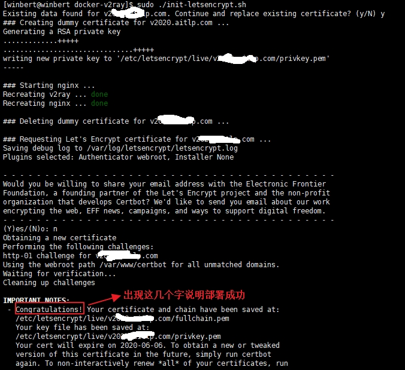

> 文章转载自[在docker-compose环境下以ws+tls方式一键搭建v2ray(So easy)](https://www.4spaces.org/docker-compose-install-v2ray-ws-tls/)，根据实际搭建情况，略有修改

通常以ws+tls方式搭建v2ray的步骤比较繁琐，比如安装v2ray、安装nginx、申请证书等等。那有没有比较简便的方法自动完成这一系列工作呢？答案就在下面。


在docker-compose环境下以ws+tls方式搭建v2ray的具体步骤如下：

## 一、环境准备

**1.获取域名及VPS**

第一步你应该先拥有一个VPS和一个域名，获取VPS和域名的方法如下：

- 免费域名注册： [免费域名申请](https://www.freenom.com/zh/index.html?lang=zh)；；
- VPS推荐搬瓦工，支持支付宝付款，注册地址：[注册搬瓦工](https://www.4spaces.org/go/bwg/)，注册教程：[史上最详细搬瓦工VPS注册/购买图文教程(内附优惠券)](https://www.4spaces.org/best-details-to-buy-banwagonhost/)，特价促销款：[搬瓦工促销](https://www.4spaces.org/bwg/static/promotion.html)。
- 通过此【[链接](https://www.vultr.com/?ref=7365575)】注册Vultr VPS，即可获得$100，推荐刚上新的韩国机房，参考： [Vultr韩国机房上线，韩国SK线路，附简单测试和新用户优惠](https://www.aliyunhost.net/vultr-korea-datacenter-launch/)。

然后将域名解析到你VPS的对应的IP地址。

通过[史上最详细搬瓦工VPS注册/购买图文教程(内附优惠券)](https://www.4spaces.org/best-details-to-buy-banwagonhost/)这篇文章，你应该知道如何使用xshell进行VPS的连接工作了。使用xshell远程连接后进行下面操作。

**2.安装docker-ce并启动**

以下操作我都是以root用户进行的。

- 安装

```shell
$ curl -fsSL https://get.docker.com -o get-docker.sh
$ sh get-docker.sh
```

**注：** 这一步如果是CENTOS 8，可能会出现 `requires containerd.io >= 1.2.2-3错误` -> [解决办法](https://www.4spaces.org/docker-ce-install-containerd-io-error/)。

- 添加用户到用户组

```shell
gpasswd -a $USER docker
```

- 启动

```shell
systemctl start docker
```

- 设置docker开机自启动

```shell
systemctl enable docker
```

**3.安装`docker-compose`**

```shell
$  curl -L "https://github.com/docker/compose/releases/download/1.25.4/docker-compose-$(uname -s)-$(uname -m)" -o /usr/local/bin/docker-compose

$ chmod +x /usr/local/bin/docker-compose

$ ln -s /usr/local/bin/docker-compose /usr/bin/docker-compose
```

**4.安装git并clone代码**

```shell
yum -y install git


git clone https://github.com/aitlp/docker-v2ray.git
```

或者你可以下载后在上传到你的VPS。

## 二、修改v2ray配置

下载部署配置文件，然后使用`WinSCP`等工具上传到你的VPS(当然，也可以安装git后直接clone)，地址： https://github.com/aitlp/docker-v2ray，如果不会下载请邮件联系 `aitlpmw(at)gmail.com`，我发送给你。

**1.`init-letsencrypt.sh`**

将里面的`domains`和`email`修改为自己的域名和邮箱。

**2.`docker-compose.yml`**

可以不用动。

**3.`data/v2ray/config.json`**

修改ID，`"id": "bae399d4-13a4-46a3-b144-4af2c0004c2e"`，也可以不修改。

**4.`data/nginx/conf.d/v2020_v2ray.conf`**

修改所有`your_domain`为自己的域名，其他地方，如果上面可以修改的地方你没修改，那么除了域名之外的也不用修改了。

## 三、一键部署v2ray

```shell
chomod +x ./init-letsencrypt.sh

sudo ./init-letsencrypt.sh
```

下面是我运行的详细过程：



## 四、客户端配置

现在你可以开始使用了。

参考： [2020年最新v2ray搭建详细图文教程(从小白到老炮)](https://www.4spaces.org/build-v2ray-from-0-to-1/)

相关配置参考： [centos7基于nginx搭建v2ray服务端配置vmess+tls+websocket完全手册](https://www.4spaces.org/v2ray-nginx-tls-websocket/)