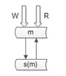
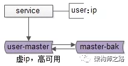
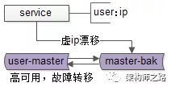

# 基本概念

## 概念一：单库

## 概念二：分片

分片解决“数据量太大”这一问题，也就是通常说的“水平切分”。

一旦引入分片，势必面临“数据路由”的新问题，数据到底要访问哪个库。路由规则通常有3种方法：

###（1）范围：range

优点：简单，容易扩展。

缺点：各库压力不均（新号段更活跃）。

###（2）哈希：hash

优点：简单，数据均衡，负载均匀。

缺点：迁移麻烦（2库扩3库数据要迁移）。

###（3）统一路由服务：router-config-server

优点：灵活性强，业务与路由算法解耦。

缺点：每次访问数据库前多一次查询。

大部分互联网公司采用的方案二：哈希路由。

## 概念三：分组

分组解决“可用性，性能提升”这一问题，分组通常通过主从复制的方式实现。

互联网公司数据库实际软件架构是“既分片，又分组”：

------

数据库软件架构，究竟设计些什么呢，至少要考虑以下四点：

- 如何保证数据可用性
- 如何提高数据库读性能（大部分应用读多写少，读会先成为瓶颈）
- 如何保证一致性
- 如何提高扩展性

------

# 如何保证数据的可用性？

解决可用性问题的思路是：冗余。

> 如何保证站点的可用性？冗余站点。
> 如何保证服务的可用性？冗余服务。
> 如何保证数据的可用性？冗余数据。

数据的冗余，会带来一个副作用：一致性问题。

## 如何保证数据库“读”高可用？

> 冗余读库

冗余读库带来什么副作用？

读写有延时，数据可能不一致。

上图是很多互联网公司mysql的架构，写仍然是单点，不能保证写高可用。

## 如何保证数据库“写”高可用？

> 冗余写库。

采用双主互备的方式，可以冗余写库。

冗余写库带来什么副作用？

双写同步，数据可能冲突（例如“自增id”同步冲突）。

> 如何解决同步冲突，有两种常见解决方案：
> （1）两个写库使用不同的初始值，相同的步长来增加id：1写库的id为0,2,4,6...；2写库的id为1,3,5,7…；
> （2）不使用数据的id，业务层自己生成唯一的id，保证数据不冲突；

阿里云的RDS服务号称写高可用，是如何实现的呢？

他们采用的就是类似于“双主同步”的方式（不再有从库了）。

仍是双主，但只有一个主提供读写服务，另一个主是“shadow-master”，只用来保证高可用，平时不提供服务。

master挂了，shadow-master顶上，虚IP漂移，对业务层透明，不需要人工介入。

> 这种方式的好处：
> （1）读写没有延时，无一致性问题；
> （2）读写高可用；

> 不足是：
> （1）不能通过加从库的方式扩展读性能；
> （2）资源利用率为50%，一台冗余主没有提供服务；

*画外音：所以，高可用RDS还挺贵的。*

# 如何扩展读性能？

提高读性能的方式大致有三种，

## 第一种是增加索引。

这种方式不展开，要提到的一点是，不同的库可以建立不同的索引。

如上图：

（1）写库不建立索引；

（2）线上读库建立线上访问索引，例如uid；

（3）线下读库建立线下访问索引，例如time；

## 第二种扩充读性能的方式是，增加从库。

这种方法大家用的比较多，存在两个缺点：

（1）从库越多，同步越慢；

（2）同步越慢，数据不一致窗口越大；

## 第三种增加系统读性能的方式是，增加缓存。

常见的缓存架构如下：

（1）上游是业务应用；

（2）下游是主库，从库（读写分离），缓存；

如果系统架构实施了服务化：

（1）上游是业务应用；

（2）中间是服务；

（3）下游是主库，从库，缓存；

业务层不直接面向db和cache，服务层屏蔽了底层db、cache的复杂性。

不管采用主从的方式扩展读性能，还是缓存的方式扩展读性能，数据都要复制多份（主+从，db+cache），一定会引发一致性问题。

# 如何保证一致性？

主从数据库的一致性，通常有两种解决方案：

## 中间件

如果某一个key有写操作，在不一致时间窗口内，中间件会将这个key的读操作也路由到主库上。

## 强制读主

“双主高可用”的架构，主从一致性的问题能够大大缓解。

第二类不一致，是db与缓存间的不一致。

这一类不一致，[《缓存架构，一篇足够？》](http://mp.weixin.qq.com/s?__biz=MjM5ODYxMDA5OQ==&mid=2651961368&idx=1&sn=82a59f41332e11a29c5759248bc1ba17&chksm=bd2d0dc48a5a84d293f5999760b994cee9b7e20e240c04d0ed442e139f84ebacf608d51f4342&scene=21#wechat_redirect)里有非常详细的叙述，本文不再展开。

另外建议，所有允许cache miss的业务场景，缓存中的KEY都设置一个超时时间，这样即使出现不一致，有机会得到自修复。

# 如何保障数据库的扩展性？

## 秒级成倍数据库扩容：

《[亿级数据DB秒级平滑扩容](http://mp.weixin.qq.com/s?__biz=MjM5ODYxMDA5OQ==&mid=2651962231&idx=1&sn=1b51d042c243f0b3ce0b748ddbcff865&chksm=bd2d0eab8a5a87bdcbe7dd08fb4c969ad76fa0ea00b2c78645db8561fd2a78d813d7b8bef2ac&scene=21#wechat_redirect)》

一步一步，娓娓道来。

**一般来说，并发量大，吞吐量大的互联网分层架构是怎么样的？**

数据库上层都有一个微服务，服务层记录“业务库”与“数据库实例配置”的映射关系，通过数据库连接池向数据库路由sql语句。

如上图所示，服务层配置用户库user对应的数据库实例ip。

*画外音：其实是一个内网域名。*

--------

*该分层架构，如何应对数据库的***高可用**？

数据库高可用，很常见的一种方式，使用双主同步+keepalived+虚ip的方式进行。

如上图所示，两个相互同步的主库使用相同的虚ip。

当主库挂掉的时候，虚ip自动漂移到另一个主库，整个过程对调用方透明，通过这种方式保证数据库的高可用。

*画外音：关于高可用，《[互联网分层架构如何保证“高可用“？](http://mp.weixin.qq.com/s?__biz=MjM5ODYxMDA5OQ==&mid=2651962050&idx=1&sn=f60b8bb833fe3425f5227da42e3b3adf&chksm=bd2d0f1e8a5a8608f81d42a16eea476d0bd4763f84f9a008ed616d1cfa050a4015780f898eb1&scene=21#wechat_redirect)》专题介绍过，本文不再展开。*

-----

*该分层架构，如何应对***数据量的暴增**？

随着数据量的增大，数据库要进行水平切分，分库后将数据分布到不同的数据库实例（甚至物理机器）上，以达到降低数据量，增强性能的扩容目的。

如上图所示，用户库user分布在两个实例上，ip0和ip1，服务层通过用户标识uid取模的方式进行寻库路由，模2余0的访问ip0上的user库，模2余1的访问ip1上的user库。

*画外音：此时，水平切分集群的读写实例加倍，单个实例的数据量减半，性能增长可不止一倍。*

综上三点所述，大数据量，高可用的互联网微服务分层的架构如下：

既有水平切分，又保证高可用。

 

**如果数据量持续增大，2个库性能扛不住了，该怎么办呢？**

此时，需要继续水平拆分，拆成更多的库，降低单库数据量，增加库主库实例（机器）数量，提高性能。

**新的问题来了，分成n个库后，随着数据量的增加，要增加到2\*n个库，数据库如何扩容，数据能否平滑迁移，能够持续对外提供服务，保证服务的可用性？**

*画外音：你遇到过类似的问题么？*

 

**停服扩容，是最容易想到的方案？**

在讨论秒级平滑扩容方案之前，先简要说明下停服务扩容的方案的步骤：

（1）站点挂一个公告“为了为广大用户提供更好的服务，本站点/游戏将在今晚00:00-2:00之间升级，届时将不能登录，用户周知”；

*画外音：见过这样的公告么，实际上在迁移数据。*

（2）**微服务停止服务**，数据库不再有流量写入；

（3）**新建2*n个新库**，并做好高可用；

**（4）**写一个小脚本进行**数据迁移**，把数据从n个库里select出来，insert到2*n个库里；

（5）**修改微服务的数据库路由配置**，模n变为模2*n；

（6）**微服务重启**，连接新库重新对外提供服务；

整个过程中，最耗时的是第四步数据迁移。

**如果出现问题，如何进行回滚？**

如果数据迁移失败，或者迁移后测试失败，则将**配置改回旧库，恢复服务**即可。

**停服方案有什么优劣？**

优点：**简单**。

缺点：

（1）需要停止服务，**方案不高可用**；

（2）技术同学压力大，所有工作要在规定时间内完成，根据经验，压力越大约容易出错；

*画外音：这一点很致命。*

（3）如果有问题第一时间没检查出来，启动了服务，运行一段时间后再发现有问题，则难以回滚，如果**回档会丢失一部分数据**；

**有没有秒级实施、更平滑、更帅气的方案呢？**

再次看一眼扩容前的架构，分两个库，假设每个库1亿数据量，**如何**平滑扩容，增加实例数，降低单库数据量呢？三个简单步骤搞定。

**步骤一：修改配置。**

主要修改两处：

·   数据库实例所在的机器做**双虚ip**：

（1）原%2=0的库是虚ip0，现增加一个虚ip00；

（2）原%2=1的库是虚ip1，现增加一个虚ip11；

·   修改服务的配置，将2个库的**数据库配置**，改为4个库的数据库配置，修改的时候要注意旧库与新库的映射关系：

（1）%2=0的库，会变为%4=0与%4=2；

（2）%2=1的部分，会变为%4=1与%4=3；

*画外音：这样能够保证，依然路由到正确的数据。*

 

**步骤二：reload配置，实例扩容。**

服务层reload配置，reload可能是这么几种方式：

（a）比较原始的，重启服务，读新的配置文件；

（b）高级一点的，配置中心给服务发信号，重读配置文件，重新初始化数据库连接池；

 

不管哪种方式，reload之后，数据库的实例扩容就完成了，原来是2个数据库实例提供服务，现在变为4个数据库实例提供服务，这个过程一般可以在秒级完成。

 

整个过程可以逐步重启，对服务的正确性和可用性完全没有影响：

（a）即使%2寻库和%4寻库同时存在，也不影响数据的正确性，因为此时仍然是双主数据同步的；

（b）即使%4=0与%4=2的寻库落到同一个数据库实例上，也不影响数据的正确性，因为此时仍然是双主数据同步的；

 

完成了实例的扩展，会发现每个数据库的数据量依然没有下降，所以第三个步骤还要做一些收尾工作。

*画外音：这一步，数据库实例个数加倍了。*

 

**步骤三：收尾工作，数据收缩。**

有这些一些收尾工作：

（a）把双虚ip修改回单虚ip；

（b）解除旧的双主同步，让成对库的数据不再同步增加；

（c）增加新的双主同步，保证高可用；

（d）删除掉冗余数据，例如：ip0里%4=2的数据全部删除，只为%4=0的数据提供服务；

*画外音：这一步，数据库单实例数据量减半了。*

 

**总结**

互联网大数据量，高吞吐量，高可用微服务分层架构，数据库实现秒级平滑扩容的三个步骤为：

（1）修改配置（双虚ip，微服务数据库路由）；

（2）reload配置，实例增倍完成；

（3）删除冗余数据等收尾工作，数据量减半完成；

 

思路比结论重要，希望大家有收获。

 

如果不是成倍扩容：

《[100亿数据平滑数据迁移,不影响服务](http://mp.weixin.qq.com/s?__biz=MjM5ODYxMDA5OQ==&mid=2651962270&idx=1&sn=3131888f29d0d137d02703a6dc91fa56&chksm=bd2d0e428a5a87547dfc6a0a292a7746ad50b74a078e29b4b8024633fa42db6ccc5f47435063&scene=21#wechat_redirect)》

也可能，是要对字段进行扩展：

《[1万属性，100亿数据，架构设计？](http://mp.weixin.qq.com/s?__biz=MjM5ODYxMDA5OQ==&mid=2651962219&idx=1&sn=30545c7a9f46fa74a61cc09323a6a8c9&chksm=bd2d0eb78a5a87a1c16b1d10fbb688adb2848345b70fa2fbc161b3a566c7c3e02adaccd5981e&scene=21#wechat_redirect)》

这些方案，都有相关文章展开写过，本文不再赘述。

数据库软件架构，到底要设计些什么？

- 可用性
- 读性能
- 一致性
- 扩展性

> 转载自[数据库软件架构，到底要设计些什么？](https://mp.weixin.qq.com/s?__biz=MjM5ODYxMDA5OQ==&mid=2651962610&idx=1&sn=e5ddf9d321139b143186f2ee596c1f06&chksm=bd2d092e8a5a8038ac72b243f7114d41a754dddfff4177eeb9d897443a3ec01922bbc4ae02cd&scene=21#wechat_redirect)，在原文基础上有修改