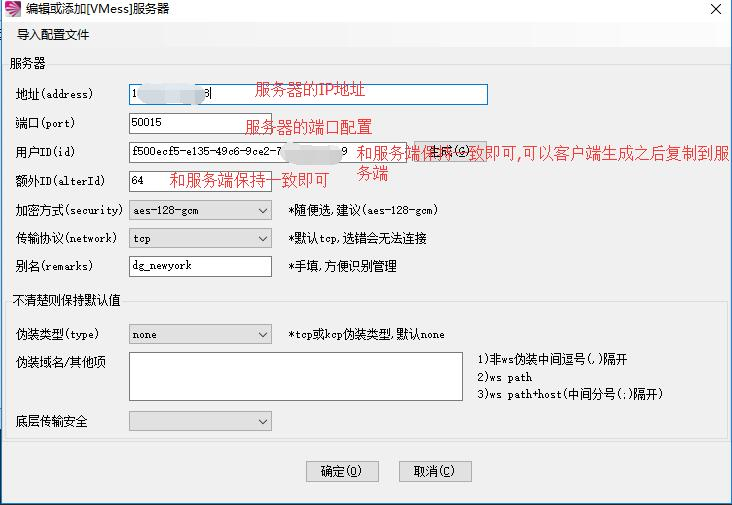

本文转载自从零开始：[史上最详尽V2Ray搭建图文教程](https://www.4spaces.org/digitalocean-build-v2ray-0-1/)，根据实际服务器配置做部分修改。

# 服务端安装

以下所有操作都是使用root用户（普通用户自行sudo）进行操作的，服务器centos7。

<!-- more -->

## 安装wget

如提示没有安装wget，在登录完成的窗口输入下面命令并回车进行wget安装：

```shell
yum -y install wget
```

## 下载脚本

安装完wget之后就可以进行下载安装v2ray的脚本了，输入如下命令并回车：

```shell
wget https://install.direct/go.sh
```

## 安装unzip

因为centos不支持apt-get，我们需要安装unzip，详见[官方说明](https://www.v2ray.com/chapter_00/install.html)：

```shell
yum install -y zip unzip  
```

## 执行安装

输入下面的命令并回车执行安装

```shell
[michael@centos74 v2ray]$ bash go.sh 
Installing V2Ray v3.14 on x86_64
Downloading V2Ray.
  % Total    % Received % Xferd  Average Speed   Time    Time     Time  Current
                                 Dload  Upload   Total   Spent    Left  Speed
100   608    0   608    0     0   2229      0 --:--:-- --:--:-- --:--:--  2235
100 8482k  100 8482k    0     0  2501k      0  0:00:03  0:00:03 --:--:-- 2813k
Extracting V2Ray package to /tmp/v2ray.
Archive:  /tmp/v2ray/v2ray.zip
   creating: /tmp/v2ray/v2ray-v3.14-linux-64/
  inflating: /tmp/v2ray/v2ray-v3.14-linux-64/geoip.dat  
  inflating: /tmp/v2ray/v2ray-v3.14-linux-64/geosite.dat  
  inflating: /tmp/v2ray/v2ray-v3.14-linux-64/readme.md  
   creating: /tmp/v2ray/v2ray-v3.14-linux-64/systemd/
  inflating: /tmp/v2ray/v2ray-v3.14-linux-64/systemd/v2ray.service  
   creating: /tmp/v2ray/v2ray-v3.14-linux-64/systemv/
  inflating: /tmp/v2ray/v2ray-v3.14-linux-64/systemv/v2ray  
  inflating: /tmp/v2ray/v2ray-v3.14-linux-64/v2ctl  
 extracting: /tmp/v2ray/v2ray-v3.14-linux-64/v2ctl.sig  
  inflating: /tmp/v2ray/v2ray-v3.14-linux-64/v2ray  
 extracting: /tmp/v2ray/v2ray-v3.14-linux-64/v2ray.sig  
  inflating: /tmp/v2ray/v2ray-v3.14-linux-64/vpoint_socks_vmess.json  
  inflating: /tmp/v2ray/v2ray-v3.14-linux-64/vpoint_vmess_freedom.json  
PORT:13437
UUID:f500ecf5-e135-49c6-9ce2-78eb490d0aa9
Created symlink from /etc/systemd/system/multi-user.target.wants/v2ray.service to /etc/systemd/system/v2ray.service.
V2Ray v3.14 is installed.
```

## 相关命令

在首次安装完成之后，V2Ray不会自动启动，需要手动运行上述启动命令。而在已经运行V2Ray的VPS上再次执行安装脚本，安装脚本会自动停止V2Ray 进程，升级V2Ray程序，然后自动运行V2Ray。在升级过程中，配置文件不会被修改。

```shell
## 启动
systemctl start v2ray

## 停止
systemctl stop v2ray

## 重启
systemctl restart v2ray

## 开机自启
systemctl enable v2ray
```

关于软件更新：**更新 V2Ray 的方法是再次执行安装脚本！再次执行安装脚本！再次执行安装脚本！**

## 配置

如果你按照上面的命令执行安装完成之后，服务端其实是不需要再进行任何配置的，配置文件位于`/etc/v2ray/config.json`，使用`cat /etc/v2ray/config.json`查看配置信息。接下来进行客户端配置就行了。

**说明：**

- *配置文件中的id、端口、alterId需要和客户端的配置保持一致*；
- *服务端使用脚本安装成功之后默认就是vmess协议*；

配置完成之后重启v2ray。

**9.防火墙开放端口**

有的vps端口默认不开放，可能导致连接不成功，如果有这种情况，详细配置，见[CentOs开放端口的方法—二、firewalld](https://www.4spaces.org/centos-open-porter/)。部分服务器的防火墙配置只能在服务提供商的控制台操作，请注意。

```
## 查看已开放端口
firewall-cmd --zone=public --list-ports

## 添加开放端口
firewall-cmd --zone=public --add-port=80/tcp --permanent
```

# Windows 客户端

## 下载

目前不支持水果系列，水果机只能自行走野路子解决。

1)下载【[v2ray-windows-64.zip Github Release](https://github.com/v2ray/v2ray-core/releases)】;
2)下载【[v2rayN-v2rayN.exe-Github Release](https://github.com/2dust/v2rayN/releases)】；

对`v2ray-windows-64.zip`进行解压，然后将下载的`V2RayN.exe`复制到解压后的目录，即两个下载好的文件需要在同一目录。


## 配置

运行V2RayN.exe，然后进行配置，下图中的配置信息，需要和你VPS搭建的时候的配置信息对应，VPS的v2ray配置信息位于`/etc/v2ray/config.json`文件里。

如果采用上面的默认方式安装，服务端配置是协议vmess，则配置如下：





## 测试

打开浏览器，访问`www.google.com`

# 安卓客户端

参考github项目，下载发行最新版即可，https://github.com/2dust/v2rayNG/releases配置方式与windows方式一样

# 进阶

现在你已经学会使用v2ray了，为了更好的上网效果，建议继续了解一下下面文章：

- [centos7基于nginx搭建v2ray服务端配置vmess+tls+websocket完全手册](https://www.4spaces.org/v2ray-nginx-tls-websocket/)；【推荐】
- [使用Google BBR PLUS加速你的VPS网络](https://www.4spaces.org/speed-up-your-vps-with-bbr-plus/)；
- [如何以mkcp方式部署v2ray](https://www.4spaces.org/digitalocean-build-v2ray-mkcp/)；

# 相关问题

- [使用v2ray访问谷歌提示异常流量](https://www.4spaces.org/v2ray-google-check/)；
- [启用cloudflare cdn之后v2ray报403错误](https://www.4spaces.org/v2ray-cloudflare-cdn-403/)；